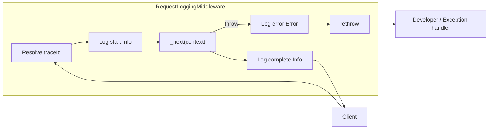

# Design: API リクエスト基本ログ（STV-403 / LOG-1）

## Overview

Core-API（`Statevia.Core.Api`）に **リクエストスコープのログミドルウェア**を追加し、各 HTTP 呼び出しで **開始（Info）・完了（Info）・ミドルウェア境界の未処理例外（Error）**を `ILogger` に出力する。`traceId` はリクエスト全体で一意にし、**テナント ID**は既存の `X-Tenant-Id` 解釈（未指定時は `default`）と一致させる。

ミニマル API（`/v1/health`）と Controller 経由の API の双方に同一の観測性を適用する。

## Steering Document Alignment

リポジトリ共通の Steering は **`.spec-workflow/steering/`** を参照する。

| 文書 | 内容 |
|------|------|
| `product.md` | プロダクト目的・利用者・原則 |
| `tech.md` | スタック・データ・品質ゲート |
| `structure.md` | ディレクトリとレイヤー境界 |

運用・契約・コマンドの正本は **`AGENTS.md`** および **`docs/development-guidelines.md`**。

### 本機能に特有する整合（要約）

- **技術**: **.NET 8** / ASP.NET Core、`ILogger<T>` と **構造化ログ**（テンプレート + プレースホルダー）。高頻度パスでは **`LoggerMessage` ソースジェネレータ**を検討し、文字列補間の割当てを避ける。
- **レイヤー**: HTTP 入出力は Hosting 近辺に集約し、Controller / Service に同種のリクエストログを重ねない（要件どおり）。
- **配置**: `api/Statevia.Core.Api/Hosting/`（既存の `TenantHeader.cs` と並置）。ログ関連が増えたら `Infrastructure/Logging/` へ移す後方互換の移し先は **tasks** で明記。
- **パイプライン**: `Program.cs` でミドルウェアを **CORS より前**に登録し、同一オリジン外クライアントからのリクエストもトレース可能にする（OPTIONS を記録対象にするかは **tasks** でフラグ化可能）。

## Code Reuse Analysis

### Existing Components to Leverage

- **`TenantHeader`**（`Hosting/TenantHeader.cs`）: ヘッダ名と既定テナントをミドルウェアでも共有する。
- **`ApiExceptionFilter`**: Controller 内で捕捉される例外は既に契約エラーに写像される。**ミドルウェアは `_next` 外に漏れた例外**と**完了ログ**に責務を限定し、フィルター側に二重の Error ログを増やさない（必要なら将来「500 のみフィルターで 1 行」など別チケット）。

### Integration Points

- **`WebApplication` パイプライン**（`Program.cs`）: `app.Build()` 直後に `UseMiddleware<…>()` を挿入。
- **標準 `Diagnostics`**: 未処理例外のスタックは **`IHostEnvironment.IsDevelopment()`** に応じて出力可否を切り替え可能（要件: 本番は抑制可能）。

## Architecture

**リクエストログミドルウェア**が `HttpContext` のライフサイクルにフックする。

1. **入口**: `traceId` を決定し `HttpContext.Items` に保存（後続コンポーネントが再利用可能にしてよい）。
2. **開始ログ**: `Method`, **`Path`**（`PathBase` + `Path`、**クエリなし**）, **`Query`**（`QueryString.Value` 相当、**path と別プロパティ**）, **`RequestBodySnapshot`**（下記「本文キャプチャ」）, `TenantId`, `UserAgent`, `TraceId`。
3. **継続**: レスポンス本文をキャプチャするため **`Response.Body` をラップ**（下記）したうえで `await _next(context)`。
4. **出口**: `StatusCode`, `ElapsedMs`, `TraceId`, **`ResponseBodySnapshot`**, （任意）`ResponseSize`（`Content-Length` またはラップで計測したバイト数）。
5. **例外**: `_next` 外で捕捉した場合、Error ログを吐いてから再スロー（ASP.NET の例外ハンドラに委譲）。

### Modular Design Principles

- ミドルウェア **1 ファイル** +（任意）**trace ID 解決の小さな static ヘルパ or 内部 private メソッド**。
- 定数（Item キー、ヘッダ名のエイリアス）は **1 箇所**に集約。

## Components and Interfaces

### `RequestLoggingMiddleware`

- **Purpose:** リクエスト単位の開始 / 完了 / 未処理例外ログを出す。
- **Interfaces:** ASP.NET の `InvokeAsync(HttpContext, RequestDelegate)` 標準形。
- **Dependencies:** `ILogger<RequestLoggingMiddleware>`, `IHostEnvironment`（スタック出力制御用。省略し `IWebHostEnvironment` でも可）。
- **Reuses:** `TenantHeader.HeaderName`, `TenantHeader.DefaultTenantId`。

### Trace ID 解決（同一クラス内 or `TraceIdResolver` static）

- **Purpose:** 要件 R4 の優先順位どおりに文字列 `traceId` を決める。
- **優先順位（確定案）:**
  1. **`traceparent`**（W3C）：パースに成功した場合、**trace-id** フィールド（32 hex）をそのまま `traceId` とする。
  2. **`X-Trace-Id`**（単一値、前後空白トリム、最大長 **128** 超は切り詰めまたは棄却して次へ。tasks で「棄却時は生成」と明文化）。
  3. **`X-Request-Id`**: 上記と同じルール。
  4. **生成**: `Guid.NewGuid().ToString("N")`（32 hex、W3C trace-id と同形）。
- **Optional（tasks 任せ）:** 応答ヘッダ `X-Trace-Id` に同じ値を付与し、クライアント相関を容易にする。付与する場合は **生成した側**のみが責任を持つ。

### W3C `tracestate` と定義 ID / ワークフロー ID（レビュー: `comment_1775318191580_u2gvs3fdn`）

**レビュー提案:** 受信／送信の **`tracestate`** に **定義 ID**・**ワークフロー ID**（display ID 等）を載せ、分散トレース側でもドメイン文脈を結びつけたい。

**議論の整理:**

| 観点 | 内容 |
|------|------|
| **メリット** | `traceparent` と一緒にヘッダ伝播するツール（プロキシ、APM）が、**同一トレース上で WF/定義**を読み取れる可能性がある。 |
| **制約** | W3C の `tracestate` は **ベンダーごとの `key@tenant=value` 形式**・**長さに実質上限**（仕様上メンバーごとに制限あり、全体も肥大化しがち）。value は **opaque** とみなされる。 |
| **タイミング** | いまの設計どおり **CORS より前のミドルウェア**だけでは、**ルート未解決**で `workflowId` / `definitionId` が **まだ無い**ことが多い（`GET /v1/workflows/{id}` の `{id}` もこの時点では未バインド）。**パス正規表現で抜く**のは保守コストが高い。 |

**design での採用案（段階的）:**

1. **必須レベル（STV-403 本体）**  
   - まず **`ILogger` の構造化プロパティ**（例: `WorkflowDisplayId`, `DefinitionDisplayId`）に、**取得できたときだけ**載せる。取得元は **Controller 入り口**、または **`UseRouting` / `UseEndpoints` より後**に置いた薄い **enrich ミドルウェア**（`RouteData.Values` / 既存の display ID 解決と整合）。
2. **`tracestate` ヘッダへの複写（任意・拡張）**  
   - 上記 ID が確定した**後**で、`Activity` / `HttpContext.Response.Headers` 経由で **`tracestate` に 1 メンバー追加**する（例: ベンダーキーは `statevia@statevia-0`、value は **短いエスケープ済み文字列**）。**既存の `tracestate` をパースしてマージ**し、上書きで失わせない。  
   - **本番で無効化**できるよう `RequestLogOptions` と同様のフラグに寄せる。
3. **v1 スコープの割り切り**  
   - tasks では **「ログフィールド enrich」**を優先し、**`tracestate` 書き換え**は **タスク分割**（または STV-403 のサブタスク／次チケット）にしてよい。

**結論（文書上）:** 提案は **有用だが、ミドルウェアの位置と ID 解決タイミングの都合で「ルート後段 or Filter」が前提**。**ログへの ID 付与を先**、`tracestate` は **オプションの第 2 段**とする。

### `HttpContext` Item キー

- **Purpose:** 同一リクエスト内で `traceId` を共有。
- **提案:** `public static class RequestLogContext` に `ItemsTraceIdKey = "Statevia.TraceId"` 等（**public** にしてテストから参照可能にするかは tasks で決定）。

## Data Models

ログは **スキーマレスな構造化ログ**とし、専用 DTO は必須にしない。以下をログの**論理フィールド**とする（Serilog 等へマッピングされるキー名は `STV-407` で統一、本実装では衝突のない **PascalCase または camelCase を一貫**。推奨: **コード上は PascalCase プレースホルダー**）。

| イベント | Level | フィールド |
|----------|-------|------------|
| 開始 | Information | `TraceId`, `Method`, `Path`（クエリ除外）, `Query`（path と別）, `RequestBody`（スナップショット、設定でオフ可）, `TenantId`, `UserAgent`（空は省略可） |
| 完了 | Information | `TraceId`, `StatusCode`, `ElapsedMs`, `ResponseBody`（スナップショット、設定でオフ可）, （任意）`ResponseSize` |
| 未処理例外 | Error | `TraceId`, `ExceptionType`, `Message`, （Development のみ）`StackTrace` |

### `Path` と `Query`（レビュー反映）

- **`Path`**: `PathBase` + `Path` のみ。**クエリを連結しない**（レビュー: クエリは別メタデータ）。
- **`Query`**: `Microsoft.AspNetCore.Http.QueryString` の文字列表現（先頭 `?` の有無は実装で一貫）。**最大長**（例: **2048 文字**）超は切り詰め、ログに `QueryTruncated=true` 等を付けてもよい。

### リクエスト本文（開始ログ）

- ミドルウェア序盤で **`Request.EnableBuffering()`**（未実行なら）を呼び、**読み取り後に `Position = 0` で復帰**し後続（モデルバインディング）を壊さない。
- 読み取り上限: **既定 8192 バイト**（`RequestLogOptions.MaxRequestBodyLogBytes` で変更可）。超過は切り詰め。
- **Content-Type** が `application/json` / `text/*` 以外は **`[non-text body omitted]`** 等のプレースホルダにしてよい（tasks で一覧を固定）。

### レスポンス本文（完了ログ）

- **`Response.Body` を `Stream` でラップ**し、下流へそのまま流しつつ、先頭 **N バイト**（既定 **8192**、`MaxResponseBodyLogBytes`）をバッファに保持。
- フラッシュ後にスナップショット文字列化（テキスト/JSON のみ。それ以外はプレースホルダ）。
- ラップ実装は **同期/非同期の両方の `Write`/`WriteAsync` を転送**し、パフォーマンス劣化を最小化する。

### マスキング（IO-14 との両立）

- 単純な **JSON キー名ベース**（`password`, `token`, `secret`, `accessToken`, `refreshToken`, `authorization` 等）と、**フラットなキー＝値**のクエリパラメータ名のマスクを行う小さな `LogBodyRedactor`（static またはサービス）を用意。
- **`workflowInput` / `input` / `output` 等**は完全マスクではなく **「値を `[redacted]` に置換」または深さ制限**のいずれかを design 実装で選択（推奨: **値がオブジェクトの場合は 1 階層まで展開しそれ以降 `[truncated]`** で STV-408 前の妥協点にする）。tasks に明記。

### `RequestLogOptions`（`IOptions<RequestLogOptions>`）

| プロパティ | 既定（提案） | 説明 |
|------------|--------------|------|
| `LogRequestBody` | `true`（Development） / **`false`（Production）** | 本番既定オフで要件「本番でオフ可能」を満たす |
| `LogResponseBody` | 同上 | 同上 |
| `MaxRequestBodyLogBytes` | 8192 | |
| `MaxResponseBodyLogBytes` | 8192 | |
| `MaxQueryStringChars` | 2048 | |

環境変数（例: `STATEVIA_LOG_HTTP_BODIES=true`）で本番一時デバッグを許可するかは任意。

**`ResponseSize`:**

- `Content-Length` が応答にあれば優先。無ければラップでカウントしたバイト数が取れれば記録。

## Error Handling

### シナリオ

1. **ログ処理自体が例外**
   - **Handling:** try/catch で握りつぶし、**元の例外があれば優先して再スロー**。ログ失敗のみなら無視（要件: ログで 500 にしない）。
   - **利用者:** 影響なし。

2. **`_next` から未処理例外**
   - **Handling:** Error ログ出力後 `throw`。
   - **利用者:** 従来どおりホストの例外応答（開発時はスタック、本番は設定依存）。

3. **Controller 内で捕捉済み（422 等）**
   - **Handling:** ミドルウェアの完了ログは **ステータスコード確定後**に出るため、**4xx/2xx も完了ログのみ**（別途 Error は出さない）。

## Testing Strategy

### Unit / ミドルウェア単体

- `DefaultHttpContext` + 手動で `RequestDelegate` を差し込み、`TestLogger` / `FakeLogger` 相当で **開始・完了のログが各 1 回**呼ばれることを検証。
- `traceparent` / `X-Trace-Id` / 生成の各分岐を **表形式テスト**でカバー。

### 統合（任意・薄く）

- `WebApplicationFactory` で **GET `/v1/health`** を 1 回叩き、ログに `TraceId` と `StatusCode=200` が含まれることを **テストホストの `ILoggerProvider` でキャプチャ**（プロジェクトに既存パターンがあれば流用）。

### E2E

- 本 spec の必須ではない（STV-401 系は別）。ログの受け入れは **単体 or 薄い統合**で足りる。

## Implementation Checklist（tasks への入力）

- [ ] `RequestLogOptions` + DI 登録（環境に応じた既定）
- [ ] `RequestLoggingMiddleware` + `Program.cs` 登録
- [ ] `TraceId` 解決と `HttpContext.Items`
- [ ] `Path` / `Query` 分離、クエリ長上限
- [ ] リクエスト本文: `EnableBuffering` + 読み取り + マスキング
- [ ] レスポンス本文: `Response.Body` ラップ + バッファ + マスキング
- [ ] 開始 / 完了 / 例外の `LoggerMessage` またはテンプレートログ
- [ ] 単体テスト（ラッパー・Redactor・ミドルウェア）
- [ ] `AGENTS.md` または `docs/`（本文ログのリスクと IO-14 への言及）

## References

- `requirements.md`（同一 spec）
- `api/Statevia.Core.Api/Program.cs`
- `api/Statevia.Core.Api/Hosting/TenantHeader.cs`
- `AGENTS.md`（Core-API レイヤー）
