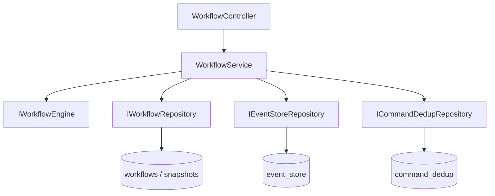
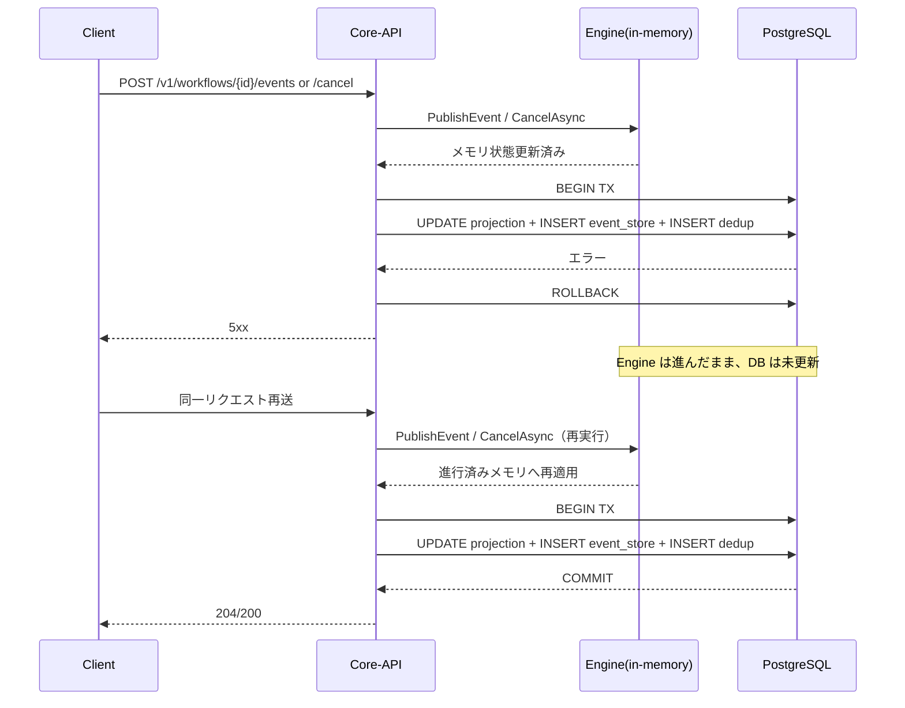

# Design: O6 サブチケット製造フェーズ（STV-413〜STV-418）

## Overview

本 design は、`STV-413`〜`STV-418` の契約を実コードへ実装するための設計方針を示す。  
中心は Core-API の `WorkflowService` におけるトランザクション制御、event_store 追記、Read Model（`workflows` / `execution_graph_snapshots`）更新、再送べき等の実装統一である。  
また、nodes 変換仕様（C14）については MVP 拒否契約を維持しつつ段階導入可能な構造へ整理する。

## Steering Document Alignment

### Technical Standards (tech.md)

- バックエンドは C# / ASP.NET Core / EF Core（PostgreSQL）を前提にし、既存のレイヤー分離（Controller → Service → Repository）を維持する。
- `WorkflowService` をユースケースの集約点とし、永続化は Repository と `CoreDbContext` トランザクション境界で管理する。
- テストは `dotnet test` ベースで、ユニット＋統合観点で event_store / projection / dedup を検証する。

### Project Structure (structure.md)

- 実装対象は主に `api/Statevia.Core.Api/` 配下（Services / Abstractions / Persistence / Tests）。
- 仕様参照は `.workspace-docs/30_specs/10_in-progress/o6-subtickets_detailed_spec.md` を正本とし、差分は docs と backlog に反映する。
- spec-workflow は `o6-subtickets-manufacturing` を製造フェーズの親 spec として運用する。

## Code Reuse Analysis

### Existing Components to Leverage

- **`WorkflowService`**: Start/Cancel/Publish の tx 制御と projection 更新が既に実装済みで、STV-413 の実装母体として再利用できる。
- **`IEventStoreRepository`**: `AppendAsync(CoreDbContext, ...)` により同一トランザクション追記が可能で、STV-414/415 の要件に適合。
- **`ICommandDedupRepository` / `ICommandDedupService`**: コマンド冪等の既存基盤として、再送べき等の拡張設計に利用する。
- **`EventStoreEventType`**: 永続イベント語彙の正本であり、対応表との整合チェック対象としてそのまま利用する。

### Integration Points

- **Core-API Service ↔ Repositories**: `WorkflowService` から `_workflows` / `_eventStore` / `_dedup` を同一 `CoreDbContext` 上で実行する。
- **Core-API Service ↔ Engine**: `_engine.Start` / `_engine.CancelAsync` / `_engine.PublishEvent` / `_engine.GetSnapshot` / `_engine.ExportExecutionGraph` を用いて projection ソースを取得する。
- **Spec ↔ Docs / Backlog**: 実装完了時に `v2-ticket-backlog.md`・`AGENTS.md`・`docs/statevia-data-integration-contract.md` の整合を維持する。

## Architecture

STV-413〜415 は「コマンド実行 → event_store append → projection 更新 → dedup 保存」を 1 トランザクションで処理するパイプラインを共通化する。  
STV-416 は Read API が DB projection を正とする設計を固定し、Engine メモリ参照は Write 側の projection 構築時のみに限定する。  
STV-417 は nodes 仕様の段階導入順（P1〜P4）を維持し、未対応要素は明示エラー契約を継続する。  
STV-418 は実装のトレーサビリティを spec/backlog/docs に同期させる運用設計で吸収する。

### Modular Design Principles

- **Single File Responsibility**: `WorkflowService` はユースケース制御、Repository は永続化、契約型は `Abstractions` に限定する。
- **Component Isolation**: tx 処理の共通化ヘルパーを導入する場合は `WorkflowService` 内 private メソッドか専用 coordinator に閉じる。
- **Service Layer Separation**: Controller は HTTP 境界のみ、業務ロジックは Service 層に集約する。
- **Utility Modularity**: payload 生成・dedup キー計算・イベント種別マッピングは小さな関数単位で分離する。



## Components and Interfaces

### Workflow Transaction Coordinator（`WorkflowService` 内）

- **Purpose:** Start/Cancel/Publish の tx 処理手順を統一し、部分更新を防止する。
- **Interfaces:** `StartAsync`, `CancelAsync`, `PublishEventAsync`（既存 public API）。
- **Dependencies:** `IWorkflowEngine`, `IDbContextFactory<CoreDbContext>`, 各 Repository。
- **Reuses:** 既存の `BuildProjectionFromEngine`, `MapStatus`, dedup 保存処理。

### Event Persistence Mapping

- **Purpose:** `EventStoreEventType` と payload 生成規則を統一し、監査可能性を維持する。
- **Interfaces:** `IEventStoreRepository.AppendAsync(...)`, `EventStoreEventType.ToPersistedString()`。
- **Dependencies:** `System.Text.Json`, event_store テーブル。
- **Reuses:** `EventStoreEventType` enum と既存 payload 形式（`tenantId`, `definitionId`, `name`）。

### Engine Replay Guard（採用方針）

- **Purpose:** DB rollback 後の再送時に、Engine 側で重複実行を検知して No-Op 応答できるようにする。
- **Interfaces:** Engine の `PublishEvent` / `CancelAsync` に `clientEventId`（必要に応じて `batchId`）を渡せる拡張インターフェースを追加する。
- **Dependencies:** Engine 内の workflow 実行履歴（適用済みイベントキー集合）と API から渡される冪等キー。
- **Reuses:** 既存の API 側 `command_dedup` / event_store 一意制約方針と組み合わせる。

採用ルール:

1. **正本判定は API/DB**  
   `workflow_id + client_event_id` の一意性で重複適用を防ぐ。再起動時の整合をここで担保する。
2. **Engine 判定は補助**  
   同一プロセス内で再送が来た場合、Engine は適用済みを返し No-Op とする。
3. **結果返却**  
   Engine は `Applied` / `AlreadyApplied` を区別して返し、API は `AlreadyApplied` でも成功系レスポンスを返せるようにする。
4. **再起動時**  
   Engine メモリだけでは判定できないため、API は DB 正本判定を必須とする（Engine 判定だけに依存しない）。

### Read Consistency Guard

- **Purpose:** Read API が DB projection を返す責務をコード・テストで固定する。
- **Interfaces:** `GetWorkflowResponseAsync`, `GetGraphJsonAsync`, `GetWorkflowViewAsync`。
- **Dependencies:** `IWorkflowRepository`, `IDisplayIdService`。
- **Reuses:** 既存の `GetByIdAsync`, `GetSnapshotByWorkflowIdAsync`。

## Data Models

### EventStore Idempotency Extension（設計候補）

```text
event_store 拡張候補
- workflow_id: uuid（既存）
- seq: bigint（既存）
- type: text（既存）
- payload: jsonb（既存）
- client_event_id: uuid | null（新規候補）
- batch_id: uuid | null（新規候補）
```

注: STV-415 実装時に DB マイグレーション要否を確定し、必要なら別タスクへ分割する。

### Engine Apply Result（設計候補）

```text
ApplyResult
- status: Applied | AlreadyApplied
- workflowId: string
- clientEventId: string | null
- reason: string | null
```

API は `AlreadyApplied` を受けた場合、同一 `clientEventId` の再送成功として扱い、DB 側で未反映なら補正書き込みを試行する。

### Retry Policy Config（設計候補）

```text
RetryPolicy
- maxAttempts: int
- baseDelayMs: int
- maxDelayMs: int
- jitter: bool
```

## Error Handling

### Error Scenarios

1. **Scenario 1: トランザクション途中失敗（DB/制約違反）**
   - **Handling:** 例外捕捉で tx rollback、API は既存エラー契約（422/500 等）で返却。
   - **User Impact:** 部分更新なし。クライアントは安全に再試行可能。

2. **Scenario 2: 再送イベントの重複**
   - **Handling:** `clientEventId` など重複キーで検知し、二重適用をスキップ（または既存結果返却）。
   - **User Impact:** 同一イベントの再送でも状態が破壊されない。

3. **Scenario 3: リトライ上限超過**
   - **Handling:** 構造化ログに workflowId/tenantId/traceId を残して失敗終了。
   - **User Impact:** 自動回復しないが、運用介入可能な証跡が残る。

### Failure Sequence（Engine 適用後に DB rollback するケース）



- rollback 時は dedup も保存されないため、再送は通常リクエストとして処理される。
- 同一プロセスで Engine メモリが生存している場合、再送は「進行済み状態」への再適用になる。
- プロセス再起動を挟むとメモリ状態を失うため、同じ再送でも挙動が変わりうる。

## 決定事項（review 反映）

1. **冪等キーの正本スキーマ**
   - `client_event_id` / `batch_id` は専用テーブル（例: `event_delivery_dedup`）で管理する。
   - テーブルは本処理とトランザクションを分離し、`RECEIVED` / `APPLIED` / `FAILED` などのステータスで進行を管理する。
   - 一意制約は `UNIQUE(tenant_id, workflow_id, client_event_id)` を採用する。

2. **`AlreadyApplied` 時の HTTP 契約**
   - 再送時でも成功レスポンスは **`204` 固定**とする。
   - 「重複再送受理」は event_store と構造化ログの **両方**に記録する。

3. **Engine インターフェース拡張範囲**
   - `PublishEvent` と `CancelAsync` の両方で `clientEventId` を受ける。
   - 後方互換のため既存シグネチャ（キーなし）はオーバーロードとして残す。

4. **rollback 後の補正書き込み手順**
   - Engine が `AlreadyApplied` を返し DB 未反映のとき、API は **projection のみ**再構築する。
   - event_store 補正は **insert-skip**（`ON CONFLICT DO NOTHING` 相当）を採用し、upsert は採用しない。

5. **リトライポリシーの既定値**
   - `maxAttempts` / `baseDelayMs` / `maxDelayMs` / jitter はすべて有効化し、段階的バックオフで **最大 3 回**まで実施する。
   - 実行間隔は API のリクエストタイムアウト上限を超えないよう制限する。
   - `timeout` エラーは再試行対象に含めない。

6. **再起動時の整合ルール**
   - Engine メモリ喪失時は DB 正本で判定し、復元不能時は **`422`** を返す。
   - 運用ログの必須キーは `traceId`, `workflowId`, `tenantId`, `clientEventId`, `decision`, `attempt`, `elapsedMs`, `errorCode` とする。

## Testing Strategy

### Unit Testing

- `WorkflowService` の Start/Cancel/Publish で tx 内処理順（更新→append→save）を検証。
- `EventStoreEventType` と payload マッピングの回帰を検証。
- 重複イベント入力時のべき等挙動（再適用しない）を検証。

### Integration Testing

- PostgreSQL を使った統合テストで rollback/commit 挙動を確認。
- Read API が DB projection を返すこと（Engine メモリに依存しない）を確認。
- nodes 未対応フィールドが仕様どおり 422/400 相当で拒否されることを確認。

### End-to-End Testing

- `POST /workflows` → `POST /events|cancel` → `GET /workflows/{id}` の一連で event_store と projection の整合を検証。
- 再送シナリオ（同一キー再送）で重複適用が起きないことを検証。
