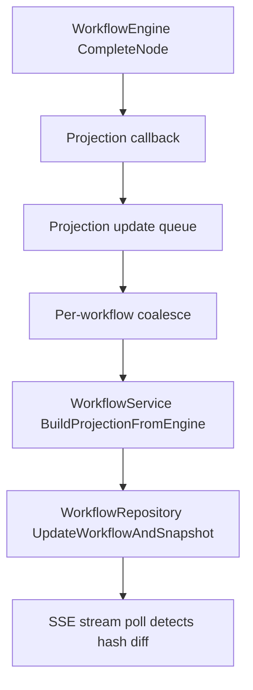
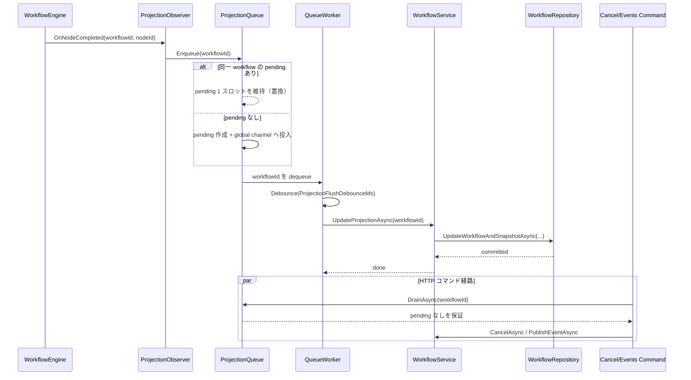

# Design: ノード完了ごとの実行グラフ投影（API 内キュー）

## Overview

本 design は、`requirements.md` で承認された「粒度 A（`CompleteNode` 直後）」の投影更新を、Engine と Core-API の境界を保ったまま実装するための設計を示す。  
方針は **Engine でノード完了を観測**し、**Core-API 内キュー**で受け、**Read Model（`workflows` / `execution_graph_snapshots`）へ非同期反映**する。

## Steering Document Alignment

### Technical Standards (`tech.md`)

- Core-API は C# / ASP.NET Core の既存 DI・Service・Repository パターンを維持する。
- Engine は DB 依存を持たず、公開 API で観測イベントを通知する。
- 競合制御は「同一 `workflow_id` の直列化」「有界キュー」「ブロックによるバックプレッシャー」を採用する。

### Project Structure (`structure.md`)

- Engine 側変更: `engine/Statevia.Core.Engine/Abstractions/` と `engine/Statevia.Core.Engine/Engine/`
- API 側変更: `api/Statevia.Core.Api/Services/`、必要に応じて `Abstractions/Services/` と `Configuration/`
- 永続層変更は最小化し、既存 `IWorkflowRepository.UpdateWorkflowAndSnapshotAsync` を再利用する。

## Code Reuse Analysis

### Existing Components to Leverage

- `WorkflowService.BuildProjectionFromEngine(...)`: エンジン状態→投影 DTO 変換を再利用する。
- `IWorkflowRepository.UpdateWorkflowAndSnapshotAsync(...)`: 投影保存を再利用する。
- `WorkflowStreamService`: SSE は既存の 2 秒ポーリング挙動を維持する（本タスクで変更しない）。

### Integration Points

- `IWorkflowEngine`: ノード完了通知ハンドラ登録 API を追加する。
- `WorkflowService`: 通知を受けて API 内キューへ enqueue し、バックグラウンドで投影更新を実行する。
- `Program.cs`: キューワーカーを hosted service として DI 登録する。

## Architecture

### Processing Model

1. Engine でノード完了（通常ステート / Join 合成ノード）を検知。
2. 観測コールバックで `workflowId` を API キューへ投入。
3. キューは同一 `workflow_id` の pending を 1 スロットに併合。
4. `ProjectionFlushDebounceMs` 経過後にワーカーが投影更新を 1 回実行。
5. `POST /cancel` / `POST /events` は対象 workflow の pending をドレインしてからコマンド処理。

### Queue Data Flow

通常系（ノード完了通知から投影更新まで）と、コマンド整合系（drain 後にコマンド実行）のデータフローを分けて扱う。

#### Flow Invariants

- `workflow_id` ごとに pending は 1 スロットまで（無限増加を防止）。
- global queue は有界。満杯時 `Enqueue` は await でブロックし、完了事実をドロップしない。
- `DrainAsync` 完了後のコマンドは、当該 workflow の pending 更新と競合しない。

## Components and Interfaces

### 1) Engine notification surface

- **Purpose:** ノード完了を API に通知する。
- **Interface案:** `IWorkflowEngine` に「ノード完了通知登録」API を追加。
- **Dependencies:** なし（DB 非依存）。
- **Notes:** コールバックは fire-and-forget で、重い処理は禁止。

### 2) Projection update queue service

- **Purpose:** enqueue / coalesce / debounce / worker 実行を担当。
- **Interface案:** `IWorkflowProjectionUpdateQueue`
  - `Enqueue(Guid workflowId)`
  - `DrainAsync(Guid workflowId, CancellationToken ct)`
- **Dependencies:** `IWorkflowService`（投影更新メソッド）、`ILogger`、`IOptions`。
- **設定値:** `MaxGlobalQueueSize`（既定 16384）、`ProjectionFlushDebounceMs`（既定 50）。

### 3) WorkflowService integration

- **Purpose:** 既存の投影構築・保存ロジックをキューワーカー向けに公開。
- **Interface案:** `UpdateProjectionAsync(Guid workflowId, CancellationToken ct)` を private から internal/public service API へ昇格。
- **Command consistency:** cancel/events 実行前に `DrainAsync(workflowId)` を呼ぶ。

### 4) Hosted worker

- **Purpose:** アプリ稼働中のキュー消費と停止時ドレイン。
- **Behavior:** `IHostedService` で開始・停止を管理。停止時は best effort ドレインし、未処理件数を構造化ログに出力。

## Data and Configuration

### Configuration

- `WorkflowProjectionQueueOptions.MaxGlobalQueueSize`（int, default: 16384）
- `WorkflowProjectionQueueOptions.ProjectionFlushDebounceMs`（int, default: 50, range: 0-250）
- （任意）`WorkflowProjectionQueueOptions.BlockWarnThresholdMs`（警告ログ閾値）

### In-memory state

- `ConcurrentDictionary<Guid, PendingWorkflowItem>`: workflow 単位 1 スロット管理
- `Channel<Guid>`: 有界グローバル待ち行列（満杯時は write を await）

## Error Handling

1. **Queue full**
   - **Handling:** `Enqueue` はブロックしてバックプレッシャーをかける。
   - **User Impact:** 高負荷時に処理遅延はあり得るが、完了事実はドロップしない。

2. **Projection update failure**
   - **Handling:** ログ出力し、同 workflow の pending フラグが残っていれば再試行可能な状態を維持する。
   - **User Impact:** 一時的に UI 更新が遅れる可能性。

3. **Shutdown timeout**
   - **Handling:** best effort ドレイン後、未処理件数をログに残して終了。
   - **User Impact:** 停止直前の一部更新が未反映の可能性（最後にコミット済みの投影が正本）。

## Testing Strategy

### Unit Testing

- Engine: 通常ステート / Join 完了時に通知が発火する。
- Queue: coalesce（1 スロット）、デバウンス 0/50ms、満杯時ブロック、ドレイン動作。
- WorkflowService: cancel/events 前ドレインで競合しない。

### Integration Testing

- API 起動下でノード完了連続時に `execution_graph_snapshots` が単調更新される。
- シャットダウン時にドレインが走り、未処理件数がログに出る。

## Microservices Considerations（将来課題）

本 design のキュー制御は **単一 API プロセス内**を前提にしている。将来、Core-API をマイクロサービス化・水平分割する場合は次を別途設計する。

- **分散直列化**
  - 現行の `workflow_id` ごとの 1 スロット / drain 保証は単一プロセス内でのみ成立する。
  - 複数インスタンス時は sticky routing、分散ロック、または単一コンシューマ（メッセージブローカー）などで同等保証が必要。

- **永続キューと再起動耐性**
  - in-memory queue は異常終了時に未反映を失う。
  - マイクロサービス環境では durable queue（Kafka / RabbitMQ / SQS 等）や outbox/inbox パターンで再送・復旧を定義する必要がある。

- **順序保証と重複排除**
  - インスタンス跨ぎで通知順序が乱れる可能性がある。
  - `workflow_id` 単位の順序キー、idempotency key（または sequence watermark）を導入し、最新投影の単調性を維持する必要がある。

- **コマンド整合（Cancel / Events）**
  - `DrainAsync` 相当の局所保証は分散環境でそのまま使えない。
  - 「コマンド適用直前までの投影反映」をどう定義するか（同期 barrier / version check / transaction outbox 連携）を再設計する必要がある。

- **可観測性と運用**
  - 単一プロセス前提のログだけではボトルネック特定が難しい。
  - queue lag、workflow 別処理遅延、再試行回数、dead-letter を横断メトリクスとして監視する必要がある。

### Non-Goals

- `event_store` への `NODE_*` 追加は対象外。
- SSE の 2 秒ポーリング間隔変更は対象外。

## References

- `.spec-workflow/specs/workflow-projection-node-completion/requirements.md`
- `docs/statevia-data-integration-contract.md`
- `.spec-workflow/specs/o6-subtickets-detailed/requirements.md`
