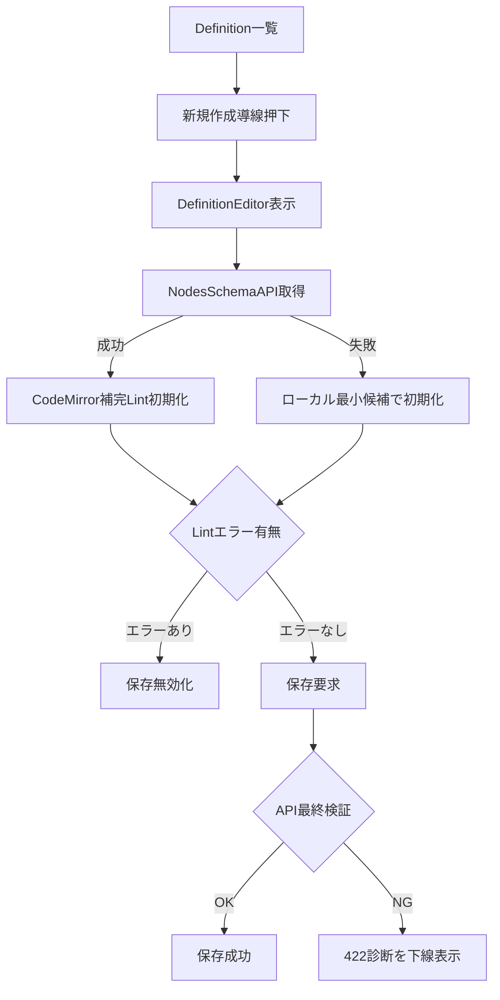

# 設計書

## 概要

Definition 一覧からの新規作成導線を追加し、定義エディタを CodeMirror ベースに置換する。
UI では補完・インライン Lint・保存事前制御を担い、API では `nodes` スキーマ配布と最終検証を担う二段構えで設計する。

## ステアリング文書との整合

### 技術標準（`tech.md`）

- Next.js App Router の構成を維持し、既存画面コンポーネントを拡張する。
- 最終的な保存可否判定は API で実施し、UI 判定は補助的な早期フィードバックとする。

### プロジェクト構成（`structure.md`）

- UI変更は `services/ui/app/definitions/` 配下に閉じる。
- スキーマ配布と最終検証の API 拡張は `api/Statevia.Core.Api` 配下に集約する。

## 既存資産の再利用分析

既存の定義一覧、定義エディタ、API の定義コンパイル経路を再利用し、全面作り直しを避ける。

### 再利用する既存要素

- **`DefinitionsPageClient`**: 新規作成導線の追加先として再利用する。
- **`DefinitionEditorPageClient`**: 保存処理と通知表示を再利用し、エディタ領域のみ置換する。
- **`NodesWorkflowDefinitionLoader`**: `nodes` 仕様の実装上の正として参照する。
- **`DefinitionService` / `DefinitionCompilerService`**: API 最終検証と保存処理を再利用する。

### 統合ポイント

- **UIルーティング**: `/definitions/new` を追加し一覧から遷移させる。
- **定義保存API**: `POST /v1/definitions` の 422 診断を UI へ接続する。
- **スキーマ配布API**: `GET /v1/definitions/schema/nodes` を追加し UI 補完/Lint 源泉にする。

## アーキテクチャ

UI（補完/Lint/事前ガード）と API（配布スキーマ/最終検証）を分離する構成を採用する。

### モジュール設計の原則

- **単一責任**: 一覧導線、エディタ拡張、スキーマ取得、診断表示を分離する。
- **コンポーネント分離**: CodeMirror 設定を画面本体から分割可能な実装にする。
- **レイヤー分離**: UI 表示ロジックと API 契約依存ロジックを分離する。
- **ユーティリティ分割**: スキーマ→補完候補生成と 422→診断マッピングを分ける。

## 処理フロー図（重要）



## コンポーネントとインターフェース

### コンポーネント1: DefinitionCreateEntry

- **目的**: 定義一覧から新規作成への直接導線を提供する。
- **公開インターフェース**: 一覧画面上のボタン（`/definitions/new`）。
- **依存先**: `uiText`（ja/en 文言）、Next.js ルーティング。
- **再利用要素**: `DefinitionsPageClient`。

### コンポーネント2: DefinitionEditorIntelligence

- **目的**: CodeMirror 補完/Lint と保存事前制御を提供する。
- **公開インターフェース**: `yaml` 入出力、診断表示、保存可否フラグ。
- **依存先**: NodesSchema API、CodeMirror 拡張、保存 API。
- **再利用要素**: `DefinitionEditorPageClient` 既存保存処理。

### コンポーネント3: NodesSchemaProviderApi

- **目的**: UI 向け `nodes` スキーマを配布する。
- **公開インターフェース**: `GET /v1/definitions/schema/nodes`。
- **依存先**: `IDefinitionSchemaService`（実装: `DefinitionSchemaService`）、`NodesWorkflowDefinitionLoader`、スキーマ供給ロジック。
- **再利用要素**: 既存 Definition API のコントローラ/サービス層。
- **拡張境界**: 将来 DTO 起点スキーマ生成へ移行する際は、`IDefinitionSchemaService` の実装差し替えで対応する。

## データモデル

### モデル1: NodesSchemaResponse

```text
NodesSchemaResponse
- schemaVersion: string
- nodesVersion: number
- schema: object
- examples: object[] (optional)
```

### モデル2: DefinitionValidationDiagnostic

```text
DefinitionValidationDiagnostic
- line: number
- column: number
- severity: string
- message: string
- code: string (optional)
```

## エラーハンドリング

### エラーシナリオ

1. **スキーマ取得失敗**
   - **対処方法**: ローカル最小候補へフォールバックし編集継続、保存時に API 最終検証で担保する。
   - **ユーザー影響**: 補完精度は下がる可能性があるが、編集不能にはならない。

2. **UI Lintエラー残存**
   - **対処方法**: エラー下線とヒントを表示し、保存ボタンを無効化する。
   - **ユーザー影響**: その場で修正ポイントが分かり、誤保存を防げる。

3. **API 最終検証エラー（422）**
   - **対処方法**: 422 診断をエディタへ再マッピングし、該当箇所に表示する。
   - **ユーザー影響**: UI と API の判定差分を可視化して再修正できる。

## テスト戦略

### 単体テスト

- スキーマから補完候補を構築するロジックを検証する。
- 422 診断を CodeMirror 診断へ変換するロジックを検証する。

### 結合テスト

- 一覧から新規作成へ遷移できることを検証する。
- Lint エラー時に保存不可になることを検証する。
- 422 診断がインライン表示されることを検証する。

### E2Eテスト

- スキーマ取得成功時の補完と保存成功フローを検証する。
- スキーマ取得失敗フォールバック時も編集と保存検証が成立することを検証する。

## 将来拡張方針

- **短期**: API配布スキーマを正として UI 補完/Lint を接続する。
- **中期**: API 内の `nodes` 入力 DTO から JSON Schema を生成し、手修正コストを下げる。
- **長期**: `nodesVersion` 指定取得（例: `?version=1`）で後方互換運用を可能にする。
