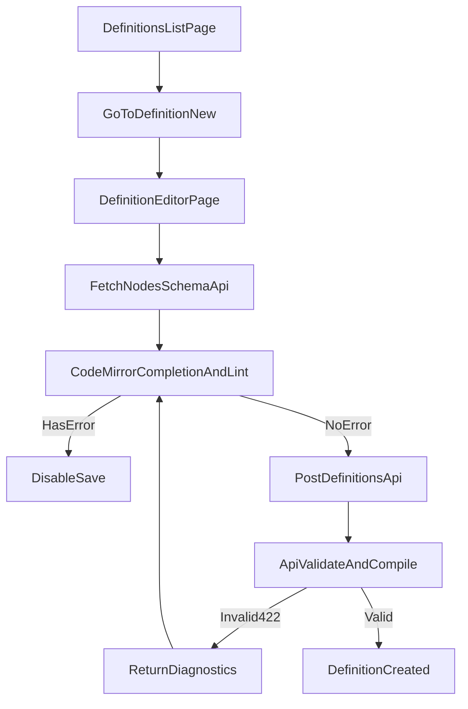

# Design: Definition作成導線改修とエディタインテリジェンス

## Overview

本設計は、Definition一覧から新規作成へ直接遷移できる UI 導線を追加し、定義エディタを CodeMirror 化して補完・Lint・保存制御を導入する。
また、`nodes` 形式スキーマを API から配布し、UI が補完/Lint の源泉として利用できる構成にする。

## Alignment with Steering Documents

### 技術標準（`tech.md`）

- UI は Next.js App Router 構成を維持し、既存画面の責務を崩さない。
- Definition 保存時の最終検証は API 側で実施し、UI は早期フィードバックに専念する。

### プロジェクト構成（`structure.md`）

- UI 実装は `services/ui/app/definitions/` 配下を中心に変更する。
- API スキーマ配布は `api/Statevia.Core.Api/Controllers/` と `Application/Definition/` に実装する。

## Reuse Analysis

### Reuse Existing Elements

- **`DefinitionsPageClient`**: 一覧UIに新規作成導線を追加する。
- **`DefinitionEditorPageClient`**: 既存の保存処理・トースト表示を再利用し、エディタ部を置換する。
- **`NodesWorkflowDefinitionLoader`**: `nodes` 仕様の実質的な正として再利用する。
- **`DefinitionService` / `DefinitionCompilerService`**: 保存時検証経路の正として再利用する。

### Integration Points

- **UI導線**: `services/ui/app/definitions/DefinitionsPageClient.tsx`
- **エディタ**: `services/ui/app/definitions/[definitionId]/edit/DefinitionEditorPageClient.tsx`
- **新規作成ルート**: `services/ui/app/definitions/new/*`
- **スキーマAPI**: `api/Statevia.Core.Api/Controllers/DefinitionsController.cs` または専用 Controller

## Architecture

### 編集・保存フロー

### 責務分離

1. **UI責務**
   - 新規作成導線表示
   - 入力中補完・軽量Lint・下線表示
   - 保存可否の事前制御
2. **API責務**
   - `nodes` スキーマ配布
   - 定義の最終検証と保存可否判定
   - 422 診断の構造化返却

## Components and Interfaces

### 1) DefinitionCreateEntry（一覧導線）

- **変更先**: `DefinitionsPageClient`
- **追加内容**:
  - 新規作成ボタン（`/definitions/new`）
  - 文言辞書キー追加（ja/en）

### 2) DefinitionEditor（CodeMirror）

- **変更先**: `DefinitionEditorPageClient`
- **追加内容**:
  - `textarea` を CodeMirror へ置換
  - APIスキーマを使った補完候補
  - エラー箇所の下線 + 診断ヒント表示
  - エラー存在時の保存無効化

### 3) NodesSchema API

- **候補エンドポイント**: `GET /v1/definitions/schema/nodes`
- **レスポンス案**:
  - `schemaVersion: string`
  - `nodesVersion: number`
  - `schema: object`
  - `examples: object[]`（任意）
- **方針**:
  - 取得結果は UI 側でキャッシュ
  - 取得失敗時はローカル最小スキーマへフォールバック

### 4) Validation Error Contract

- **保存 API**: `POST /v1/definitions`
- **エラー時**:
  - HTTP 422
  - 位置情報を含む診断配列（line/column/message 相当）
- **UI処理**:
  - 診断を CodeMirror の lint source にマッピング
  - トーストは補助表示、主表示はインライン診断

## Future Extensibility

### 短期（今回）

- API配布スキーマ + API最終検証を導入し、UI依存の仕様ハードコードを減らす。

### 中期

- API内に `nodes` 入力契約DTOを導入し、DTOから JSON Schema を生成する。
- 手書きスキーマの運用を段階的に縮小する。

### 長期

- `nodesVersion` ごとのスキーマ配布（`?version=1` など）を提供し、後方互換を維持する。
- スキーマ生成は起動時またはビルド時に固定し、リクエスト毎生成を禁止する。

## Error Handling

1. **スキーマ取得失敗**
   - **検知**: スキーマ API が失敗またはタイムアウト
   - **対処**: ローカル最小候補で継続、保存時に API で最終検証
2. **UI Lintエラー**
   - **検知**: CodeMirror 診断が Error レベル
   - **対処**: 保存ボタン無効 + エディタ下線表示
3. **API 検証エラー**
   - **検知**: 422 レスポンス
   - **対処**: 診断をエディタへ反映し、修正導線を強調

## Test Strategy

### Unit Tests

- 補完候補生成（スキーマ入力 → 候補一覧）の検証
- 診断マッピング（422 → CodeMirror diagnostics）の検証

### Integration Tests

- Definition一覧から新規作成画面へ遷移できること
- Lintエラー時に保存が無効化されること
- 422 診断が下線表示されること
- スキーマ取得失敗時フォールバックが機能すること

### API Tests

- `GET /v1/definitions/schema/nodes` が期待レスポンスを返すこと
- `schemaVersion` / `nodesVersion` の整合
- 不正定義保存時に 422 構造化エラーを返すこと
