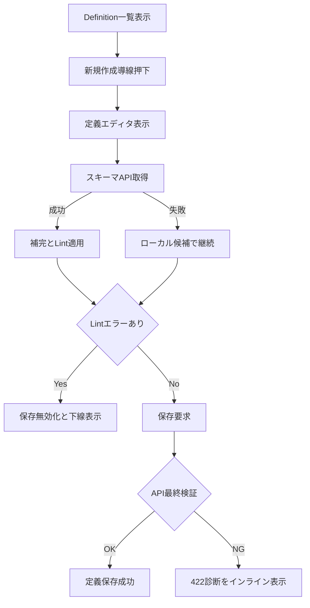

# 要件定義書

## 背景と目的

現在の定義作成は定義詳細からのみ開始できるため、一覧からすぐに作成へ入れない導線上の非効率がある。
また、定義エディタは入力補助・エラー可視化が弱く、記述ミスを保存時まで検知できない課題がある。
本仕様では、一覧からの新規作成導線追加、CodeMirror による補完とインライン Lint、API 側の厳格検証、API 配布スキーマ導入を通じて、作成体験と保守性を改善する。

## プロダクト方針との整合

- 定義駆動開発の操作導線を短縮し、作成から実行までのリードタイムを下げる。
- UI と API の責務を分離し、最終検証の正を API 側へ集約する。
- `nodes` 形式の仕様変更に対し、UI のハードコード追従を減らして将来拡張性を高める。

## 機能要件

### 要件1

**ユーザーストーリー:** 運用者として、定義一覧から新規作成画面へ遷移したい。なぜなら、定義詳細を経由せずに作成を開始したいから。

#### 受け入れ基準（要件1）

| No | アクター | きっかけ（ユースケース） | 期待される結果 |
| --- | --- | --- | --- |
| 1 | 運用者 | Definition 一覧を開く | 新規作成導線（ボタンまたはリンク）が表示される |
| 2 | 運用者 | 新規作成導線を押下する | `/definitions/new` へ遷移できる |
| 3 | 運用者 | 新規作成画面を表示する | 既存 `definitionId` 前提の読込なしで編集開始できる |

### 要件2

**ユーザーストーリー:** 定義作成者として、YAML記述時に補完候補を使いたい。なぜなら、入力ミスを減らし作成速度を上げたいから。

#### 受け入れ基準（要件2）

| No | アクター | きっかけ（ユースケース） | 期待される結果 |
| --- | --- | --- | --- |
| 1 | 定義作成者 | YAML を編集する | CodeMirror ベースのエディタで編集できる |
| 2 | 定義作成者 | キー入力や文脈に応じた補完を要求する | API 配布スキーマに基づく候補が提示される |
| 3 | 定義作成者 | スキーマ API が失敗する | ローカル最小候補で編集継続できる |

### 要件3

**ユーザーストーリー:** 定義作成者として、記述ミスを下線とヒントで確認したい。なぜなら、保存前に不正定義を修正したいから。

#### 受け入れ基準（要件3）

| No | アクター | きっかけ（ユースケース） | 期待される結果 |
| --- | --- | --- | --- |
| 1 | 定義作成者 | YAML に構文/形式エラーを含める | 該当箇所が下線表示され、ヒントが表示される |
| 2 | 定義作成者 | Lint エラーが残った状態で保存しようとする | 保存操作が無効化される |
| 3 | システム | API 最終検証で不正と判定する | 422 診断を返し、UI がエディタへ再表示する |
| 4 | システム | UI 事前検証通過でも API 検証に失敗する | API 判定を優先し保存を拒否する |

### 要件4

**ユーザーストーリー:** UI実装者として、`nodes` 形式スキーマを API から取得したい。なぜなら、仕様変更への追従コストを下げたいから。

#### 受け入れ基準（要件4）

| No | アクター | きっかけ（ユースケース） | 期待される結果 |
| --- | --- | --- | --- |
| 1 | UI実装者 | スキーマ取得 API を呼ぶ | `nodes` 形式スキーマが返る |
| 2 | UI実装者 | 返却内容を参照する | `schemaVersion` と `nodesVersion` を取得できる |
| 3 | システム | `nodes` 仕様が拡張される | バージョン互換性を維持した配布形式で提供できる |

### 要件5

**ユーザーストーリー:** 開発者として、スキーマ定義の更新コストを下げたい。なぜなら、`nodes` 拡張時の変更箇所を局所化したいから。

#### 受け入れ基準（要件5）

| No | アクター | きっかけ（ユースケース） | 期待される結果 |
| --- | --- | --- | --- |
| 1 | 開発者 | 現行運用を設計する | API 配布スキーマを単一参照源として扱う |
| 2 | 開発者 | 中期改善を計画する | DTO 起点スキーマ生成へ移行可能な設計を維持する |
| 3 | 開発者 | 性能要件を評価する | スキーマ生成は起動時またはビルド時に固定される |

## フロー図の記載方針（重要）

本仕様は導線変更、非同期スキーマ取得、二段階検証、エラー再表示を含むため、処理フロー図を必須とする。

## 非機能要件

### コード構成とモジュール性

- **単一責任**: 一覧導線、エディタ拡張、スキーマ取得、診断マッピングを分離する。
- **モジュール設計**: CodeMirror 拡張は UI コンポーネントから分離して再利用可能にする。
- **依存関係管理**: UI は API スキーマ契約に依存し、`nodes` 仕様を重複定義しない。
- **インターフェースの明確化**: スキーマ API と 422 診断のレスポンス契約を文書化する。

### パフォーマンス

- スキーマ取得はキャッシュ戦略を導入し、過剰再フェッチを避ける。
- 補完/Lintの導入後も、入力体験が著しく劣化しないこと。

### セキュリティ

- スキーマ API は機密情報を返さず、入力仕様に限定した情報のみ返却する。
- 422 診断は内部実装詳細や秘匿情報を露出しない。

### 信頼性

- 不正定義は UI と API の双方で保存不可にする。
- スキーマ取得失敗時も編集機能を停止させずフォールバックで継続可能にする。

### ユーザビリティ

- 一覧画面から1クリックで新規作成へ進めること。
- エラー箇所の下線と修正ヒントで、原因と修正方向が即座に把握できること。

## 対象外

- Monaco Editor への置換。
- `nodes` 以外の新フォーマット追加。
- ユーザープロファイルへのエディタ設定保存。

## 参照

- `.spec-workflow/specs/ui-language-mode-toggle/requirements.md`
- `services/ui/app/definitions/DefinitionsPageClient.tsx`
- `services/ui/app/definitions/[definitionId]/edit/DefinitionEditorPageClient.tsx`
- `api/Statevia.Core.Api/Application/Definition/NodesWorkflowDefinitionLoader.cs`
