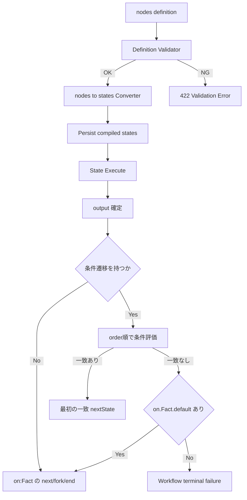

# Design: nodes→states 変換残課題と output 条件遷移

## Overview

本設計は、`nodes` から `states` へ変換する際の残課題を整理し、`Fork/Join` と独立した **output 条件による次 state 選択**を追加するための技術方針を定義する。

## Alignment with Steering Documents

### 技術標準（`tech.md`）

- Core-API / Engine の責務分離を維持し、定義変換と実行時条件評価を混在させない。
- 変換結果は deterministic にし、テストで再現可能にする。

### プロジェクト構成（`structure.md`）

- 定義バリデーションと変換は Definition 系サービスの責務に置く。
- 実行時の遷移選択は Engine 側の state 実行フェーズに閉じる。

## Reuse Analysis

### Reuse Existing Elements

- **既存 nodes→states 変換器**: 基本の state 生成ロジックは再利用し、遷移正規化のみ拡張する。
- **Fork/Join 実行ロジック**: 既存分岐セマンティクスを変更しない。
- **既存バリデーション経路**: 422 応答のエラー契約を再利用する。

### Integration Points

- **Definition 受け付け時**: `on.<Fact>.cases/default` の整合検証を追加する。
- **State 実行完了時**: `output` を入力に `on.<Fact>.cases` を評価して遷移先を解決する。
- **nodes 互換入力**: `nodes.next` と `nodes.edges.to.id`（単一無条件遷移）を同一セマンティクスとして正規化する。

## Architecture

### 変換後モデル（論理）

```text
TransitionCase
- when: ConditionExpression
- next: string?                     // next/fork/end のいずれか
- fork: string[]?
- end: bool
- order: int

FactTransitionExtension
- cases: TransitionCase[]           // 条件付きのみ
- default: TransitionDefinition|string  // 無条件フォールバック（string は next のショートハンド）
```

### 設計原則

- **決定性**: `order` 指定ありを先に `order ASC` で評価し、未指定はその後ろで定義順に評価する。
- **後方互換**: 条件遷移を持たない state は従来の `on: <Fact> -> next/fork/end` と同値。
- **失敗を早期化**: 定義時に検出可能な矛盾（default 重複、遷移先不在）は実行前に拒否する。
- **排他制約**: 同一 `on.<Fact>` では `next/fork/end` と `cases/default` を混在させない。
- **既存 path 互換**: `when.path` は既存の簡易 JSONPath（`$` または `$.seg1.seg2`）に揃える。
- **終端互換**: `states` 形式では複数の `end: true` を許可し、`nodes` 形式では現行互換として `type: end` を 1 つに維持する。
- **終端明示**: `states` 形式では少なくとも 1 つの `end: true` を必須とし、空遷移は許可しない。

## Processing Flow



## Components and Interfaces

### 1) TransitionNormalizer（変換時）

- **目的**: nodes の出辺を `on.<Fact>.cases` と `on.<Fact>.default` に正規化する。
- **入力**: ノードの edge 定義群。
- **出力**: `FactTransitionExtension`。
- **主な検証**:
  - 無条件 edge は 0 または 1 件
  - 条件 edge の `order` 重複可否（初版は可、同値は定義順）
  - 遷移先 state 参照の存在確認

### 2) OutputConditionEvaluator（実行時）

- **目的**: state の `output` から次遷移先を決定する。
- **入力**: `output`, `on.<Fact>.cases`, `on.<Fact>.default`。
- **出力**: `nextState` または失敗。
- **評価規則**:
  1. `order` 指定ありは `order ASC`
  2. `order` 同値同士は定義順
  3. `order` 未指定はすべての `order` 指定あり case の後ろ
  4. `order` 未指定同士は `cases` の記載順
  5. first-match wins
  6. no-match 時は `on.<Fact>.default` へフォールバック

### 3) ValidationPolicy（定義登録時）

- **目的**: 実行時失敗を最小化する事前検査。
- **ルール**:
  - 条件遷移がある `on.<Fact>.cases` には `on.<Fact>.default` を必須化
  - `on.<Fact>` で `cases/default` と `next/fork/end` の混在を禁止
  - `on.<Fact>.default: <StateName>` は `default.next` のショートハンドとして受理
  - `on.<Fact>.default` のオブジェクト形式は `next/fork/end` のいずれか 1 つのみ許可
  - `nodes.next` と単一無条件 `nodes.edges.to.id` が併記される場合は同一値のみ許可
  - `states` 形式の複数 `end: true` は許可する
  - `states` 形式では少なくとも 1 つの `end: true` を要求する
  - `on.<Fact>` と `on.<Fact>.default` のどちらも `next/fork/end` のいずれか 1 つを必須とし、空遷移を禁止する
  - `end: true` と `next/fork` の併記を禁止する
  - `nodes` 形式は `type: end` をちょうど 1 つ要求する
  - 参照 path の基本妥当性（空文字・不正形式）を検査
  - 遷移先 state 不在を検出

## Data Model and Condition Format (MVP)

```text
ConditionExpression
- path: string        // output 内参照（例: $.risk.score）
- op: string          // eq | ne | gt | gte | lt | lte | exists | in | between
- value: unknown?     // exists 以外で使用。in は配列、between は 2 要素配列
```

- `path` は既存と同じ簡易 JSONPath（`$` または `$.seg1.seg2`）のみ許可する。
- `op: in` の `value` はリテラル配列とする（例: `[1, 2, 3]`）。
- `op: between` の `value` は `[min, max]` の 2 要素リテラル配列とする。
- 範囲短縮記法（例: `[1...9]`）はサポートしない。
- `contains`, `notContains`, `startsWith`, `endsWith`, `matches`, `notMatches`, `anyOf`, `allOf`, `noneOf`, `notIn`, `isNull`, `isNotNull`, `isEmpty`, `isNotEmpty`, `before`, `after`, `onOrBefore`, `onOrAfter`, `overlaps`, `intersects` は今回の対象外とする。

## Sample YAML (Draft)

### 1) nodes 定義（入力）

```yaml
version: 1
workflow:
  id: order-approval
  name: Order Approval Workflow
nodes:
  - id: start
    type: start
    label: Start
    next: validate-order

  - id: validate-order
    type: action
    label: Validate Order
    action: order.validate
    input:
      path: $.order
    next: wait-approval

  - id: wait-approval
    type: wait
    label: Wait Approval
    event: approval.completed
    next: route-by-score

  - id: route-by-score
    type: action
    label: Build Route Decision
    action: approval.route
    edges:
      - to: reject-order
        when:
          path: $.policy.blocked
          op: eq
          value: true
        order: 5
      - to: auto-approve
        when:
          path: $.risk.band
          op: in
          value: [1, 2, 3]
        order: 8
      - to: auto-approve
        when:
          path: $.risk.score
          op: between
          value: [0, 30]
        order: 10
      - to: manual-review-fork
        when:
          path: $.risk.score
          op: gt
          value: 30
        order: 20
      - to: manual-review-fork
        default: true

  - id: manual-review-fork
    type: fork
    label: Manual Review Fork
    branches: [review-finance, review-compliance]

  - id: review-finance
    type: action
    label: Review by Finance
    action: review.finance
    input:
      path: $.shared
    next: manual-review-join

  - id: review-compliance
    type: action
    label: Review by Compliance
    action: review.compliance
    input:
      path: $.shared
    next: manual-review-join

  - id: manual-review-join
    type: join
    label: Manual Review Join
    mode: all
    next: finalize-order

  - id: auto-approve
    type: action
    label: Auto Approve
    action: approval.auto
    input:
      path: $.order
    next: workflow-end

  - id: reject-order
    type: action
    label: Reject Order
    action: approval.reject
    input:
      reason: $.policy.reason
      blocked: true
    next: workflow-end

  - id: finalize-order
    type: action
    label: Finalize Order
    action: approval.finalize
    input:
      approvedBy: $.reviewFinance.approver
      complianceChecked: true
    next: workflow-end

  - id: workflow-end
    type: end
    label: End
```

### 2) states 定義（完全例）

```yaml
workflow:
  name: Order Approval Workflow

states:
  Start:
    on:
      Completed:
        next: ValidateOrder

  ValidateOrder:
    action: order.validate
    input:
      path: $.order
    on:
      Completed:
        next: WaitApproval

  WaitApproval:
    wait:
      event: approval.completed
    on:
      Completed:
        next: RouteByScore

  RouteByScore:
    action: approval.route
    on:
      Completed:
        cases:
          - order: 5
            when:
              path: $.policy.blocked
              op: eq
              value: true
            next: RejectOrder
          - order: 8
            when:
              path: $.risk.band
              op: in
              value: [1, 2, 3]
            next: AutoApprove
          - order: 10
            when:
              path: $.risk.score
              op: between
              value: [0, 30]
            next: AutoApprove
          - order: 20
            when:
              path: $.risk.score
              op: gt
              value: 30
            next: ManualReviewFork
        default: ManualReviewFork

  ManualReviewFork:
    on:
      Completed:
        fork: [ReviewFinance, ReviewCompliance]

  ReviewFinance:
    action: review.finance
    input:
      path: $.shared
    on:
      Completed:
        next: ManualReviewJoin

  ReviewCompliance:
    action: review.compliance
    input:
      path: $.shared
    on:
      Completed:
        next: ManualReviewJoin

  ManualReviewJoin:
    join:
      allOf: [ReviewFinance, ReviewCompliance]
    on:
      Joined:
        next: FinalizeOrder

  AutoApprove:
    action: approval.auto
    input:
      path: $.order
    on:
      Completed:
        end: true

  RejectOrder:
    action: approval.reject
    input:
      reason: $.policy.reason
      blocked: true
    on:
      Completed:
        end: true

  FinalizeOrder:
    action: approval.finalize
    input:
      approvedBy: $.reviewFinance.approver
      complianceChecked: true
    on:
      Completed:
        end: true
```

### 3) サンプルの意図

- `nodes` 形式のサンプルは `start` / `action` / `wait` / `fork` / `join` / `end` の全ノード種別を含む。
- `nodes` 形式のサンプルは `next`、`edges`、`when.path/op/value`、`order`、`default`、`input`、`event`、`branches`、`mode` を全て含む。
- `states` 形式のサンプルは `action` / `wait` / `join` / `input` / `next` / `fork` / `end` / `cases` / `default` を全て含む。
- `RouteByScore` は `eq` / `in` / `between` / `gt` と `default` を組み合わせた条件遷移の完全例である。
- `states` 形式では `AutoApprove` / `RejectOrder` / `FinalizeOrder` の複数終端を許可する一方、`nodes` 形式では単一の `workflow-end` ノードへ集約する。

## Error Handling

1. **定義時矛盾**
   - **検知**: `on.<Fact>.default` 重複、遷移先不在、`cases` ありで `default` 不在、`next/fork/end` と `cases/default` の混在、空遷移、`end: true` と `next/fork` の併記、`nodes` 形式の `type: end` 個数不正、`states` 形式で終端不在
   - **対処**: 422 で拒否し、どの state で失敗したかを返す
2. **実行時 no-match かつ default 不在**
   - **検知**: evaluator 結果が unresolved
   - **対処**: terminal failure として終了し、監視用ログを出力
3. **条件評価不能（型不整合・参照不能）**
   - **検知**: evaluator 内で比較不能
   - **対処**: 当該条件を false 扱い、警告ログを出力して次条件へ進む

## Error Visibility Policy

- **Engine**: 既存のエラー配列返却方針を維持し、条件評価エラーも同じ形式で返す。
- **API**: デバッグ用途では、評価対象 case、採用 case、no-match 理由を返却可能とする。
- **UI**: API の評価結果を表示し、UI 側で条件再評価は行わない。

### 実装同期メモ（T9/T10）

- **Engine 実装**: `ExecutionGraph` ノードに `ConditionRouting` を保持し、`OutputConditionEvaluator.EvaluateDetailed` の結果（`resolution`, `matchedCaseIndex`, `caseEvaluations`, `evaluationErrors`）を `ExportExecutionGraph` に含める。
- **API 実装**: `DefinitionCompilerService` の `compiledJson` に `conditionalTransitions` と `stateInputs` を含める。
- **API/UI 境界実装**: `WorkflowViewMapper` はグラフ JSON の `conditionRouting` を `WorkflowViewNodeDto.ConditionRouting` へ透過し、UI は `buildWorkflowView` でその値を再評価せず保持する。
- **命名ポリシー**: `ExecutionGraph.ExportJson` と `DefinitionCompilerService` のデバッグ JSON は `camelCase` で統一済み。`WorkflowViewMapper` も camelCase 契約の受け口へ移行済み。

## Test Strategy

### Unit Tests

- TransitionNormalizer の変換結果（条件 edge / 無条件 edge / mixed）を検証する。
- OutputConditionEvaluator の `first-match wins`、`default`、型不整合時 false 扱いを検証する。

### Integration Tests

- 定義登録 API で 422 になるケース（default 不在、遷移先不在）を検証する。
- 条件遷移なし定義の回帰（従来の next と同一挙動）を検証する。

### Regression Focus

- Fork/Join の既存実行フローが変更されないことを確認する。

## Open Decisions for Next Discussion

- 現時点で未確定事項なし（path 記法、order 未指定時、可観測性方針は確定）。

## Documentation Update Timing

- `docs/` 配下（例: `docs/core-engine-definition-spec.md`）への契約反映は、実装完了とテスト確認後の同期タスクで実施する。
- 本 spec フェーズでは `.spec-workflow/specs/` 内の要件・設計文書を正として議論を進める。
