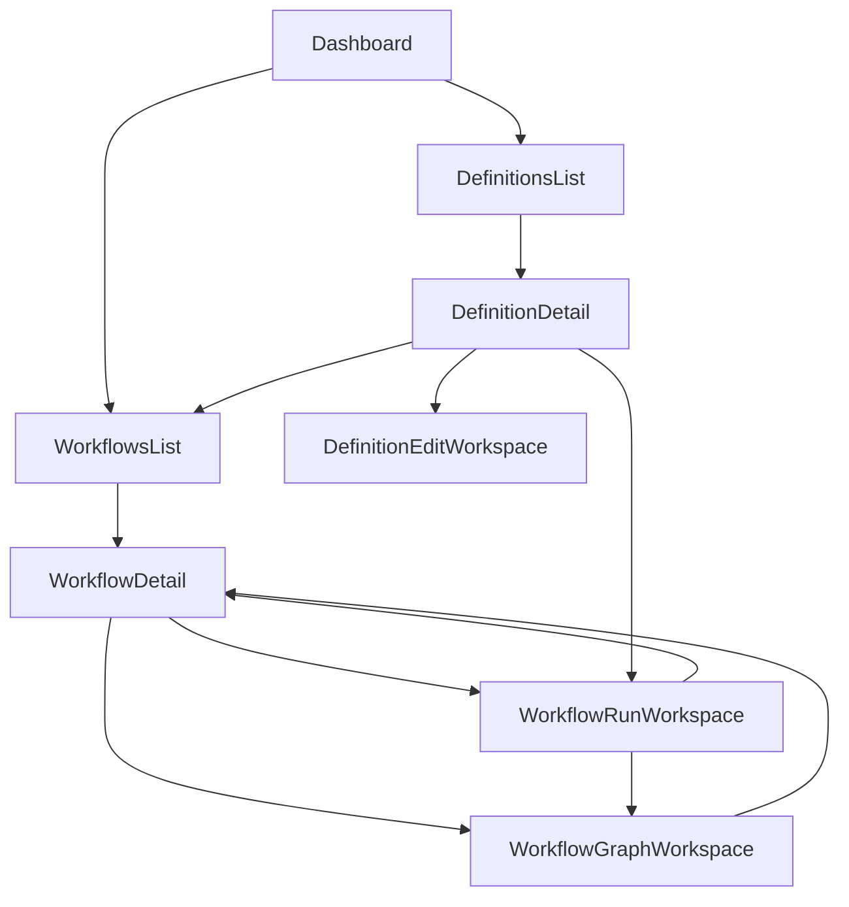
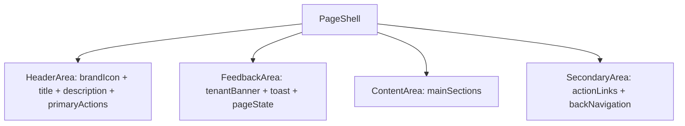
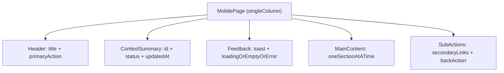
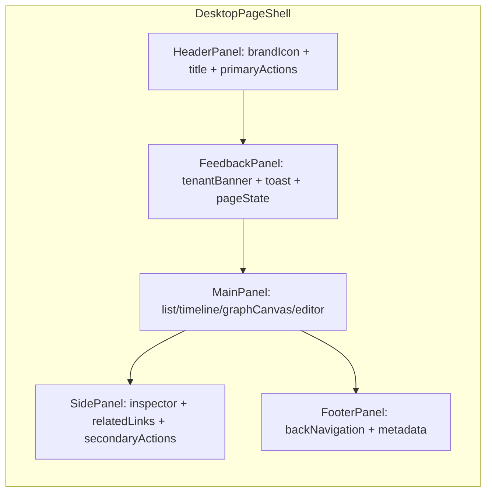
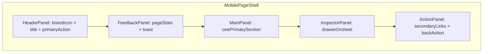

# Design: UIデザイン共通化・UX強化

## Overview

本設計は、既存のハイブリッド遷移（ハブ + 専用画面分離）を維持したまま、UI 骨格・状態表示・導線ルールを共通化する。
実装は共通コンポーネントを導入し、ハブ画面から専用画面へ段階適用する。

## Alignment with Steering Documents

### 技術標準（`tech.md`）

- Next.js App Router 構成に従い、`app/` 配下の各 page client を共通レイアウト部品で統一する。
- UI 側は API 契約を再解釈せず、表示責務に集中する。
- 大きな画面をコンテナ + 表示コンポーネントに分離し、責務過密を避ける。

### プロジェクト構成（`structure.md`）

- 共通部品は `services/ui/app/components/layout/` と `services/ui/app/components/common/` に配置する。
- 画面固有ロジックは各 route 配下に残し、共通化対象だけを切り出す。
- `playground` は本 spec の対象外とし、導線共通化は新 UI ルートに限定する。

## Reuse Analysis

### Reuse Existing Elements

- **`services/ui/app/layout.tsx`**: ルートコンテナ幅・背景設定の基盤として再利用する。
- **`services/ui/public/brand/logo-original.png`**: 共通ヘッダーに表示するブランドアイコンの原典として再利用する。
- **`services/ui/app/components/Toast.tsx`**: 成功/失敗通知の共通部品として利用する。
- **`services/ui/app/components/execution/TenantMissingBanner.tsx`**: 共通フィードバック領域に統合する。
- **`services/ui/app/components/execution/ExecutionDashboard.tsx`**: run/detail/graph の既存差分を吸収する対象として再利用する。
- **`services/ui/app/lib/statusStyle.ts`**: StatusBadge 実装で状態色の単一ルールとして利用する。

### Integration Points

- **Hub Pages**: `/dashboard`, `/definitions`, `/workflows`
- **Detail / Workspace Pages**: `/workflows/[workflowId]`, `/workflows/[workflowId]/run`, `/workflows/[workflowId]/graph`, `/definitions/[definitionId]/edit`
- **Data / API**: `GET /v1/definitions`, `GET /v1/workflows`, `GET /v1/workflows/{id}`, `GET /v1/workflows/{id}/graph`, `POST /v1/workflows`, `POST /v1/workflows/{id}/events`

## Architecture

### Page Topology

```text
/dashboard                  -> Hub
/definitions                -> Hub
/workflows                  -> Hub
/workflows/[workflowId]     -> Detail
/workflows/[workflowId]/run -> Workspace
/workflows/[workflowId]/graph -> Workspace
/definitions/[definitionId]/edit -> Workspace
```

### Processing Flow



### Layout Architecture





### Layout Panel Images





## Components and Interfaces

### 1) PageShell

- **目的**: 全画面の共通骨格（ヘッダー + 本文 + 副導線）を統一する。
- **公開インターフェース**: `title`, `description`, `primaryActions`, `children`, `secondaryActions`。
- **依存先**: なし（レイアウトのみ）。
- **再利用要素**: `app/layout.tsx` のコンテナ規約。

### 1.1) GlobalHeader（PageShell 内）

- **目的**: ブランドアイコンと画面タイトルを共通表示し、画面間のブランド一貫性を担保する。
- **公開インターフェース**: `iconSrc`, `productName`, `title`, `primaryActions`。
- **依存先**: Next.js `Image`（または同等の画像表示手段）。
- **再利用要素**: `services/ui/public/brand/icon-mark.png`。

### 1.2) Tone Tokens（PageShell / globals）

- **目的**: ヘッダー背景・本文背景・境界色・アクセント色をトークン化し、全画面で同一トーンを適用する。
- **公開インターフェース**: `--tone-header-bg`, `--tone-surface-bg`, `--tone-border`, `--tone-accent`（名称は実装時に調整可）。
- **依存先**: `globals.css`, Tailwind utility class。
- **再利用要素**: `logo-original.png` の配色（ダークネイビー + ブルー/グリーン系）。

### 2) PageState

- **目的**: Loading/Empty/Error 表示の統一。
- **公開インターフェース**: `state: "loading" | "empty" | "error"`, `message`, `retryAction`。
- **依存先**: 必要時のみ retry callback。
- **再利用要素**: 既存画面の読み込み/空状態/エラー文言。

### 3) ActionLinkGroup

- **目的**: 一覧へ戻る・関連画面へ進む導線の配置とラベル統一。
- **公開インターフェース**: `links[]`（`label`, `href`, `priority`）。
- **依存先**: Next.js `Link`。
- **再利用要素**: 各画面ヘッダーの既存リンク群。

### 4) StatusBadge

- **目的**: 状態表示の見た目と意味を共通化する。
- **公開インターフェース**: `status`。
- **依存先**: `statusStyle`。
- **再利用要素**: Dashboard/Workflow 系画面での既存ステータス表示。

## Data Model

### PageLayoutModel

```text
PageLayoutModel
- title: string
- description: string?
- primaryActions: ActionItem[]
- secondaryActions: ActionItem[]
- feedbackState:
  - kind: "loading" | "empty" | "error" | "none"
  - message: string?
```

### ActionItem

```text
ActionItem
- label: string
- href: string
- priority: "primary" | "secondary"
```

### BrandToneModel

```text
BrandToneModel
- header:
  - background: string
  - foreground: string
  - border: string
- page:
  - background: string
  - surface: string
- accent:
  - primary: string
  - secondary: string
```

## Error Handling

1. **状態表示ルールの不整合**
   - **検知**: 画面ごとに loading/empty/error の表示位置や文言が異なる。
   - **対処**: `PageState` 適用を優先し、個別実装を置換する。
   - **ユーザー影響**: 状態の解釈ミスを抑止できる。
2. **導線ラベルの揺れ**
   - **検知**: 同じ遷移意図で異なるラベルが使われる。
   - **対処**: `ActionLinkGroup` のラベル規約で統制する。
   - **ユーザー影響**: 画面移動の予測可能性が向上する。
3. **SP で情報過多**
   - **検知**: 折り返しや縦長化で主要情報が埋もれる。
   - **対処**: 単一カラム順序規約と Drawer/Sheet への分離を適用する。
   - **ユーザー影響**: 主要操作へ短手数で到達できる。
4. **トーン調整による可読性低下**
   - **検知**: 背景と文字/CTA のコントラストが不足し、視認性が下がる。
   - **対処**: トーン適用後にヘッダー/本文/CTA のコントラストを検証し、必要ならトークン値を再調整する。
   - **ユーザー影響**: ブランド統一と可読性を両立できる。

## Test Strategy

### Unit Tests

- `PageState` の各状態表示（loading/empty/error）を検証する。
- `StatusBadge` の表示ルールを status ごとに検証する。
- `GlobalHeader` でアイコン表示とタイトル表示が崩れないことを検証する。

### Integration Tests

- Hub/Detail/Workspace の主要画面で共通ヘッダーと導線の整合を検証する。
- 主要導線（一覧 -> 詳細 -> Run/Graph/Edit）のラベルと配置が統一されていることを検証する。
- ブランドトーン適用後も主要 CTA と本文テキストの可読性が維持されることを検証する。

### E2E Tests

- SP/PC の主要導線で、期待された表示順序と CTA 優先度が維持されることを確認する。
- `playground` 非依存でも主要運用フローが完結することを確認する。

## Fixed Decisions

- 共通化の優先軸は「一貫性」とする。
- 共通化対象はハブ画面 + 専用画面（`playground` 除外）とする。
- SP は単一カラム順序規約（Header -> ContextSummary -> Feedback -> Main -> SubActions）を採用する。
- 共通ヘッダーにブランドアイコンを表示し、全画面の配色トーンは `logo-original.png` に整合する方向で統一する。
