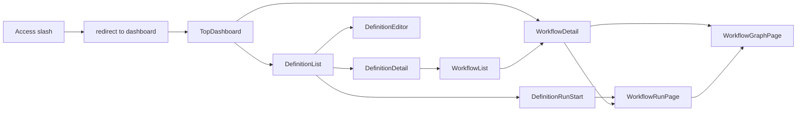

# Design: UIハイブリッド刷新（一覧・詳細ハブ + 専用画面分離）

## Overview

本設計は、`Definition` と `Workflow` のモデル関係に合わせて、UIの情報設計をハイブリッド型へ刷新する。
`DefinitionList/Detail` と `WorkflowList/Detail` を参照ハブとし、`DefinitionEditor`、`WorkflowRunPage`、`WorkflowGraphPage` を専用画面として分離する。
また、TOP導線は `/` から `app/page.tsx` の `redirect()` で `/dashboard` へ集約する。

## Alignment with Steering Documents

### 技術標準（`tech.md`）

- Next.js App Router の責務に合わせ、ルーティングは `app/` 配下で明示的に管理する。
- UIは Core-API 契約を正とし、ドメインロジックの再実装を避ける。
- 複雑画面はコンテナと表示コンポーネントを分離して責務過密を防ぐ。

### プロジェクト構成（`structure.md`）

- 画面ルートは `services/ui/app/*/page.tsx` に集約する。
- API呼び出しは `services/ui/app/lib/api.ts` と feature hooks に寄せる。
- グラフ表示は既存 `features/graph` と `components/nodes` を再利用し、専用画面化で責務を分離する。

## Reuse Analysis

### Reuse Existing Elements

- **`services/ui/app/components/execution/ExecutionDashboard.tsx`**: 実行関連表示の再利用元。段階的に run/detail 用へ責務分割して再利用する。
- **`services/ui/app/features/execution/useExecution.ts`**: Workflow詳細取得の基盤として継続利用し、URL主導化に合わせて入力契約を整理する。
- **`services/ui/app/features/nodes/useNodeCommands.ts`**: Resume 操作を run 専用画面へ移送して再利用する。
- **`services/ui/app/features/graph/useGraphData.ts`**: GraphPage での状態同期に再利用する。
- **`services/ui/app/api/core/[...path]/route.ts`**: Core-API プロキシ経路として流用し、新画面群でも同一経路を使用する。

### Integration Points

- **Core API**: `GET /v1/definitions`, `GET /v1/workflows`, `GET /v1/workflows/{id}`, `GET /v1/workflows/{id}/graph`, `POST /v1/workflows`, `POST /v1/workflows/{id}/events`。
- **Route migration**: 既存 `/playground` と `/playground/run/[displayId]` から新URL群への案内導線を提供する。
- **Status updates**: 実行更新通知は補助とし、最終状態はGET再取得を正とする。

## Architecture

### Route Topology

```text
/                      -> redirect("/dashboard")
/dashboard             -> TopDashboardPage
/definitions           -> DefinitionListPage
/definitions/[id]      -> DefinitionDetailPage
/definitions/[id]/edit -> DefinitionEditorPage
/definitions/[id]/run  -> DefinitionRunStartPage
/workflows             -> WorkflowListPage
/workflows/[id]        -> WorkflowDetailPage
/workflows/[id]/run    -> WorkflowRunPage
/workflows/[id]/graph  -> WorkflowGraphPage
```

### Module Design Principles

- **ハブ優先**: 一覧/詳細を先に確立し、専用画面はハブ経由で遷移させる。
- **URL主導**: 詳細対象はURLで確定し、入力フォーム依存を廃止する。
- **責務分離**: 実行操作、グラフ表示、定義編集を独立させる。
- **互換維持**: 移行期間は旧導線を残し、ユーザーの学習コストを抑える。

## Processing Flow



## Components and Interfaces

### 1) RootRedirectPage

- **目的**: `/` へのアクセスを `/dashboard` へ統一する。
- **公開インターフェース**: `app/page.tsx` で `redirect("/dashboard")` を実行する。
- **依存先**: `next/navigation` の `redirect`。
- **再利用要素**: なし。

### 2) TopDashboardPage

- **目的**: 直近WorkflowDetail 10件の表示と主要導線提供。
- **公開インターフェース**: `/dashboard`。
- **依存先**: `GET /v1/workflows`（limit 10）、既存カード/バナーUI。
- **再利用要素**: `ExecutionStatusBanner`, `statusStyle`。

### 3) DefinitionHubPages

- **目的**: 定義起点の参照・編集・実行開始導線を提供。
- **公開インターフェース**: `/definitions`, `/definitions/[id]`, `/definitions/[id]/edit`, `/definitions/[id]/run`。
- **依存先**: `GET /v1/definitions`, `POST /v1/workflows`。
- **再利用要素**: `playground/defaultYaml.ts`（初期値流用候補）、`lib/api.ts`。

### 4) WorkflowHubPages

- **目的**: 実行一覧と詳細のURL主導表示。
- **公開インターフェース**: `/workflows`, `/workflows/[id]`。
- **依存先**: `useExecution`, `workflowView`。
- **再利用要素**: `ExecutionHeader`（ID入力部は再設計）、`ExecutionTimeline`。

### 5) WorkflowRunAndGraphPages

- **目的**: 実行操作とグラフ観測を専用画面で提供。
- **公開インターフェース**: `/workflows/[id]/run`, `/workflows/[id]/graph`。
- **依存先**: `useNodeCommands`, `useGraphData`, `NodeGraphView`。
- **再利用要素**: `NodeDetail`, `GraphLegend`, `ExecutionComparisonBar`。

## Data Model

### RouteContext

```text
RouteContext
- definitionId: string?
- workflowId: string?
- source: "dashboard" | "definitions" | "workflows" | "playground"
- filters:
  - status: string?
  - name: string?
```

### DashboardWorkflowSummary

```text
DashboardWorkflowSummary
- workflowId: string
- displayId: string
- workflowName: string
- status: "Running" | "Completed" | "Failed" | "Cancelled"
- updatedAt: string
- definitionId: string?
```

## Error Handling

1. **存在しないID参照**
   - **検知**: `/definitions/[id]` や `/workflows/[id]` の取得で 404。
   - **対処**: not-found 相当UIへ遷移し、一覧への復帰リンクを表示。
   - **ユーザー影響**: 画面が壊れず復帰可能。
2. **実行操作競合（409）**
   - **検知**: Cancel/Resume/Event 実行で競合応答。
   - **対処**: トースト通知 + 状態再取得。
   - **ユーザー影響**: 操作失敗理由を理解できる。
3. **入力不正（422）**
   - **検知**: DefinitionEditor 保存/検証で 422。
   - **対処**: フィールドまたはブロック単位でエラー表示。
   - **ユーザー影響**: 修正箇所が即時に特定できる。

## Test Strategy

### Unit Tests

- `redirect()` による `/` から `/dashboard` への遷移を固定化する。
- ルートパラメータから対象IDを解決する hooks/util を検証する。
- 一覧フィルタ状態の復元ロジックを検証する。

### Integration Tests

- `DefinitionList -> DefinitionDetail -> WorkflowList -> WorkflowDetail -> WorkflowGraphPage` の導線を検証する。
- `DefinitionList -> DefinitionEditor` の導線と保存エラー表示を検証する。
- `DefinitionList -> WorkflowRunPage -> WorkflowGraphPage` の新規開始導線を検証する。

### E2E Tests

- `/` 直アクセス時に `/dashboard` へ遷移すること。
- ダッシュボードの直近10件から詳細へ遷移できること。
- 旧導線から新導線へ迷わず遷移できること。

## Fixed Decisions

- パス命名は `/dashboard` で最終固定とする。
- DefinitionEditor の検証APIは MVP では既存APIで完結し、専用validateエンドポイント追加は次回以降の積み残しとする。
- 一覧フィルタ状態はURLクエリで管理する方針で固定する。
