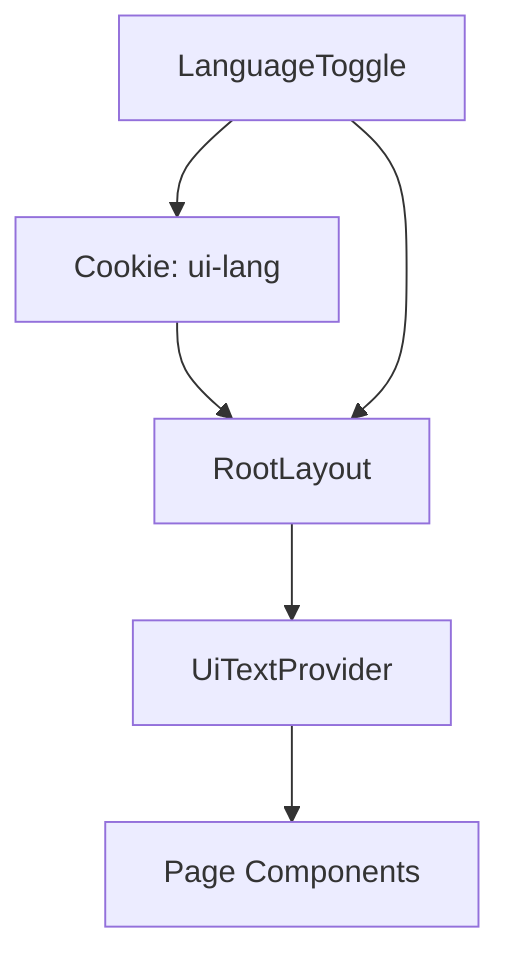

# Design: UI言語モード切替（日本語 / 英語）

## Overview

本設計は、既存の `uiText` 参照基盤を拡張し、`ja` / `en` の文言辞書を切り替える仕組みを導入する。
言語決定はレイアウト層で行い、画面コンポーネントは共通の取得 API（Provider / Hook）経由で文言を参照する。

## Alignment with Steering Documents

### 技術標準（`tech.md`）

- Next.js App Router の構造を維持し、`app/layout.tsx` で共通設定を適用する。
- UI 表示責務で完結させ、Core-API の契約は変更しない。
- 画面コンポーネントへの変更は最小限にし、文言取得口を共通化する。

### プロジェクト構成（`structure.md`）

- 言語辞書は `services/ui/app/lib/` に配置し、UI 共通部品として扱う。
- ヘッダーの切替 UI は `services/ui/app/components/layout/` へ配置する。
- 既存画面は `uiText` 直接参照から `useUiText()` 参照へ段階移行する。

## Reuse Analysis

### Reuse Existing Elements

- **`services/ui/app/lib/uiText.ts`**: 現行日本語辞書を `ja` 辞書の基礎として再利用する。
- **`services/ui/app/layout.tsx`**: 共通ヘッダーに言語切替 UI を追加する基盤として再利用する。
- **`services/ui/app/components/layout/PageShell.tsx`**: ページ骨格は維持し、文言供給のみ差し替える。

### Integration Points

- **Header / Layout**: `services/ui/app/layout.tsx`
- **Text Provider**: `services/ui/app/lib/uiTextContext.tsx`（新規）
- **Dictionary**: `services/ui/app/lib/uiText.ja.ts` / `services/ui/app/lib/uiText.en.ts`（新規）
- **Locale Utility**: `services/ui/app/lib/i18n.ts`（新規）
- **Main Pages**: Dashboard / Definitions / Workflows / Workflow Detail 系ページ

## Architecture

### Data Flow

### Locale Resolution Rules

1. `ui-lang` Cookie を読み込み、`ja` または `en` のみ許可する。
2. 未設定 / 不正値の場合は `ja` を採用する。
3. 採用ロケールを `html lang` と `UiTextProvider` の両方に反映する。

### Component Responsibilities

#### 1) `i18n.ts`（新規）

- **目的**: ロケール型定義と解決関数を提供する。
- **公開 I/F**:
  - `type Locale = "ja" | "en"`
  - `resolveLocale(raw: string | undefined): Locale`
  - `getDateTimeLocale(locale: Locale): string`

#### 2) `uiText` 辞書分割（新規）

- **目的**: 言語ごとの辞書を分離し、キー整合を型で担保する。
- **公開 I/F**:
  - `uiTextJa: UiText`
  - `uiTextEn: UiText`
  - `getUiText(locale: Locale): UiText`

#### 3) `UiTextProvider` + `useUiText()`（新規）

- **目的**: 各 Client Component に現在ロケールの文言を供給する。
- **公開 I/F**:
  - `<UiTextProvider locale uiText>{children}</UiTextProvider>`
  - `useUiText(): UiText`
  - `useLocale(): Locale`

#### 4) `LanguageToggle`（新規）

- **目的**: 共通ヘッダーで言語を切り替える。
- **動作**:
  - ボタン押下で `ui-lang` Cookie を更新
  - `router.refresh()` で同一ページを再描画
  - 現在言語を視覚的に強調表示

## Migration Plan

1. `uiText` の型定義を共通化し、`ja` / `en` 辞書を作成する。
2. `layout.tsx` で locale を解決し、`UiTextProvider` を適用する。
3. ヘッダーへ `LanguageToggle` を追加する。
4. 主要画面（Dashboard / Definitions / Workflows）から `useUiText()` へ置換する。
5. 日時表示関数をロケール対応に変更する。
6. 残り画面へ段階展開する。

## Error Handling

1. **不正な Cookie 値**
   - **検知**: `resolveLocale` が `ja` / `en` 以外を受け取る。
   - **対処**: 既定値 `ja` を返す。
2. **辞書キー欠落**
   - **検知**: `UiText` 型との不一致で TypeScript エラー。
   - **対処**: 欠落キーを辞書へ補完する。
3. **Provider 未適用で Hook 利用**
   - **検知**: `useUiText()` 呼び出し時に context が未設定。
   - **対処**: 開発時エラーを投げ、適用漏れを早期発見する。

## Test Strategy

### Unit Tests

- `resolveLocale` が不正値を `ja` へフォールバックすることを検証する。
- `getUiText(locale)` が `ja` / `en` で正しい辞書を返すことを検証する。
- `LanguageToggle` のクリックで Cookie 更新処理が呼ばれることを検証する。

### Integration Tests

- `layout.tsx` で `html lang` がロケールに一致することを検証する。
- Dashboard / Definitions / Workflows で言語切替後の文言更新を検証する。
- 日時表示がロケールに応じて変化することを検証する。

### E2E Tests

- 日本語表示で主要導線を操作できることを確認する。
- 英語表示へ切替後も同じ導線を問題なく操作できることを確認する。
- リロード・画面遷移後も選択言語が保持されることを確認する。

## Fixed Decisions

- 初期既定言語は `ja` とする。
- 言語設定保持には Cookie を利用する。
- 共通ヘッダーで言語切替操作を提供する。
- 文言参照は `useUiText()` へ統一する。
