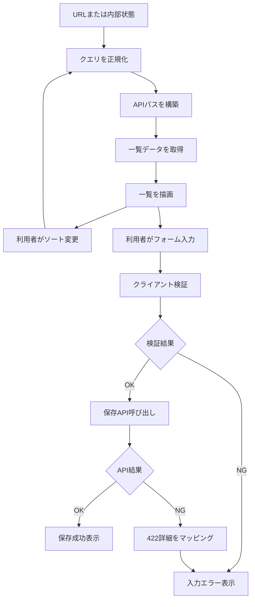
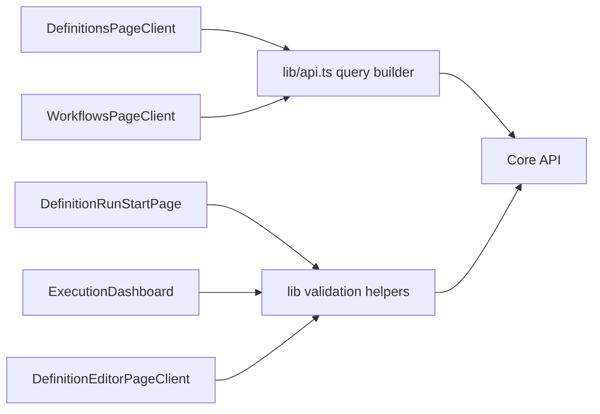
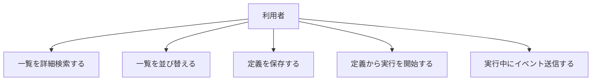

# 設計書

## 概要

一覧検索の詳細化、列ソート追加、入力フォーム検証強化をUI横断で実装する。  
`Definitions` と `Workflows` で異なる状態管理方式を揃え、クエリ正規化と入力制約を共通化する。

## ステアリング文書との整合

### 技術標準（`tech.md`）

- 既存の Next.js / React / TypeScript 構成に準拠し、画面ロジックは関数コンポーネント内で管理する。
- API通信は既存 `api.ts` のヘルパーを拡張して実装する。

### プロジェクト構成（`structure.md`）

- 画面ごとのUIは `services/ui/app/*PageClient.tsx` に保持する。
- 共通のクエリ・検証ロジックは `services/ui/app/lib` へ集約する。

## 既存資産の再利用分析

既存の一覧取得パターンと422エラー表示パターンを再利用し、重複実装を避ける。

### 再利用する既存要素

- **`buildWorkflowsListPath`**: クエリ組み立ての基盤として拡張する。
- **`readListQuery`（Workflows）**: 正規化方針の起点として共通化する。
- **`extractApiValidationDetails`（DefinitionEditor）**: 422詳細表示の共通化ベースとして利用する。

### 統合ポイント

- **一覧API (`/definitions`, `/workflows`)**: 検索/ソートパラメータを安全に付与する。
- **保存API (`/definitions`)**: 422 `details` をフィールド別に受けてUIへ反映する。

## アーキテクチャ

画面コンポーネントから直接クエリ文字列を組み立てず、`lib` の正規化・組み立て関数を経由する。  
フォーム検証は「クライアント事前検証 -> API最終検証」の二段構えに統一する。

### モジュール設計の原則

- **単一責任**: 検索条件正規化、ソート定義、入力検証を分離する。
- **コンポーネント分離**: 入力コントロールと表示要素を分割して再利用しやすくする。
- **レイヤー分離**: APIパス生成を `lib/api.ts` に集約し、UI層との責務境界を守る。
- **ユーティリティ分割**: 文字種・長さ・危険文字判定を小関数で構成する。

## 処理フロー図（重要）

- 検索・ソート・保存時バリデーションの処理順を統一する。



## コンポーネント図（本仕様）



## ユースケース図（本仕様）



## コンポーネントとインターフェース

### クエリ正規化ユーティリティ

- **目的**: 検索条件/ソート条件の型安全な正規化
- **公開インターフェース**: `readListQuery`, `buildListPath` 系関数
- **依存先**: `URLSearchParams`
- **再利用要素**: 既存 `buildWorkflowsListPath`

### 入力検証ユーティリティ

- **目的**: フォームの文字種・長さ・危険文字チェック
- **公開インターフェース**: `validateDefinitionName` などの検証関数
- **依存先**: 文字列ユーティリティ
- **再利用要素**: 既存の422エラー抽出ロジック

## データモデル

### 一覧クエリモデル

```text
ListQuery
- limit: number
- offset: number
- name?: string
- definitionId?: string
- status?: string
- sortBy?: string
- sortOrder?: "asc" | "desc"
```

### フォーム検証結果モデル

```text
ValidationResult
- isValid: boolean
- fieldErrors: Record<string, string[]>
- globalErrors: string[]
```

## フォーム項目別の入力制約一覧

### 一覧/実行フォームの制約

| 画面 | 項目 | 必須 | 文字数上限 | 文字種・形式 | 禁止/補正 | 根拠 |
| --- | --- | --- | --- | --- | --- | --- |
| Definitions 一覧 | `name`（検索） | 任意 | 100文字 | `^[A-Za-z0-9._-]{0,100}$`（半角英数字と `-` `_` `.` のみ） | 前後trim、許可外文字はエラー表示（自動変換しない） | 検索語を識別子ベースに限定し、インジェクション・ログ汚染・曖昧検索負荷を抑える |
| Workflows 一覧 | `name`（検索） | 任意 | 100文字 | `^[A-Za-z0-9._-]{0,100}$`（半角英数字と `-` `_` `.` のみ） | 前後trim、許可外文字はエラー表示（自動変換しない） | Definitions 一覧と同一方針で一覧検索の入力面を統一する |
| Workflows 一覧 | `definitionId`（フィルタ） | 任意 | 80文字 | `A-Za-z0-9_-`（必要に応じて `:` を許可） | 許可外文字はエラー表示（自動変換しない） | ID照合の曖昧一致を避け、意図しないヒットを防ぐ |
| Workflows 一覧 | `status`（select） | 任意 | - | 列挙値のみ（`Running` / `Completed` / `Cancelled` / `Failed`） | 列挙外は既定（未指定）へフォールバック | クエリ改ざん耐性とAPI契約整合のため |
| Definition 実行開始 | `workflowInput`（JSON） | 任意 | **65536バイト**（UTF-8。通称64KiB） | JSON構文として有効であること | 解析失敗時は送信不可、エラー表示 | API呼び出し失敗の早期防止とDoS的な過大入力を抑止。文字数は符号化に依存し、ASCIIのみなら最大65536文字、多バイト文字ではそれ未満になる |
| Workflow 実行（Run） | `eventName`（イベント送信） | 必須（送信時） | 64文字 | `^[A-Za-z][A-Za-z0-9._-]*$` | 前後trim、空文字は送信不可、許可外文字はエラー表示 | イベント名を識別子として安定運用し、監査・再現性・誤送信防止を担保 |

### 編集フォームの制約

| 画面 | 項目 | 必須 | 文字数上限 | 文字種・形式 | 禁止/補正 | 根拠 |
| --- | --- | --- | --- | --- | --- | --- |
| Definition エディタ | `name` | 必須 | 100文字 | `^[A-Za-z][A-Za-z0-9._-]{0,99}$`（半角英字始まり、半角英数字と `.` `-` `_` のみ） | 前後trim、許可外文字はエラー表示（自動変換しない） | 機械可読な命名規則を統一し、検索性・監査性・API整合を高める |
| Definition エディタ | `yaml` | 必須 | 256KB | YAML構文として有効であること（既存 lint 検証に準拠） | 空文字不可、NUL文字禁止、lintエラー時は保存不可 | 構文不正による実行失敗を未然に防ぎ、過大入力での性能劣化を避ける |

### 制約決定の共通根拠

1. **セキュリティ**: 制御文字・不正フォーマットを入口で排除し、インジェクション/ログ汚染リスクを下げる。  
2. **可用性**: 上限サイズを設け、過大入力によるUIフリーズやAPI負荷増大を防ぐ。  
3. **運用性**: イベント名・ID系は機械可読な制約にして、調査・再実行・監査を容易にする。  
4. **整合性**: クライアント検証は早期フィードバック、最終判定はAPI 422で統一する。

### 関連APIのDBスキーマ型・制約一覧

| 対象入力項目 | 関連API | 主な永続化先（テーブル.カラム） | DB型 | DB上の長さ制限 | 備考 |
| --- | --- | --- | --- | --- | --- |
| Definitions 一覧 `name`（検索） | `GET /definitions?name=...` | `workflow_definitions.name` | `character varying(512)` | **512文字** | UIの100文字制限はDB上限より厳しめ |
| Workflows 一覧 `name`（検索） | `GET /workflows?name=...` | （検索条件として利用。専用保存なし） | - | - | 参照先の実体は `display_ids.display_id`（`varchar(10)`）または `workflows.workflow_id`（UUID） |
| Workflows 一覧 `definitionId`（フィルタ） | `GET /workflows?definitionId=...` | （検索条件として利用。専用保存なし） | - | - | 解決先は `workflow_definitions.definition_id` / `display_ids.display_id` |
| Workflows 一覧 `status` | `GET /workflows?status=...` | `workflows.status` | `character varying(64)` | **64文字** | 列挙値運用（`Running`/`Completed`/`Cancelled`/`Failed`） |
| Definition 実行開始 `workflowInput`（JSON） | `POST /workflows` | `execution_graph_snapshots.graph_json` | `text` | **実質無制限（DB定義上）** | DB側は上限未定義。UIの65536バイト制限はアプリ都合の防御線 |
| Workflow 実行 `eventName` | `POST /workflows/{id}/events` | `event_store.type`, `workflow_events.type` | `character varying(128)` | **128文字** | `eventName` そのものは type に反映される設計前提 |
| Workflow 実行 イベントpayload | `POST /workflows/{id}/events` | `event_store.payload_json`, `workflow_events.payload_json` | `text` | **実質無制限（DB定義上）** | JSON文字列の長さ制約はDB側にない |
| Definition エディタ `name` | `POST /definitions` | `workflow_definitions.name` | `character varying(512)` | **512文字** | UIの100文字制限はDB上限より厳しめ |
| Definition エディタ `yaml` | `POST /definitions` | `workflow_definitions.source_yaml` | `text` | **実質無制限（DB定義上）** | UIの200KB制限はアプリ都合の防御線 |
| Definition エディタ コンパイル結果 | `POST /definitions` | `workflow_definitions.compiled_json` | `text` | **実質無制限（DB定義上）** | コンパイル後JSONはDB側でサイズ制限なし |

注記:

- 本一覧のDB型・制約は `api/Statevia.Core.Api/Migrations/001_InitialCreate.cs` と `api/Statevia.Core.Api/Migrations/002_AddCommandDedupTable.cs` を根拠とする。  
- `text` はマイグレーション上で長さ未指定のため、上限管理は主にアプリ層（UI/APIバリデーション）で行う前提。

## エラーハンドリング

### エラーシナリオ

1. **無効な検索/ソート条件**
   - **対処方法**: 正規化時に既定値へフォールバックする
   - **ユーザー影響**: 安全な既定一覧が表示される

2. **フォーム入力不正（クライアント）**
   - **対処方法**: 保存前に入力をブロックし、フィールド近傍に理由を表示する
   - **ユーザー影響**: API呼び出し前に修正可能になる

3. **フォーム入力不正（API 422）**
   - **対処方法**: `details` をフィールド別に再マッピングして表示する
   - **ユーザー影響**: サーバー要件に即した修正点が分かる

## テスト戦略

### 単体テスト

- クエリ正規化関数と検証関数の境界値（空文字、過長、無効値）を重点検証する。
- ソート許可値ホワイトリスト判定を検証する。

### 結合テスト

- 検索条件とソート条件の組み合わせで正しいAPIパスが生成されることを検証する。
- 422レスポンスがフィールド別表示へ反映されることを検証する。

### E2Eテスト

- 一覧画面で「検索 -> ソート -> ページング」の連続操作が維持されることを確認する。
- フォームで不正入力を行い、修正後に保存成功するシナリオを確認する。
