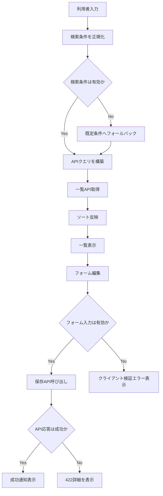

# 要件定義書

## 背景と目的

本仕様は、UI全体で一覧操作の体験を統一し、検索精度・探索効率・入力安全性を同時に向上させることを目的とする。  
対象は `Definitions` / `Workflows` を中心とした一覧画面、定義編集フォーム、およびワークフロー実行画面のイベント送信フォームとする。

## プロダクト方針との整合

- 定義駆動運用で頻出する「一覧から素早く対象を特定する」行為を強化する。
- API契約を維持しつつ、UIで先行バリデーションを行い入力不正を早期検知する。
- 既存のページング導線を壊さず、検索・ソート・検証エラー表示を一貫化する。

## 機能要件

### 要件1

**ユーザーストーリー:** 利用者として、一覧画面で詳細条件を使って検索したい。なぜなら、対象データを短時間で絞り込みたいから。

#### 受け入れ基準（要件1）

| No | アクター | きっかけ（ユースケース） | 期待される結果 |
| --- | --- | --- | --- |
| 1 | 利用者 | 一覧画面で複数フィルタ条件を指定して検索する | 条件を組み合わせた検索結果が表示される |
| 2 | 利用者 | 検索後にページ移動する | 検索条件を維持したままページングされる |
| 3 | 利用者 | 画面再訪またはURL共有で同条件を開く | 同一条件が復元される |
| 4 | 利用者 | 条件クリアを実行する | フィルタ条件が初期化され、既定一覧が表示される |

### 要件2

**ユーザーストーリー:** 利用者として、一覧結果を列単位で並べ替えたい。なぜなら、更新日時や名前順で確認したいから。

#### 受け入れ基準（要件2）

| No | アクター | きっかけ（ユースケース） | 期待される結果 |
| --- | --- | --- | --- |
| 1 | 利用者 | ソート項目を変更する | 指定列で再取得・再表示される |
| 2 | 利用者 | 昇順/降順を切り替える | 並び順が即時反映される |
| 3 | システム | 無効なソート値を受け取る | 安全な既定ソートにフォールバックする |

### 要件3

**ユーザーストーリー:** 利用者として、入力フォームで不正な値を送信前に知りたい。なぜなら、保存失敗の手戻りを減らしたいから。

#### 受け入れ基準（要件3）

| No | アクター | きっかけ（ユースケース） | 期待される結果 |
| --- | --- | --- | --- |
| 1 | 利用者 | 許可外文字や制御文字を入力する | クライアント側でエラー表示される |
| 2 | 利用者 | 最大長を超える入力を行う | 送信前に入力制限またはエラーが表示される |
| 3 | システム | APIが422を返却する | フィールド別エラーを画面上で再表示する |
| 4 | 利用者 | エラー修正後に再送信する | 正常保存でき、エラー表示が解消される |
| 5 | 利用者 | ワークフロー実行画面でイベント名を入力して送信する | 形式/長さチェックを満たす場合のみ送信できる |
| 6 | 利用者 | 定義実行開始画面で入力JSONを指定して開始する | JSON構文エラー時は開始せず、修正ガイドを表示する |

## フロー図の記載方針（重要）

- 検索・ソート・バリデーションの複合処理は分岐が多いため、通常系と異常系を同一フローで示す。

## 図表と要件の対応

- **要件1（検索詳細化）**: フロー図（検索条件正規化から一覧表示まで）で担保
- **要件2（ソート追加）**: フロー図（ソート変更から再取得まで）で担保
- **要件3（入力検証強化）**: フロー図（クライアント検証とAPI 422再表示）および設計書の入力制約一覧で担保

## 非機能要件

### コード構成とモジュール性

- **単一責任**: 検索クエリ正規化、ソート指定、入力検証を責務分離する。
- **モジュール設計**: 画面固有ロジックと共通ユーティリティを分離する。
- **依存関係管理**: UIコンポーネントからAPIクエリ生成ロジックを直接散在させない。
- **インターフェースの明確化**: 許可される `sortBy` / `sortOrder` / 入力制約を型で明示する。

### パフォーマンス

- 条件変更時は必要最小限の再取得に留める。
- 不要な再描画を避けるため、検索条件・一覧状態を適切にメモ化する。

### セキュリティ

- 文字種制限・長さ制限・危険文字検知をクライアントで先行実施する。
- API返却の422詳細を信頼し、最終判定はサーバー側バリデーションに委譲する。

### 信頼性

- 無効クエリや異常入力でも画面がクラッシュせず、安全にフォールバックできる。
- 検索・ソート・保存操作の失敗時に再試行導線を提供する。

### ユーザビリティ

- 検索条件・ソート状態・ページング状態を利用者が把握しやすいUIで表示する。
- エラー表示は修正箇所が即座に分かる位置に表示する。
