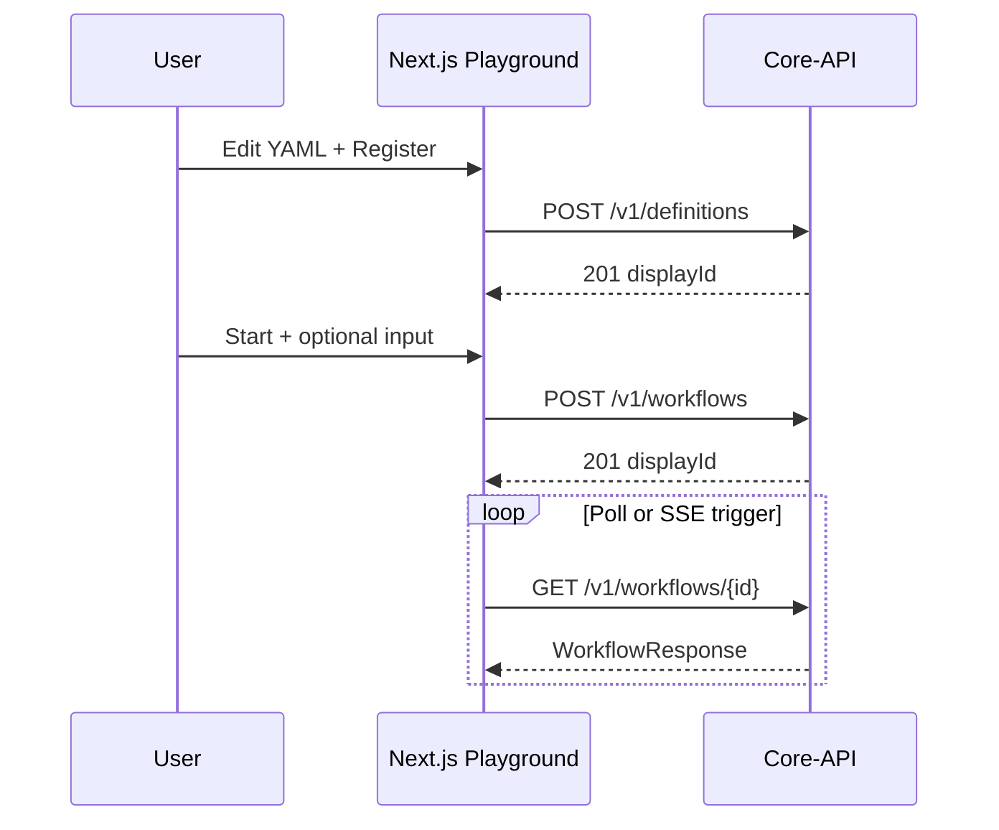

# Design: UI Playground

> **承認状態**: **依頼中** — [approval-request.md](./approval-request.md)

## 概要

本ドキュメントは **spec-workflow 上の設計要約**である。ワイヤーフレーム、API マッピング表、実装フェーズ P3.0〜P3.2 の詳細は **`.workspace-docs/30_specs/10_in-progress/ui-playground-design.md`** を正本とする。

## アーキテクチャ決定

| 決定事項 | 内容 |
|----------|------|
| バックエンド | 既存 **C# Core-API** のみ。Playground 専用 BFF は作らない。 |
| ルート | **`/playground`** プレフィックス。既存 `/` ダッシュボードと共存。 |
| Read の正 | **`GET /v1/workflows/{id}`** / **`…/graph`**（DB projection）。SSE は通知層。 |
| 定義検証 | 現行は **`POST /v1/definitions`** のエラー応答。専用 validate API は Out of Scope（requirements 参照）。 |
| コンポーネント | **`useExecution`** 系とグラフ・タイムラインを **再利用**（Requirement 7）。 |

## データフロー（要約）

## SSE（任意）

- エンドポイント: `GET /v1/workflows/{id}/stream`
- ペイロード: `GraphUpdated`（`statevia-data-integration-contract.md` §5.1.1）
- 受信後: **GET で確定**（デバウンス可）

## 関連ドキュメント

- `requirements.md` — 受け入れ基準
- `tasks.md` — 実装タスク（P3.0〜）
