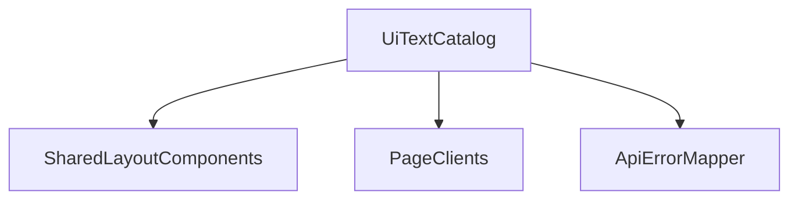

# Design: UI表示文言の整理と表記ゆれ統一

## Overview

本設計は、既存 UI の構造や機能を変更せず、文言の表記ゆれ是正に限定して共通化を行う。
実装は `uiText` カタログを導入し、共通部品から順に段階適用する。

## Alignment with Steering Documents

### 技術標準（`tech.md`）

- Next.js App Router 構成を維持し、文言定義は `services/ui/app/lib` に集約する。
- 画面ロジックは現状維持とし、文言参照先の置換のみを中心に変更する。

### プロジェクト構成（`structure.md`）

- 画面共通の文言は `services/ui/app/lib/uiText.ts` で管理する。
- 共通文言を利用する部品（`PageState`, `layout`, `errors`）を優先して適用する。

## Code Reuse Analysis

### Existing Components to Leverage

- **`services/ui/app/components/layout/PageState.tsx`**: `loading/empty/error` の共通表示。
- **`services/ui/app/lib/errors.ts`**: API エラーからトースト文言への変換処理。
- **`services/ui/app/layout.tsx`**: 全画面に波及するナビゲーション文言。
- **`services/ui/app/workflows/WorkflowsPageClient.tsx`**: 主要画面の操作語の適用対象。

### Integration Points

- **共通文言定義**: `services/ui/app/lib/uiText.ts`（新規）。
- **共通表示部品**: `PageState`, `ListPagination`, `ActionLinkGroup`。
- **主要画面**: Dashboard, Definitions, Workflows と workflow/detail 系 route。

## Architecture

文言の責務を「定義」と「利用」に分離する。



## Components and Interfaces

### UiTextCatalog

- **Purpose:** 主要 UI 文言をカテゴリ別に管理する。
- **Interfaces:** `navigation`, `actions`, `pageState`, `errorPrefixes`。
- **Dependencies:** なし。
- **Reuses:** 既存ハードコード文言を移管。

### ErrorTextAdapter

- **Purpose:** API エラー文言に共通プレフィクスを適用する。
- **Interfaces:** `toToastError(error): ToastState`。
- **Dependencies:** `UiTextCatalog`, `ApiError` 型。
- **Reuses:** `services/ui/app/lib/errors.ts`。

### SharedCopyConsumers

- **Purpose:** 共通部品・主要画面で `UiTextCatalog` を参照する。
- **Interfaces:** 既存 props を維持（文言参照先のみ変更）。
- **Dependencies:** `UiTextCatalog`。
- **Reuses:** `PageState`, `layout`, 各 page client。

## Data Models

### UiTextModel

```text
UiTextModel
- navigation:
  - dashboard: string
  - definitions: string
  - workflows: string
- actions:
  - reload: string
  - retry: string
  - save: string
  - cancel: string
- pageState:
  - loading: string
  - empty: string
  - error: string
- errorPrefixes:
  - unauthorized401: string
  - forbidden403: string
  - conflict409: string
  - unprocessable422: string
  - server500: string
```

### Confirmed Mapping Table

| 現行表記 | 統一後 | 備考 |
| --- | --- | --- |
| Workflow | ワークフロー | 画面表示は日本語へ統一（内部識別子は変更しない） |
| Definition | 定義 | 一覧/詳細/説明文で統一 |
| Execution | 実行 | 見出し・ラベルで統一 |
| Workflow 一覧 | ワークフロー一覧 | 一覧名の英日混在を解消 |
| Definition 一覧 | 定義一覧 | 一覧名の英日混在を解消 |
| Load | ロード | 操作語をカタカナに統一 |
| Loading... / 読み込み中... | ローディング... | 読み込み状態文言を統一 |
| Cancel | キャンセル | 操作語を統一 |
| Resume | 再開 | 操作語を統一 |
| Event 送信 | イベント送信 | 和英混在を解消 |
| Cancelled / Canceled / CANCELED | Cancelled | 表示用語を1つに固定（値変換は別管理） |
| Nodes / {n} nodes | ノード / {n} 件 | 一覧系ラベルを日本語化 |
| nodeId | ノードID | IDラベル統一 |
| status | ステータス | 項目ラベル統一 |
| definitionId | 定義ID | ユーザー向けラベル統一 |
| displayId | 表示ID | ユーザー向けIDラベルを統一 |
| graphId | グラフID | ユーザー向けラベル統一 |
| close toast | 通知を閉じる | アクセシビリティラベルを日本語化 |
| List / Graph | リスト / グラフ | 表示切替文言を日本語化 |
| workflow input | 入力データ | 入力欄ラベルを日本語化 |
| Definition Editor | 定義エディタ | 画面タイトルを日本語化 |
| health | ヘルスチェック | ナビゲーション文言を日本語化 |
| 再読み込み | リロード | 再取得操作の表記を統一 |

## Dictionary Agreement Scope

次フェーズの多言語化を見据えて、以下を「辞書化対象」に含める。

- 画面上に可視表示される文言（見出し、本文、ボタン、トースト、バナー）
- アクセシビリティ文言（`aria-label` など）
- 入力補助文言（`placeholder`）

次は対象外とする。

- コメント、型名、識別子（ただし表示用途で使っている場合は対象）
- API内部イベントの生値そのもの（表示ラベル方針が未合意の場合）

### Open Dictionary Candidates（未辞書化の合意対象）

| 優先度 | ファイル | 文言候補（抜粋） | 推奨キー案 |
| --- | --- | --- | --- |
| P0 | `services/ui/app/components/execution/ExecutionDashboard.tsx` | `実行の詳細`, `実行操作`, `Event 名（POST /events）`, `全画面表示`, `全画面終了 (Esc)`, `指定されたワークフローが見つかりませんでした。ID を確認してください。` | `executionDashboard.header.titleDefault`, `executionDashboard.actions.sectionTitle`, `executionDashboard.actions.eventNameLabel`, `executionDashboard.graph.fullscreenEnter`, `executionDashboard.graph.fullscreenExit`, `executionDashboard.errors.workflowNotFound` |
| P0 | `services/ui/app/components/execution/ExecutionTimeline.tsx` | `実行履歴タイムライン`, `現在に戻る`, `イベントがありません`, `続きを読み込む`, `Unknown` | `executionTimeline.title`, `executionTimeline.backToCurrent`, `executionTimeline.empty`, `executionTimeline.loadMore`, `executionTimeline.event.unknown` |
| P0 | `services/ui/app/components/execution/ExecutionComparisonBar.tsx` | `2実行の比較`, `A のみ`, `B のみ`, `差分`, `未読み込み`, `差分サマリ`, `ノード差分なし` | `executionComparison.title`, `executionComparison.kind.onlyLeft`, `executionComparison.kind.onlyRight`, `executionComparison.kind.diff`, `executionComparison.state.notLoaded`, `executionComparison.summary.title`, `executionComparison.summary.noDiff` |
| P0 | `services/ui/app/components/nodes/NodeDetail.tsx` | `待機中 (Wait)`, `失敗情報`, `（メッセージなし）` | `nodeDetail.waiting.title`, `nodeDetail.failure.title`, `nodeDetail.failure.noMessage` |
| P0 | `services/ui/app/components/layout/ActionLinkGroup.tsx` | `画面導線`（aria） | `actionLinks.aria.navigation` |
| P1 | `services/ui/app/workflows/WorkflowsPageClient.tsx` | `定義文脈（フィルタ中）`, `定義条件を外す`, `フィルタ`, `（すべて）`, `詳細`, `条件に合うワークフローはありません。` | `workflowsPage.filter.contextActive`, `workflowsPage.filter.clearDefinition`, `workflowsPage.filter.title`, `workflowsPage.filter.all`, `common.detail`, `workflowsPage.empty.filtered` |
| P1 | `services/ui/app/definitions/DefinitionsPageClient.tsx` | `定義の検索とページングを行い、詳細画面へ遷移します。`, `名前検索（部分一致）`, `定義一覧を読み込み中です。` | `definitionsPage.description`, `definitionsPage.search.label`, `definitionsPage.loading` |
| P1 | `services/ui/app/dashboard/DashboardPageClient.tsx` | `直近のワークフロー（最大 10 件）です。`, `直近ワークフローを取得しています。`, `データを取得できませんでした。` | `dashboard.descriptionRecent`, `dashboard.loadingRecent`, `dashboard.error.fetchFailed` |
| P2 | `services/ui/app/definitions/[definitionId]/DefinitionDetailClient.tsx` | `定義を取得できませんでした。`, `名前`, `登録日時`, `関連ワークフロー`, `編集・実行` | `definitionDetail.error.fetchFailed`, `definitionDetail.meta.name`, `definitionDetail.meta.createdAt`, `definitionDetail.relatedWorkflows.title`, `definitionDetail.actions.title` |
| P2 | `services/ui/app/definitions/[definitionId]/edit/DefinitionEditorPageClient.tsx` | `定義名を入力してください。`, `YAML を入力してください。`, `定義メタ情報を読み込み中...`, `保存中...` | `definitionEditor.validation.nameRequired`, `definitionEditor.validation.yamlRequired`, `definitionEditor.loading.meta`, `definitionEditor.actions.saving` |
| P2 | `services/ui/app/definitions/[definitionId]/run/page.tsx` | `定義起点で実行`, `開始中...`, `ワークフロー開始`, `開始後は Run 画面...` | `definitionRunPage.title`, `definitionRunPage.actions.starting`, `definitionRunPage.actions.startWorkflow`, `definitionRunPage.help.redirectAfterStart` |

### Remaining Targets Checklist（実装前最終版）

以下は、合意済みポリシー適用後も辞書化が必要な表示文言の残対象。

| 優先 | ファイル | 未辞書化文言（代表） | キー候補 |
| --- | --- | --- | --- |
| P0 | `services/ui/app/components/layout/ActionLinkGroup.tsx` | `画面導線`（aria-label） | `actionLinks.aria.navigation` |
| P0 | `services/ui/app/components/execution/ExecutionDashboard.tsx` | `実行の詳細` | `executionDashboard.header.titleDefault` |
| P0 | `services/ui/app/components/execution/ExecutionDashboard.tsx` | `実行操作` | `executionDashboard.actions.sectionTitle` |
| P0 | `services/ui/app/components/execution/ExecutionDashboard.tsx` | `イベント名` | `executionDashboard.actions.eventNameLabel` |
| P0 | `services/ui/app/components/execution/ExecutionDashboard.tsx` | `全画面表示` | `executionDashboard.graph.fullscreenEnter` |
| P0 | `services/ui/app/components/execution/ExecutionDashboard.tsx` | `全画面終了 (Esc)` | `executionDashboard.graph.fullscreenExit` |
| P0 | `services/ui/app/components/execution/ExecutionDashboard.tsx` | `指定されたワークフローが見つかりませんでした。ID を確認してください。` | `executionDashboard.errors.workflowNotFound` |
| P0 | `services/ui/app/components/execution/ExecutionTimeline.tsx` | `実行履歴タイムライン` | `executionTimeline.title` |
| P0 | `services/ui/app/components/execution/ExecutionTimeline.tsx` | `現在に戻る` | `executionTimeline.backToCurrent` |
| P0 | `services/ui/app/components/execution/ExecutionTimeline.tsx` | `イベントがありません` | `executionTimeline.empty` |
| P0 | `services/ui/app/components/execution/ExecutionTimeline.tsx` | `続きを読み込む` | `executionTimeline.loadMore` |
| P0 | `services/ui/app/components/execution/ExecutionComparisonBar.tsx` | `2実行の比較` | `executionComparison.title` |
| P0 | `services/ui/app/components/execution/ExecutionComparisonBar.tsx` | `A のみ` | `executionComparison.kind.onlyLeft` |
| P0 | `services/ui/app/components/execution/ExecutionComparisonBar.tsx` | `B のみ` | `executionComparison.kind.onlyRight` |
| P0 | `services/ui/app/components/execution/ExecutionComparisonBar.tsx` | `差分` | `executionComparison.kind.diff` |
| P0 | `services/ui/app/components/execution/ExecutionComparisonBar.tsx` | `未読み込み` | `executionComparison.state.notLoaded` |
| P0 | `services/ui/app/components/execution/ExecutionComparisonBar.tsx` | `差分サマリ` | `executionComparison.summary.title` |
| P0 | `services/ui/app/components/execution/ExecutionComparisonBar.tsx` | `ノード差分なし` | `executionComparison.summary.noDiff` |
| P0 | `services/ui/app/components/nodes/NodeDetail.tsx` | `待機中 (Wait)` | `nodeDetail.waiting.title` |
| P0 | `services/ui/app/components/nodes/NodeDetail.tsx` | `失敗情報` | `nodeDetail.failure.title` |
| P0 | `services/ui/app/components/nodes/NodeDetail.tsx` | `（メッセージなし）` | `nodeDetail.failure.noMessage` |
| P0 | `services/ui/app/components/nodes/GraphLegend.tsx` | `Next` | `graphLegend.edge.next` |
| P0 | `services/ui/app/components/nodes/GraphLegend.tsx` | `グラフ凡例`（aria） | `graphLegend.aria.root` |
| P0 | `services/ui/app/components/nodes/GraphLegend.tsx` | `ノードステータス凡例`（aria） | `graphLegend.aria.nodeStatus` |
| P0 | `services/ui/app/components/nodes/GraphLegend.tsx` | `エッジ種別凡例`（aria） | `graphLegend.aria.edgeType` |
| P1 | `services/ui/app/workflows/WorkflowsPageClient.tsx` | `定義文脈（フィルタ中）` | `workflowsPage.filter.contextActive` |
| P1 | `services/ui/app/workflows/WorkflowsPageClient.tsx` | `定義条件を外す` | `workflowsPage.filter.clearDefinition` |
| P1 | `services/ui/app/workflows/WorkflowsPageClient.tsx` | `フィルタ` | `workflowsPage.filter.title` |
| P1 | `services/ui/app/workflows/WorkflowsPageClient.tsx` | `（すべて）` | `workflowsPage.filter.all` |
| P1 | `services/ui/app/workflows/WorkflowsPageClient.tsx` | `条件に合うワークフローはありません。` | `workflowsPage.empty.filtered` |
| P1 | `services/ui/app/workflows/WorkflowsPageClient.tsx` | `取得に失敗しました。時間をおいて再試行してください。` | `workflowsPage.error.fetchFailed` |
| P1 | `services/ui/app/definitions/DefinitionsPageClient.tsx` | `定義の検索とページングを行い、詳細画面へ遷移します。` | `definitionsPage.description` |
| P1 | `services/ui/app/definitions/DefinitionsPageClient.tsx` | `名前検索（部分一致）` | `definitionsPage.search.label` |
| P1 | `services/ui/app/definitions/DefinitionsPageClient.tsx` | `定義一覧を読み込み中です。` | `definitionsPage.loading` |
| P1 | `services/ui/app/definitions/DefinitionsPageClient.tsx` | `定義一覧を取得できませんでした。` | `definitionsPage.error.fetchFailed` |
| P1 | `services/ui/app/dashboard/DashboardPageClient.tsx` | `直近のワークフロー（最大 10 件）です。` | `dashboard.descriptionRecent` |
| P1 | `services/ui/app/dashboard/DashboardPageClient.tsx` | `直近のワークフローを取得しています。` | `dashboard.loadingRecent` |
| P1 | `services/ui/app/dashboard/DashboardPageClient.tsx` | `合計件数: --` | `dashboard.totalCountFallback` |
| P1 | `services/ui/app/dashboard/DashboardPageClient.tsx` | `データを取得できませんでした。` | `dashboard.error.fetchFailed` |
| P2 | `services/ui/app/definitions/[definitionId]/DefinitionDetailClient.tsx` | `定義を取得できませんでした。` | `definitionDetail.error.fetchFailed` |
| P2 | `services/ui/app/definitions/[definitionId]/DefinitionDetailClient.tsx` | `名前` | `definitionDetail.meta.name` |
| P2 | `services/ui/app/definitions/[definitionId]/DefinitionDetailClient.tsx` | `登録日時` | `definitionDetail.meta.createdAt` |
| P2 | `services/ui/app/definitions/[definitionId]/DefinitionDetailClient.tsx` | `関連ワークフロー` | `definitionDetail.relatedWorkflows.title` |
| P2 | `services/ui/app/definitions/[definitionId]/DefinitionDetailClient.tsx` | `編集・実行` | `definitionDetail.actions.title` |
| P2 | `services/ui/app/definitions/[definitionId]/edit/DefinitionEditorPageClient.tsx` | `定義名を入力してください。` | `definitionEditor.validation.nameRequired` |
| P2 | `services/ui/app/definitions/[definitionId]/edit/DefinitionEditorPageClient.tsx` | `YAML を入力してください。` | `definitionEditor.validation.yamlRequired` |
| P2 | `services/ui/app/definitions/[definitionId]/edit/DefinitionEditorPageClient.tsx` | `定義メタ情報を読み込み中...` | `definitionEditor.loading.meta` |
| P2 | `services/ui/app/definitions/[definitionId]/edit/DefinitionEditorPageClient.tsx` | `保存中...` | `definitionEditor.actions.saving` |
| P2 | `services/ui/app/definitions/[definitionId]/edit/DefinitionEditorPageClient.tsx` | `保存（POST /definitions）` | `definitionEditor.actions.saveWithApiHint` |
| P2 | `services/ui/app/definitions/[definitionId]/run/page.tsx` | `定義を実行` | `definitionRunPage.title` |
| P2 | `services/ui/app/definitions/[definitionId]/run/page.tsx` | `開始中...` | `definitionRunPage.actions.starting` |
| P2 | `services/ui/app/definitions/[definitionId]/run/page.tsx` | `ワークフロー開始` | `definitionRunPage.actions.startWorkflow` |
| P2 | `services/ui/app/definitions/[definitionId]/run/page.tsx` | `開始後は実行画面` | `definitionRunPage.help.redirectAfterStart` |

### Dictionary Completion Criteria（完了判定）

- `services/ui/app/**/*.tsx` で、可視テキスト/`aria-label`/`placeholder` の直書きが以下を除いて残っていないこと。
  - 合意済み非辞書化対象（イベント種別、ステータス値）
  - 動的データ（ID値、日時、API由来メッセージ本文など）
- 新規追加の辞書キーは `Key Namespace Rules` に従うこと。
- 主要画面の文言アサーションが回帰テストで通過すること。

### Key Namespace Rules（合意用）

- 共有語彙: `common.*`, `navigation.*`, `actions.*`, `labels.*`
- 共通部品: `execution*.*`, `node*.*`, `graphLegend.*`, `actionLinks.*`
- 画面固有: `dashboard.*`, `workflowsPage.*`, `definitionsPage.*`, `definitionDetail.*`, `definitionEditor.*`, `definitionRunPage.*`
- キーは英語名、値は当面 `ja` 固定で管理する。

### Resolved Policies（合意済み）

1. `ExecutionTimeline` のイベント種別（`GraphUpdated` など）は日本語辞書化しない。
2. ステータス値（`Running`, `Completed`, `Cancelled` など）は辞書変換しない。
3. 技術文言（例: `POST /events`, `SSE`）は基本的にUI上へ直接表記しない。必要な場合のみ実装時に個別検討し、レビューで明示する。

## Error Handling

1. **直書き文言の取りこぼし**
   - **Handling:** 検索ベースで統一対象を抽出し、共通参照化のチェックリストで管理する。
   - **User Impact:** 一部画面のみ表記ゆれが残るリスクを低減する。

2. **エラー文言の意味変更**
   - **Handling:** 既存メッセージ構造を維持し、プレフィクス統一のみを実施する。
   - **User Impact:** エラー理解の一貫性を維持しつつ、挙動差分を最小化する。

## Testing Strategy

### Unit Testing

- `PageState` の状態文言が `UiTextCatalog` 経由で表示されることを確認する。
- `toToastError` の 401/403/409/422/500 マッピングが共通プレフィクスに一致することを確認する。

### Integration Testing

- 主要導線（Dashboard/Definitions/Workflows）でナビ文言が統一されることを確認する。
- 共通部品と主要画面で操作語（再試行/保存/キャンセル）の表記が一致することを確認する。

### End-to-End Testing

- 主要フローで視認される文言が統一ルールに従うことを確認する。
