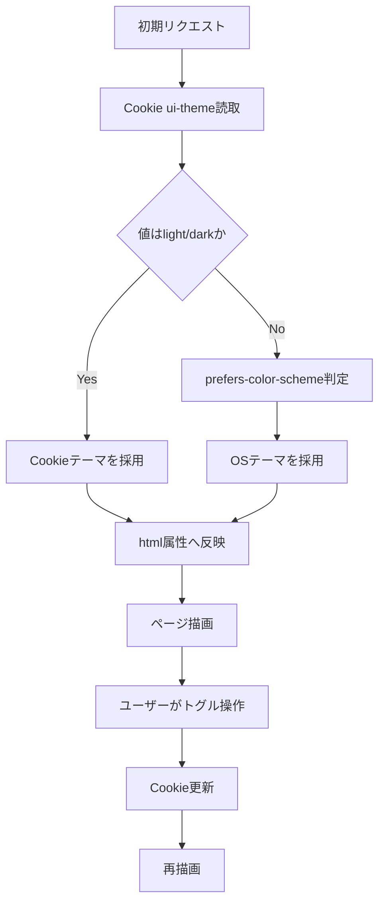

# 設計書

## 概要

本設計は、既存 UI の CSS 変数トークンを活用し、
`light` / `dark` を切り替える仕組みを追加するものである。
テーマ決定はレイアウト層で実施し、共通ヘッダーのトグル操作から
Cookie 更新と再描画を行う。

## ステアリング文書との整合

### 技術標準（`tech.md`）

- Next.js App Router 構造を維持し、`app/layout.tsx` で初期テーマを解決する。
- 表示責務で完結させ、Core-API 契約は変更しない。
- 既存 UI 導線（Dashboard / Definitions / Workflows）を維持する。

### プロジェクト構成（`structure.md`）

- テーマ切替 UI は `services/ui/app/components/layout/` に配置する。
- テーマ判定と Cookie ユーティリティは `services/ui/app/lib/` に集約する。
- グローバル配色トークンは `services/ui/app/globals.css` を唯一の定義元とする。

## 既存資産の再利用分析

既存実装の拡張で実現し、新規追加は最小限に留める。

### 再利用する既存要素

- **`services/ui/app/layout.tsx`**: 共通ヘッダーとルート描画を再利用し、初期テーマ反映を追加する。
- **`services/ui/app/components/layout/LanguageToggle.tsx`**: ヘッダー操作部品の配置と操作性を踏襲する。
- **`services/ui/app/globals.css`**: 既存の `--tone-*` 変数を土台にライト/ダークを定義する。

### 統合ポイント

- **`services/ui/app/lib/theme.ts`（新規）**: テーマ型と判定ロジックを実装する。
- **`services/ui/app/components/layout/ThemeToggle.tsx`（新規）**: テーマ切替 UI と Cookie 更新を実装する。
- **`services/ui/app/layout.tsx`**: 初期テーマ決定と `html` 属性反映を統合する。
- **`services/ui/app/globals.css`**: テーマ別トークンと `color-scheme` を統合する。

## アーキテクチャ

レイアウト層でテーマを一元判定し、CSS 変数によって全画面へ反映する。

### モジュール設計の原則

- **単一責任**: テーマ解決、永続化、表示切替の責務を分割する。
- **コンポーネント分離**: トグル UI は独立コンポーネントとして実装する。
- **レイヤー分離**: 判定ロジックは `lib`、表示は `components/layout` に分離する。
- **ユーティリティ分割**: Cookie 値検証とテーマ型を共通関数化する。

## 処理フロー図（重要）



## コンポーネントとインターフェース

### `theme.ts`

- **目的**: テーマ型定義と安全な解決関数を提供する。
- **公開インターフェース**:
  - `type Theme = "light" | "dark"`
  - `isTheme(value: string): value is Theme`
  - `resolveTheme(raw: string | undefined): Theme | null`
- **依存先**: なし（純粋関数）
- **再利用要素**: `services/ui/app/lib/i18n.ts` の設計方針

### `ThemeToggle.tsx`

- **目的**: 共通ヘッダーでテーマを切り替える。
- **公開インターフェース**:
  - `<ThemeToggle currentTheme />`（想定）
- **依存先**: `next/navigation`, `document.cookie`, `theme.ts`
- **再利用要素**: `services/ui/app/components/layout/LanguageToggle.tsx`

### `layout.tsx`

- **目的**: 初期テーマ判定とルート属性反映を担う。
- **公開インターフェース**: Next.js ルートレイアウト
- **依存先**: `next/headers`（Cookie 読取）、`ThemeToggle.tsx`
- **再利用要素**: 既存ヘッダー/ナビゲーション構成

## データモデル

### Theme

```text
Theme
- value: "light" | "dark"
- source: "cookie" | "system"
```

### ThemeCookie

```text
ThemeCookie
- key: "ui-theme"
- allowedValues: "light" | "dark"
- invalidValueHandling: nullを返してsystem判定へフォールバック
```

## エラーハンドリング

### エラーシナリオ

1. **Cookie 不正値**
   - **対処方法**: `resolveTheme` で `null` とし、OS 判定へフォールバックする。
   - **ユーザー影響**: 画面は継続表示され、テーマのみ既定判定になる。

2. **テーマ反映漏れ**
   - **対処方法**: `layout.tsx` で属性付与を一元化し、クライアント側更新処理を統一する。
   - **ユーザー影響**: テーマ表示の不一致が解消される。

3. **画面別コントラスト不足**
   - **対処方法**: 直書き色クラスをトークン参照へ置換する。
   - **ユーザー影響**: ライト/ダーク双方で可読性を維持できる。

## テスト戦略

### 単体テスト

- `resolveTheme` が不正値を `null` として扱うことを検証する。
- トグル操作で Cookie 更新処理が呼ばれることを検証する。

### 結合テスト

- 初期表示で Cookie 値が優先適用されることを検証する。
- Cookie 未設定時に OS 設定由来のテーマへ切り替わることを検証する。
- ヘッダー操作で同一 URL のまま表示テーマが更新されることを検証する。

### E2Eテスト

- ライト/ダーク切替後も主要導線を操作できることを確認する。
- リロードと画面遷移後に選択テーマが保持されることを確認する。
