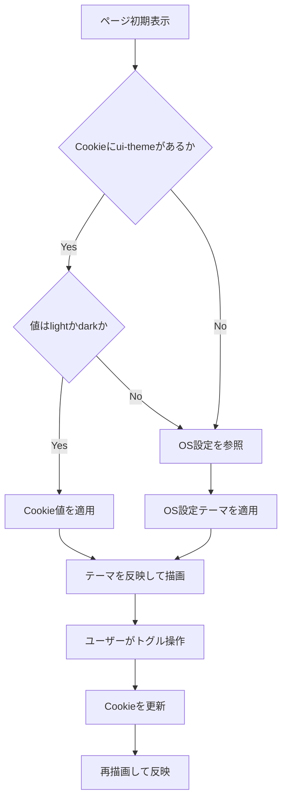

# 要件定義書

## 背景と目的

本仕様は、UI 上でライトテーマとダークテーマを切り替える機能を追加し、
利用者が環境や好みに応じて視認性を調整できるようにすることを目的とする。
対象は `services/ui/app` 配下の共通ヘッダーと主要画面
（Dashboard / Definitions / Workflows）とする。

## プロダクト方針との整合

- 定義駆動運用の導線（Dashboard / Definitions / Workflows）を維持したまま、
  表示テーマのみを切り替えられるようにする。
- API 契約や業務ロジックは変更せず、UI 表示層でテーマ切替を完結させる。
- 再訪時に前回テーマを引き継ぎ、運用時の再設定コストを下げる。

## 機能要件

### 要件1

**ユーザーストーリー:** 利用者として、画面上でライト / ダークを切り替えたい。
なぜなら、利用環境に応じて見やすい表示にしたいから。

#### 受け入れ基準（要件1）

| No | アクター | きっかけ（ユースケース） | 期待される結果 |
| --- | --- | --- | --- |
| 1 | 利用者 | 共通ヘッダーを表示する | テーマ切替 UI が表示される |
| 2 | 利用者 | ライトを選択する | 画面全体がライトテーマで表示される |
| 3 | 利用者 | ダークを選択する | 画面全体がダークテーマで表示される |
| 4 | 利用者 | 同一 URL 上でテーマを切り替える | 画面遷移なしで表示テーマのみ更新される |

### 要件2

**ユーザーストーリー:** 利用者として、選択したテーマを保持してほしい。
なぜなら、再読み込みや再訪のたびに再設定したくないから。

#### 受け入れ基準（要件2）

| No | アクター | きっかけ（ユースケース） | 期待される結果 |
| --- | --- | --- | --- |
| 1 | 利用者 | テーマを切り替える | 選択テーマが Cookie に保存される |
| 2 | 利用者 | ページを再読み込みする | 直前に選択したテーマで表示される |
| 3 | 利用者 | 別画面へ遷移する | 遷移先でも同じテーマが適用される |
| 4 | システム | Cookie が未設定または不正値である | 安全な既定判定で表示される |

### 要件3

**ユーザーストーリー:** 利用者として、初回表示でも自分の環境に合ったテーマで
表示されてほしい。なぜなら、まぶしさや視認性の問題を避けたいから。

#### 受け入れ基準（要件3）

| No | アクター | きっかけ（ユースケース） | 期待される結果 |
| --- | --- | --- | --- |
| 1 | システム | 初期表示時に有効な Cookie がある | Cookie のテーマを優先適用する |
| 2 | システム | 初期表示時に Cookie がない | `prefers-color-scheme` を参照して適用する |
| 3 | システム | Cookie が不正値である | `prefers-color-scheme` 判定へフォールバックする |
| 4 | 利用者 | 初回表示を確認する | 意図しないテーマのちらつきが最小化される |

### 要件4

**ユーザーストーリー:** 利用者として、テーマ切替後も既存機能を同様に使いたい。
なぜなら、見た目以外の挙動が変わると運用が不安定になるから。

#### 受け入れ基準（要件4）

| No | アクター | きっかけ（ユースケース） | 期待される結果 |
| --- | --- | --- | --- |
| 1 | 利用者 | Dashboard / Definitions / Workflows を閲覧する | 主要テキストと背景のコントラストが維持される |
| 2 | 利用者 | 既存の言語切替やナビゲーションを操作する | 既存操作が回帰しない |
| 3 | 開発者 | テーマ色を追加・変更する | CSS 変数または統一されたトークンで管理できる |

## フロー図の記載方針（重要）

- テーマ初期判定と切替反映は、Cookie と OS 設定の条件分岐があるためフロー図で示す。

## 非機能要件

### コード構成とモジュール性

- **単一責任**: テーマ判定、永続化、UI 切替の責務を分離する。
- **モジュール設計**: 判定ロジックは `lib`、UI は `components/layout` へ集約する。
- **依存関係管理**: 画面ごとの個別テーマ判定を避け、レイアウト層で一元管理する。
- **インターフェースの明確化**: `light` / `dark` のみを許可する型・関数契約を定義する。

### パフォーマンス

- 初期テーマ判定は軽量に行い、初回表示体感を悪化させない。
- テーマ切替で不要な再フェッチや過剰再描画を増やさない。

### セキュリティ

- Cookie 値はホワイトリスト（`light` / `dark`）で検証し、不正値をそのまま使用しない。
- テーマ情報は UI 設定用途に限定し、機密情報を保存しない。

### 信頼性

- Cookie 未設定・不正値でも UI が破綻せず、フォールバック表示できる。
- 既存導線（Dashboard / Definitions / Workflows）を維持し、機能回帰を起こさない。

### ユーザビリティ

- テーマ切替 UI は共通ヘッダーから常時アクセス可能にする。
- 現在のテーマ状態を視覚的に判別できる表示にする。
