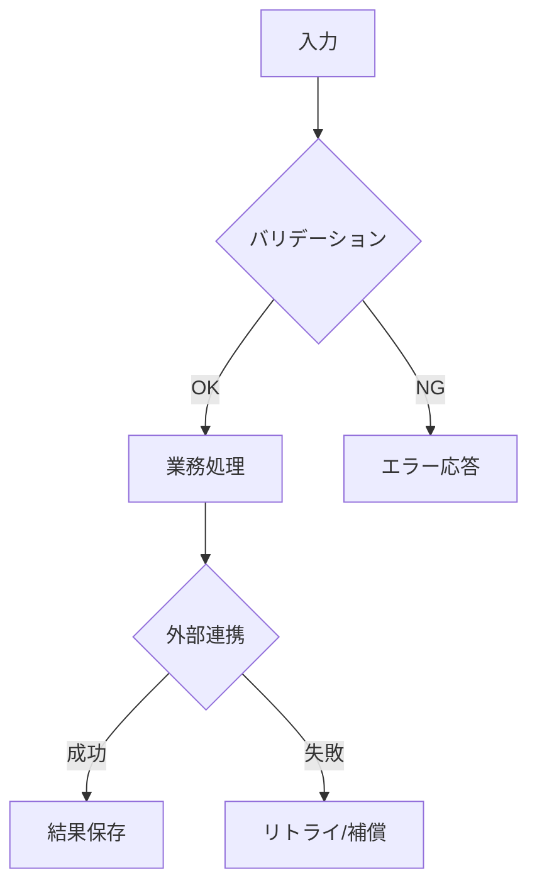

# 設計書

## 概要

[機能の全体像と、システム内での位置づけを記載]

## ステアリング文書との整合

### 技術標準（`tech.md`）

[既存の技術方針・標準にどう準拠するかを記載]

### プロジェクト構成（`structure.md`）

[ディレクトリ構成・責務分割の方針にどう合わせるかを記載]

## 既存資産の再利用分析

[既存コードの流用・拡張・統合方針を記載]

### 再利用する既存要素

- **[コンポーネント/ユーティリティ名]**: [利用方法]
- **[サービス/ヘルパー名]**: [拡張方法]

### 統合ポイント

- **[既存システム/API]**: [統合方法]
- **[DB/ストレージ]**: [既存スキーマとの接続方法]

## アーキテクチャ

[採用する設計パターンと構成を記載]

### モジュール設計の原則

- **単一責任**: 各ファイルの責務を1つに保つ
- **コンポーネント分離**: 大きな実装より小さく独立した要素を優先する
- **レイヤー分離**: データアクセス/業務ロジック/表示を分離する
- **ユーティリティ分割**: 目的ごとに小さく分割する

## 処理フロー図（重要）

- 仕様が単純でない場合、文章だけでなく**処理の具体的な流れが分かる図**を必ず記載する
- 以下を含む場合は図を必須とする
  - 状態遷移
  - 複数サービス連携
  - 非同期ジョブ
  - 例外処理/リトライ
- 可能な限り、通常系と異常系を同じ図または関連図で示す



## コンポーネントとインターフェース

### コンポーネント1

- **目的**: [この要素が担う責務]
- **公開インターフェース**: [公開メソッド/API]
- **依存先**: [依存対象]
- **再利用要素**: [既存資産]

### コンポーネント2

- **目的**: [この要素が担う責務]
- **公開インターフェース**: [公開メソッド/API]
- **依存先**: [依存対象]
- **再利用要素**: [既存資産]

## データモデル

### モデル1

```text
[Model1 の構造を言語に合わせて記載]
- id: [識別子型]
- name: [文字列型]
- [必要な追加項目]
```

### モデル2

```text
[Model2 の構造を言語に合わせて記載]
- id: [識別子型]
- [必要な追加項目]
```

## エラーハンドリング

### エラーシナリオ

1. **シナリオ1**: [説明]
   - **対処方法**: [リトライ/フォールバック/通知など]
   - **ユーザー影響**: [表示・体験への影響]

2. **シナリオ2**: [説明]
   - **対処方法**: [リトライ/フォールバック/通知など]
   - **ユーザー影響**: [表示・体験への影響]

## テスト戦略

### 単体テスト

- [アプローチ]
- [重点対象]

### 結合テスト

- [アプローチ]
- [検証する主要フロー]

### E2Eテスト

- [アプローチ]
- [ユーザーシナリオ]
