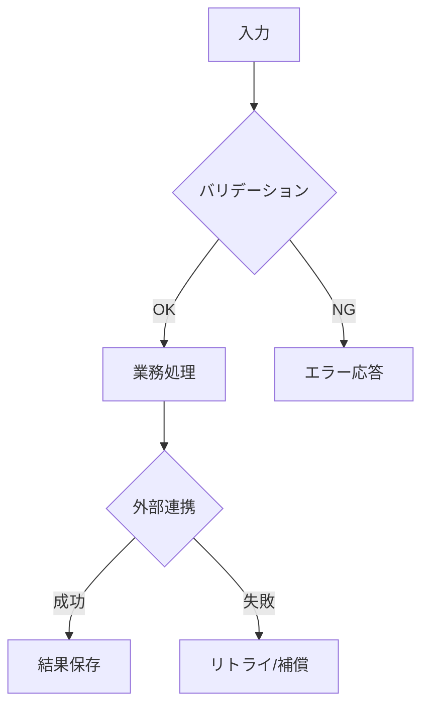

# 設計書

## 概要

[機能の全体像と、システム内での位置づけを記載]

## ステアリング文書との整合

### 技術標準（`tech.md`）

[既存の技術方針・標準にどう準拠するかを記載]

### プロジェクト構成（`structure.md`）

[ディレクトリ構成・責務分割の方針にどう合わせるかを記載]

## 既存資産の再利用分析

[既存コードの流用・拡張・統合方針を記載]

### 再利用する既存要素

- **[コンポーネント/ユーティリティ名]**: [利用方法]
- **[サービス/ヘルパー名]**: [拡張方法]

### 統合ポイント

- **[既存システム/API]**: [統合方法]
- **[DB/ストレージ]**: [既存スキーマとの接続方法]

## アーキテクチャ

[採用する設計パターンと構成を記載]

### モジュール設計の原則

- **単一責任**: 各ファイルの責務を1つに保つ
- **コンポーネント分離**: 大きな実装より小さく独立した要素を優先する
- **レイヤー分離**: データアクセス/業務ロジック/表示を分離する
- **ユーティリティ分割**: 目的ごとに小さく分割する

## 処理フロー図（重要）

- 仕様が単純でない場合、文章だけでなく**処理の具体的な流れが分かる図**を必ず記載する
- 以下を含む場合は図を必須とする
  - 状態遷移
  - 複数サービス連携
  - 非同期ジョブ
  - 例外処理/リトライ
- 可能な限り、通常系と異常系を同じ図または関連図で示す



## 図表の選定ガイド（必要に応じて追加）

- 処理フロー図に加えて、仕様の理解やレビュー効率が上がる場合は以下の図表を追加する
- 図は「読者の意思決定に必要な情報」を優先し、過度に詳細化しない
- 1つの図で表現しきれない場合は、観点ごとに図を分割する

### 1. コンポーネント図（推奨）

- **目的**: モジュール境界、責務、依存関係を明確化する
- **記載を推奨するケース**:
  - 複数レイヤー（UI / API / DB）にまたがる
  - 新規モジュール追加や責務再編がある
  - 既存資産の再利用・置換方針を示したい
- **最低限含める情報**:
  - コンポーネント名
  - 入出力インターフェース（API/関数/イベント）
  - 依存方向

### 2. ドメイン/モデル図（推奨）

- **目的**: 主要概念の関係と整合ルールを示す
- **記載を推奨するケース**:
  - 新規モデル追加
  - 既存モデルの意味変更
  - 画面項目とデータモデルの対応整理が必要
- **最低限含める情報**:
  - モデル名
  - 主要属性
  - 関連（1:1 / 1:N / N:N）

### 3. エンティティ関連図（ER図）（必要時）

- **目的**: 永続化構造と整合性制約を明確化する
- **記載を推奨するケース**:
  - DBスキーマ変更（追加/削除/型変更）がある
  - 結合条件や一意制約が実装成否に直結する
- **最低限含める情報**:
  - テーブル/エンティティ名
  - 主キー・外部キー
  - 制約（ユニーク、必須、カスケード等）

### 4. シーケンス図（必要時）

- **目的**: 時系列の呼び出し順と責務分担を明確化する
- **記載を推奨するケース**:
  - 非同期処理
  - 外部サービス連携
  - リトライ/タイムアウト/補償処理がある
- **最低限含める情報**:
  - 参加者（Actor / UI / API / DB / 外部）
  - 主要メッセージ
  - 失敗時の分岐

### 5. 業務フロー図（必要時）

- **目的**: 利用者業務とシステム処理の対応を示す
- **記載を推奨するケース**:
  - 業務手順の変更
  - 運用ルールや承認ステップの追加
- **最低限含める情報**:
  - 業務アクター
  - 業務ステップ
  - システム処理との接点

### 6. ユースケース図（必要時）

- **目的**: 誰が何をできるかを俯瞰する
- **記載を推奨するケース**:
  - 複数ロール（管理者/一般利用者など）で権限差がある
  - 対象機能が広く、要件トレーサビリティを強めたい
- **最低限含める情報**:
  - アクター
  - ユースケース
  - include / extend（必要な場合のみ）

### 7. 状態遷移図（必要時）

- **目的**: 状態と遷移条件を厳密に示す
- **記載を推奨するケース**:
  - ステータス管理やライフサイクルが重要
  - 遷移制約が不具合原因になりやすい
- **最低限含める情報**:
  - 状態一覧
  - 遷移条件/イベント
  - 終端状態

### 8. API契約表（必要時）

- **目的**: API入出力とエラー契約を一覧化する
- **記載を推奨するケース**:
  - API IF変更
  - フロント/バック間の仕様齟齬が起きやすい
- **最低限含める情報**:
  - エンドポイント
  - リクエスト/レスポンス主要項目
  - ステータスコードとエラー形式

### 9. 入力制約マトリクス（推奨）

- **目的**: フォーム項目ごとの制約と根拠を明文化する
- **記載を推奨するケース**:
  - バリデーション追加/変更
  - セキュリティ対策を伴う入力制御
- **最低限含める情報**:
  - 項目名
  - 必須/任意
  - 文字数・文字種・禁止文字
  - 根拠（セキュリティ、運用、性能、契約）

## コンポーネントとインターフェース

### コンポーネント1

- **目的**: [この要素が担う責務]
- **公開インターフェース**: [公開メソッド/API]
- **依存先**: [依存対象]
- **再利用要素**: [既存資産]

### コンポーネント2

- **目的**: [この要素が担う責務]
- **公開インターフェース**: [公開メソッド/API]
- **依存先**: [依存対象]
- **再利用要素**: [既存資産]

## データモデル

### モデル1

```text
[Model1 の構造を言語に合わせて記載]
- id: [識別子型]
- name: [文字列型]
- [必要な追加項目]
```

### モデル2

```text
[Model2 の構造を言語に合わせて記載]
- id: [識別子型]
- [必要な追加項目]
```

## エラーハンドリング

### エラーシナリオ

1. **シナリオ1**: [説明]
   - **対処方法**: [リトライ/フォールバック/通知など]
   - **ユーザー影響**: [表示・体験への影響]

2. **シナリオ2**: [説明]
   - **対処方法**: [リトライ/フォールバック/通知など]
   - **ユーザー影響**: [表示・体験への影響]

## テスト戦略

### 単体テスト

- [アプローチ]
- [重点対象]

### 結合テスト

- [アプローチ]
- [検証する主要フロー]

### E2Eテスト

- [アプローチ]
- [ユーザーシナリオ]
