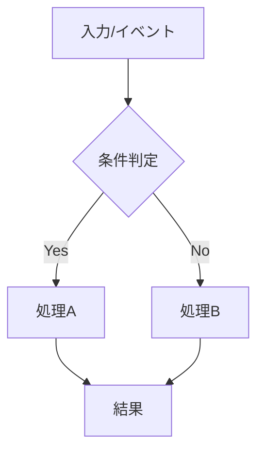

# 要件定義書

## 背景と目的

[機能の背景、目的、ユーザーに提供する価値を簡潔に記載]

## プロダクト方針との整合

[この機能が `product.md` の目標や原則にどう貢献するかを記載]

## 機能要件

### 要件1

**ユーザーストーリー:** [役割]として、[機能]をしたい。なぜなら[価値/便益]だから。

#### 受け入れ基準（要件2）

1. WHEN [きっかけ] THEN [システム] SHALL [期待動作]
2. IF [前提条件] THEN [システム] SHALL [期待動作]
3. WHEN [きっかけ] AND [条件] THEN [システム] SHALL [期待動作]

### 要件2

**ユーザーストーリー:** [役割]として、[機能]をしたい。なぜなら[価値/便益]だから。

#### 受け入れ基準

1. WHEN [きっかけ] THEN [システム] SHALL [期待動作]
2. IF [前提条件] THEN [システム] SHALL [期待動作]

## フロー図の記載方針（重要）

- 仕様が複雑な場合は、文章だけでなく**処理の具体的な流れが分かる図**を必ず記載する
- 特に以下に該当する場合は図の記載を必須とする
  - 条件分岐が多い
  - 非同期処理や外部連携がある
  - 例外系やリトライを含む
  - 状態遷移がある
- 図は `mermaid` のフローチャートまたはシーケンス図を推奨する

## 非機能要件

### コード構成とモジュール性

- **単一責任**: 1ファイル1責務を意識し、目的を明確にする
- **モジュール設計**: コンポーネント/ユーティリティ/サービスを分離し再利用可能にする
- **依存関係管理**: モジュール間の過剰な相互依存を避ける
- **インターフェースの明確化**: レイヤー間の契約を明文化する

### パフォーマンス

- [性能要件]

### セキュリティ

- [セキュリティ要件]

### 信頼性

- [信頼性要件]

### ユーザビリティ

- [使いやすさに関する要件]
