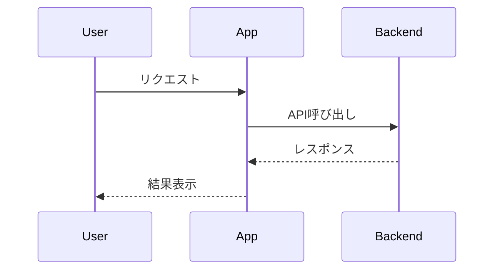

# 技術スタック

## プロジェクト種別

[このプロジェクトの種類を記載: Webアプリ / CLI / デスクトップ / モバイル / ライブラリ / APIサービス など]

## コア技術

### 主要言語

- **言語**: [例: Python 3.11, Go 1.21, TypeScript, Rust, C++]
- **ランタイム/コンパイラ**: [必要に応じて記載]
- **言語別ツール**: [パッケージ管理・ビルドツールなど]

### 主要ライブラリ/フレームワーク

[プロジェクトの中心となる依存関係を記載]

- **[ライブラリ名/FW名]**: [用途とバージョン]
- **[ライブラリ名/FW名]**: [用途とバージョン]

### アーキテクチャ

[構成方針を記載: MVC / イベント駆動 / プラグイン型 / クライアント-サーバー / モノリス / マイクロサービス など]

### データ保存（該当する場合）

- **主ストレージ**: [例: PostgreSQL, ファイル, インメモリ, クラウドストレージ]
- **キャッシュ**: [例: Redis, インメモリ, ディスクキャッシュ]
- **データ形式**: [例: JSON, Protocol Buffers, XML, Binary]

### 外部連携（該当する場合）

- **API**: [連携する外部サービス]
- **通信プロトコル**: [例: HTTP/REST, gRPC, WebSocket, TCP/IP]
- **認証方式**: [例: OAuth, APIキー, 証明書]

### 監視/ダッシュボード技術（該当する場合）

- **ダッシュボード基盤**: [例: React, Vue, Vanilla JS, Terminal UI]
- **リアルタイム通信**: [例: WebSocket, SSE, ポーリング]
- **可視化ライブラリ**: [例: Chart.js, D3]
- **状態管理**: [例: Redux, Vuex]

## 開発環境

### ビルド/開発ツール

- **ビルドシステム**: [例: Make, CMake, Gradle, npm scripts, cargo]
- **パッケージ管理**: [例: pip, npm, cargo, go mod]
- **開発フロー**: [例: hot reload, watch mode, REPL]

### コード品質ツール

- **静的解析**: [品質/正確性確認ツール]
- **フォーマッタ**: [コード整形ツール]
- **テスト基盤**: [単体/結合/E2E]
- **ドキュメント生成**: [必要に応じて]

### バージョン管理/コラボレーション

- **VCS**: [例: Git]
- **ブランチ戦略**: [例: GitHub Flow, trunk-based]
- **レビュー運用**: [レビューの進め方]

## デプロイ/配布（該当する場合）

- **対象環境**: [クラウド / オンプレ / デスクトップ / モバイル など]
- **配布方式**: [SaaS / パッケージ配布 / App Store など]
- **導入要件**: [前提条件・必要環境]
- **更新方式**: [アップデート手段]

## 技術要件と制約

### 性能要件

- [例: 応答時間, スループット, メモリ使用量, 起動時間]
- [具体的な目標値]

### 互換性要件

- **プラットフォーム対応**: [OS/アーキテクチャ/バージョン]
- **依存バージョン範囲**: [最小/最大バージョン]
- **準拠規格**: [業界標準・仕様]

### セキュリティ/コンプライアンス

- **セキュリティ要件**: [認証, 暗号化, データ保護]
- **準拠要件**: [GDPR, SOC2 など]
- **脅威モデル**: [主要なリスク]

### スケーラビリティ/可用性

- **想定負荷**: [ユーザー数, リクエスト数, データ量]
- **可用性目標**: [稼働率, 障害復旧]
- **成長見込み**: [将来の拡張方針]

## 技術判断と根拠

[主要な技術選定・設計判断と理由を記載]

### 判断ログ

1. **[技術/パターン選定]**: [採用理由と比較した代替案]
2. **[アーキテクチャ判断]**: [受け入れるトレードオフ]
3. **[ツール/ライブラリ選定]**: [評価観点と選定理由]

## 処理フロー図の記載（必要時は必須）

- 連携・非同期・状態遷移・複雑な分岐を含む仕様では、文章説明に加えて**処理フロー図**を記載する
- フロー図は `mermaid`（`flowchart` / `sequenceDiagram`）を推奨する
- 技術選定の妥当性がフロー依存の場合は、判断ログと図を相互参照できるようにする

## 既知の制約/課題

[技術的負債、現時点の制約、将来改善案を記載]

- **[制約1]**: [影響と改善案]
- **[制約2]**: [発生理由と対応時期]
