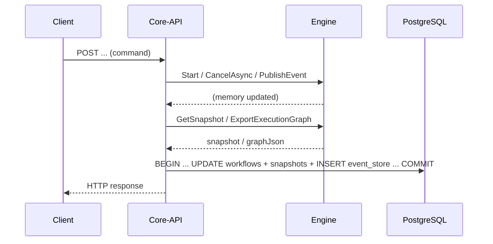

# O6 サブチケット詳細仕様（STV-413〜STV-418）

- Version: 1.0.0
- 更新日: 2026-04-10
- 対象: `v2-modification-plan.md` 懸念 C2/C7/C11/C13/C14 に対応する実行チケットの仕様確定
- 関連: `.workspace-docs/30_specs/10_in-progress/o6-concerns_decomposition_spec.md`, `.workspace-docs/50_tasks/10_in-progress/v2-ticket-backlog.md`, `.workspace-docs/50_tasks/20_done/v2-u1-event-ordering-and-transactions.md`, `.workspace-docs/50_tasks/20_done/v2-u7-reducer-placement.md`, `.spec-workflow/specs/o6-subtickets-detailed/`（spec-workflow 承認用）

---

## 0. 用語と正本

| 用語 | 意味 |
|------|------|
| **projection** | `workflows` 行および `execution_graph_snapshots.graph_json`（HTTP の Read Model の根拠となる永続化された実行ビュー）。 |
| **コマンド同期経路** | HTTP ハンドラが `IWorkflowEngine` を in-process で呼び、**同一リクエスト内**で Engine メモリを更新したうえで DB に書き戻す流れ。 |
| **コールバック経路** | U1 で想定される、非同期実行中に Engine から Core-API へイベント列を渡す流れ（**現行コードベースでは未実装**。本仕様は将来実装時の契約を固定する）。 |
| **event_store** | `event_store` テーブルへの追記。`seq` は workflow 単位で単調増加（INSERT 順で付与）。 |

**実装の正**: 本書の「現状実装」は `api/Statevia.Core.Api/Services/WorkflowService.cs` および `EventStoreEventType` に基づく。U1 文書（`v2-u1-event-ordering-and-transactions.md`）との差分は、各 STV 節で明示する。

---

## STV-413 — C2: projection 更新タイミングの統一仕様化

### STV-413 の目的

コマンド同期経路と（将来の）コールバック経路で、**projection と event_store の整合ルール**を一文書に統一し、実装・レビュー時の判断基準にする。

### 現状実装（v2 確定・正）

次の **HTTP コマンド**はいずれも「Engine 呼び出し → メモリ上のスナップショット取得 → DB 書き込み」の順で、**1 リクエストあたり 1 トランザクション**（`Start` は ReadCommitted、`Cancel` / `PublishEvent` は Serializable）で projection と event_store を更新する。

| 操作 | Engine 呼び出し | projection 更新 | event_store 追記 | 備考 |
|------|-----------------|-----------------|-------------------|------|
| `POST /v1/workflows`（Start） | `Start` | `AddWorkflowAndSnapshotAsync` | `WorkflowStarted` | 開始ペイロードに `definitionId`, `tenantId`（JSON）。 |
| `POST .../cancel` | `CancelAsync` | `UpdateWorkflowAndSnapshotAsync` | `WorkflowCancelled` | ペイロードに `tenantId`。 |
| `POST .../events` | `PublishEvent(wfId, name)` | `UpdateWorkflowAndSnapshotAsync` | `EventPublished` | ペイロードに `tenantId`, `name`。 |

projection の内容は、いずれも **`GetSnapshot` + `ExportExecutionGraph`** から構築した値で上書きする（`BuildProjectionFromEngine` 相当）。

**決定（C2 解消の核）**: 現行アーキテクチャでは **「コマンド同期経路のみ」**であり、**1 HTTP コマンド完了時点**で、当該 workflow の DB 上の projection は **そのコマンドに対応する Engine メモリ状態と一致**する（同一トランザクション内で読み取り・書き込みするため）。

### 将来実装（U1 コールバック導入時の契約）

U1 の **案 C（順序付きバッチ）** を前提とする。

1. **1 バッチ = 1 トランザクション**: コールバック 1 回で渡される順序付きイベント列に対し、`event_store` へ **まとめて INSERT**（`seq` は配列順または API 付与で単調）→ reducer 適用 → **projection 一括更新**を **同一トランザクション**で行う。
2. **コマンド戻り値経路との整合**: コマンド直後に返るイベント列も **同じ 3 ステップ**（INSERT → reducer → projection）を **1 トランザクション**で行う。`seq` はコールバックと連続する単調列になるよう API（または合意した seq 付与規則）で管理する。
3. **途中失敗**: バッチ処理が失敗した場合は **バッチ全体をロールバック**し、再試行時は **STV-415** のべき等規則に従う。

### STV-413 のチケット完了条件

- 上記「現状実装」と「将来契約」を **`docs/` または本リポジトリの契約ドキュメント**に 1 節として転記し、`v2-modification-plan.md` 8.2 の C2 説明と矛盾しないことを確認する。
- 可能なら **シーケンス図（テキストまたは Mermaid）** を 1 本含める（コマンド同期 1 本でよい）。

---

## STV-414 — C7: Engine イベントと event_store 対応表の策定

### STV-414 の目的

**永続化される**イベント種別と、HTTP 契機・payload・読み取り側の利用を表形式で正本化する。`modification-plan` が参照する「24 種」などの **Engine 内部イベント語彙**は、現状 `event_store` にすべては載っていないため、**「載るもの／載らないもの／将来載せるもの」** を区別する。

### 現状: `EventStoreEventType`（Core-API が追記する種別）

| 永続化 `type`（DB 文字列） | 発火契機（HTTP） | payload（JSON・概要） | 主な利用 |
|----------------------------|------------------|-------------------------|----------|
| `WorkflowStarted` | `POST /v1/workflows` 成功 | `definitionId`, `tenantId` | タイムライン `ExecutionStatusChanged`（Running）、監査 |
| `WorkflowCancelled` | `POST .../cancel` 成功 | `tenantId` | タイムライン `ExecutionStatusChanged`（Cancelled） |
| `EventPublished` | `POST .../events` 成功 | `tenantId`, `name`（イベント名） | タイムライン `GraphUpdated`（簡易パッチ） |

**決定**: 上表が **現行の event_store 契約の正**。新種別の追加は **マイグレーション不要な enum 拡張 + 契約ドキュメント更新**で行い、`docs/core-api-interface.md` または `docs/statevia-data-integration-contract.md` に反映する。

### ギャップ（Engine 内部 vs event_store）

- U1 文書の `NODE_*` / `JOIN_*` / `EXECUTION_*` 等は、**コールバック経路実装後**に「event_store に投影するか／projection のみ更新か」を種別ごとに決める。
- **未確定のまま残す項目**は「将来対応」列で管理し、STV-414 完了時点では **表に行として存在**し、説明が空でないこと（TBD 明示可）。

### STV-414 のチケット完了条件

- 上記表を **`docs/` に独立節**として追加するか、本ファイルを正本のまま `docs` からリンクする。
- `EventStoreEventType` の XML コメントと **同一の語彙**であることをコードレビューで確認できる。

---

## STV-415 — C11: コールバック失敗時の再送べき等仕様化

### 前提

コールバック経路が存在しない現状では **本チケットは主に契約先行**。ただし **コマンド同期経路の DB 失敗**にも一部適用できる。

### 決定事項（仕様）

1. **重複キー**: 再送される各イベント（またはバッチ内の各イベント）には、Engine または API が生成する **`clientEventId`（UUID 推奨）** を payload または専用列で持てるようにする（実装は別チケット）。
2. **べき等 INSERT**: `event_store` への追記は **`(workflow_id, client_event_id)` の UNIQUE**（または同等の重複検知）により、同一イベントの再送を **無視または既存行を返す**（projection は再適用しない）。
3. **バッチ再送**: 案 C の場合、バッチ全体に **`batchId`（UUID）** を付与し、バッチ内イベントは **すべて成功した場合のみ** commit。失敗時はバッチ全体 rollback のうえ **同一 `batchId` の再送**を許容する。
4. **リトライ上限**: API 側で **指数バックオフ + 最大試行回数**を設定可能にする（既定値は実装チケットで決定）。超過時は **構造化ログ（Error）** と **メトリクス**（将来）に記録し、運用手順に「手動介入／DLQ」を記載する。
5. **コマンド同期の失敗**: Start が DB commit 前に失敗した場合、Engine 上は既にインスタンスが存在しうる。現状は **クライアントが 5xx でリトライ**し、冪等キーで重複作成を防ぐ想定（`command_dedup`）。コールバック導入後は **Engine 側の「未永続化インスタンス」の扱い**を別タスクで定義する（本仕様では「要検討」として 1 行記載する）。

### STV-415 のチケット完了条件

- 上記を `docs/` または DB スキーマ設計メモに転記し、STV-413 の「バッチ = 1 TX」と整合していること。
- スキーマ変更が必要な場合は **EF マイグレーション案**を別行で起票可能な粒度に書く。

---

## STV-416 — C13: GetSnapshot と reducer 出力の整合方針決定

### 決定（仕様）

1. **HTTP API の契約上の正**: `GET /v1/workflows/{id}` 等が返す実行状態・グラフは **DB の projection**（`workflows` / `execution_graph_snapshots`）を正とする。クライアントは Engine メモリを直接参照しない。
2. **`GetSnapshot` / `ExportExecutionGraph` の位置づけ**: **同一プロセス内のランタイムビュー**。コマンド同期経路では、**各コマンドの DB 書き込み直前**に読み取るため、**その時点では projection と一致**する。
3. **コールバック経路導入後**: Engine メモリは **未永続の進行**を含みうる。運用・デバッグで `GetSnapshot` を参照する場合は **「最終永続状態とは限らない」** ことを `AGENTS.md` または開発者向けドキュメントに 1 文以上で明記する。
4. **reducer（U7）**: reducer の出力は **event_store の適用結果**として projection を更新する想定とし、`GetSnapshot` が reducer 状態と **常に同一**であることは保証しない（**永続化された系列に対する reducer 結果が正**）。

### STV-416 のチケット完了条件

- 上記 4 点を `AGENTS.md` または `docs/` に反映し、レビューで「デバッグ時の誤解防止」が読み取れること。

---

## STV-417 — C14: nodes 未対応要素の段階導入計画

### STV-417 の根拠

`v2-nodes-to-states-conversion-spec.md` の 7.1 / 7.2 / 11 が正本。C14 は **MVP 後の優先順位とエラー契約**を固定する。

### 段階計画（優先度順・提案）

| 段階 | 対象フィールド | 内容 | 依存 |
|------|----------------|------|------|
| **P1** | `onError` | action 失敗時の `Failed` Fact 遷移と states の対応。Action Registry・Engine FSM 契約の更新。 | Engine / API |
| **P2** | `timeout` / `onTimeout` | Wait とスケジューラ、event_store 上の意味（U1 との整合）。 | Engine |
| **P3** | `output` | state 出力と reducer / Read Model の対応（IO 系仕様）。 | Engine / API / IO |
| **P4** | `controls` | cancel / resume / 外部制御と API の対応。 | API / UI 任意 |

### STV-417 の未対応時の契約（現行維持）

- 変換仕様 7.1 に列挙された禁止フィールドが **1 つでも存在する**定義は、**受理せず** 422/400 相当の明確なメッセージを返す（MVP どおり）。
- 段階導入時は **7.2 を改訂**し、受理したフィールドを 7.1 から削除または「条件付き受理」に移す。

### STV-417 のチケット完了条件

- 上記表を `v2-nodes-to-states-conversion-spec.md` の「将来拡張」に追記するか、本ファイルを正本としてそこからリンクする。
- 各段階について **起票可能な STV または IO 番号**のプレースホルダをバックログに追加する（`STV-418` で統合でも可）。

---

## STV-418 — O6 横断: 懸念対応ロードマップ統合

### STV-418 の目的

STV-413〜417 の仕様が **バックログ・計画書・実装**の参照先として一貫するよう整理する。

### チェックリスト（完了条件）

1. `v2-ticket-backlog.md` の STV-413〜417 の **備考**が本ファイル（または `docs` 転記先）を指す。
2. `v2-modification-plan.md` 8.2 の C2/C7/C11/C13/C14 に **「詳細は o6-subtickets_detailed_spec」** への参照が 1 行以上ある（任意タスクだが STV-418 の受け入れとする）。
3. STV-413〜417 がすべて **完了**したら、O6 の「仕様未確定」は **実装チケット**に落ちている状態にする（本チェックリストで確認）。

### 推奨スプリント割当（参考）

| スプリント | 主対象 |
|------------|--------|
| 1 | STV-413, STV-414 |
| 2 | STV-415（＋スキーマ必要なら設計） |
| 3 | STV-416, STV-417（並行可） |
| 4 | STV-418 |

---

## 変更履歴

| 版 | 日付 | 内容 |
|----|------|------|
| 1.0.0 | 2026-04-10 | STV-413〜STV-418 の仕様初版（現状実装の正本化と将来 U1 整合）。 |
