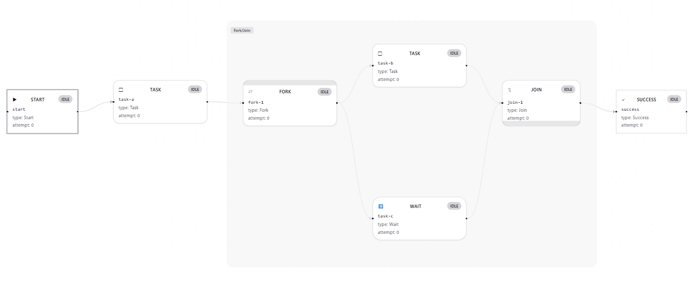

# statevia

**statevia** は、
State / FSM / Fork-Join / Wait / Resume / Cancel を統合した
**型安全・非同期・イベント駆動ワークフローエンジンの中核ライブラリ**です。

- 実装はシンプル
- 設計は厳密
- 可視化と監査に強い ExecutionGraph
- Definition から自動構築される FSM / Fork / Join

---

## 特徴

- 明示的 FSM（(State, Fact) → TransitionResult）
- Fork / Join による並列実行
- Wait / Resume（イベント駆動 or 明示再開）
- Cancel 伝播と安全なキャンセル設計
- ExecutionGraph による完全な実行可視化
- Payload Snapshot + redactionPolicy による情報統制
- State 単体はジェネリック / Engine 全体は非ジェネリック

---

## 設計思想

statevia は以下の思想をベースに設計されています。

- State は処理に集中する
- Engine は実行制御に集中する
- Definition は実行構造のみを表す
- ExecutionGraph は「事実ログ」でありロジックではない
- Fork / Join / Wait / Cancel は FSM の拡張構文である
- 非同期 Task ベースでブロッキングしない

設計思想の詳細:

- docs/design-philosophy.md

## 📸 UI スクリーンショット

### Graph View（Fork / Join / WAIT / Resume）

## 

## アーキテクチャ概要

```txt
Definition (JSON/YAML)
        ↓
  FSM / Fork / Join 自動構築
        ↓
     Execution Engine
        ↓
 StateExecution (async Task)
        ↓
   ExecutionGraph（事実ログ）
```

詳細:

- docs/architecture.md

---

## Hello Workflow

最小構成サンプル:

- samples/hello-statevia

```csharp
var engine = new WorkflowEngine(definition);

await engine.StartAsync();

engine.EmitEvent("resume-event");

var graph = engine.ExecutionGraph;
```

---

## 仕様ドキュメント

- Definition
  - docs/definition-spec.md

- FSM
  - docs/fsm-spec.md

- Fork / Join
  - docs/fork-join-spec.md

- Wait / Cancel
  - docs/wait-cancel-spec.md

- ExecutionGraph
  - docs/execution-graph-spec.md

---

## 実行イメージ（Definition × 実行フロー × ExecutionGraph）

### サンプル定義

```yaml
workflow:
  start: A
  states:
    A:
      onCompleted: Fork1

    Fork1:
      fork:
        - B
        - C

    B:
      onCompleted: WaitB

    WaitB:
      wait:
        event: resumeB
      onResume: Join1

    C:
      onCompleted: D

    D:
      onCompleted: Join1

    Join1:
      join:
        requires: [WaitB, D]
      onCompleted: E

    E:
      end: true
```

---

### 実行フロー（論理構造図）

```text
A
│
▼
Fork1
├─▶ B ─▶ WaitB ──(resumeB)──┐
│                           ├─▶ Join1 ─▶ E
└─▶ C ─▶ D ─────────────────┘
```

---

### 時系列実行イメージ

```text
t0: A Running → Completed
t1: Fork1 発火 → B / C 並列実行

t2: B Completed → WaitB (Waiting)
t3: C Completed → D Running → Completed

t4: Join1 は WaitB 未完了のため待機

t5: Event: resumeB
t6: WaitB Resumed → Completed

t7: Join1 条件成立 → E 実行
t8: E Completed → Workflow Completed
```

---

### ExecutionGraph（スナップショット例）

```json
{
  "status": "Completed",
  "nodes": [
    { "id": "A", "status": "Completed", "type": "Task" },
    { "id": "B", "status": "Completed", "type": "Task" },
    { "id": "WaitB", "status": "Completed", "type": "Wait" },
    { "id": "C", "status": "Completed", "type": "Task" },
    { "id": "D", "status": "Completed", "type": "Task" },
    { "id": "Join1", "status": "Completed", "type": "Join" },
    { "id": "E", "status": "Completed", "type": "Task" }
  ],
  "edges": [
    { "from": "A", "to": "B", "type": "Fork" },
    { "from": "A", "to": "C", "type": "Fork" },
    { "from": "B", "to": "WaitB", "type": "Normal" },
    { "from": "WaitB", "to": "Join1", "type": "Resume", "event": "resumeB" },
    { "from": "C", "to": "D", "type": "Normal" },
    { "from": "D", "to": "Join1", "type": "Join" },
    { "from": "Join1", "to": "E", "type": "Normal" }
  ]
}
```

## 使いどころ

- 非同期ジョブオーケストレーション
- ワークフローエンジン
- 複雑な状態遷移を持つ業務処理
- イベント駆動処理
- 並列タスクの制御と可視化

---

## 実装ポリシー

- Engine Core はライブラリ配布前提
- ユーザーは State 実装のみ担当
- 並列数制御・キャンセルポリシーはユーザー責務
- 危険な状態の検知機構はエンジン側で提供

---

## Repository Structure

```txt
src/
docs/
samples/
tests/
```

---

## License

MIT

---

## ステータス

本プロジェクトは設計・開発中です。初回安定版リリース前に破壊的変更が発生する可能性があります。
