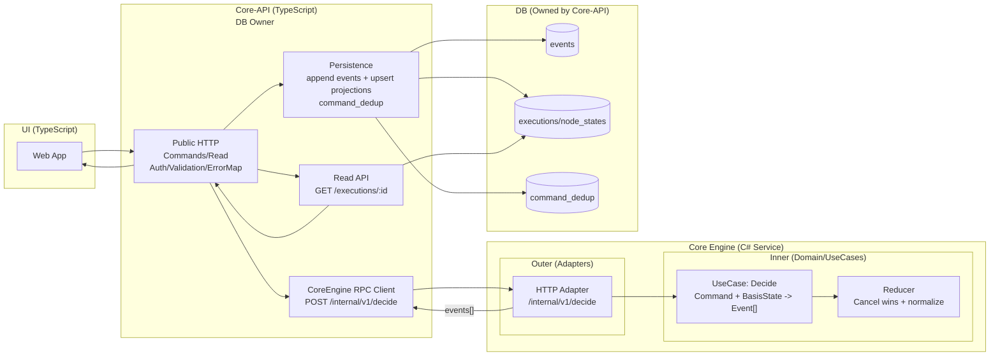

# Architecture V2

Version: 2.0
Decision: Core Engineは独立プロセス / APIがDB所有 / UIはAPIのみを見る

---

## 1. 決定事項

### 1.1 方式

- **Core Engine（C#）**：独立プロセス（サービス）
- **Core-API（TypeScript）**：UI向けPublic API（BFF） + DB所有者（events/projections/dedup）
- **UI（TypeScript）**：Core-API のみを見る（Read/Write/将来Pushも）
- **DB**：Core-API が所有（Core EngineはDBを持たない）

### 1.2 ドメイン原則

- 状態変更は Command → Event[] → Reducer（Cancel wins）で定義される
- “通知”の最小単位は **Event[]**（Core Engine→Core-API は Event[] を返す）
- Cancel wins は **Reducerが最終保証**（Core Engine内）

---

## 2. 責任分界

### 2.1 Core Engine（C# / 独立サービス）

責務（内側は純粋、外周でHTTP）：

- Domain（Events/State/Reducer）: Cancel wins + normalize
- UseCase: Decide(Command + BasisState) → Event[]
- Guard: terminal/cancelRequested 等のドメイン整合性チェック
- HTTP Adapter: /internal/v1/decide を提供（外周）
- DBやProjectionは知らない（I/Oなし）

### 2.2 Core-API（TypeScript / DB所有）

責務：

- UI向け Public API（HTTP）
- 認証/認可、レート制限、入力バリデーション
- DB永続：events append（順序保証）/ projections upsert / command_dedup
- Core Engine RPC client（/decide呼び出し）
- Read API（GET /executions/:id 等）
- エラー写像（Core Engineのreject → 409/422/404）
- SSE（Server-Sent Events：サーバー送信イベント）

### 2.3 UI（TypeScript）

- Command送信（POST）
- Read model 表示（GET）
- SSE購読（Core-APIへ）

---

## 3. 全体図（固定）



---

## 4. インターフェイス契約

### 4.1 Core-API → Core Engine（Internal RPC）

#### Endpoint

- `POST /internal/v1/decide`

#### Request: DecideRequest

```json
{
  "requestId": "uuid",
  "tenantId": "t-1",
  "idempotencyKey": "uuid",
  "correlationId": "c-1",
  "actor": { "kind": "user|system|scheduler|external", "id": "..." },

  "basis": {
    "kind": "state",
    "execution": {
      /* ExecutionState snapshot */
    },
    "expectedVersion": 12
  },

  "command": {
    "type": "CancelExecution",
    "executionId": "ex-1",
    "payload": { "reason": "user" }
  }
}
```

#### Response: DecideResponse（Accepted）

```json
{
  "accepted": true,
  "executionId": "ex-1",
  "events": [
    /* EventEnvelope[] */
  ]
}
```

#### Response: DecideResponse（Rejected）

```json
{
  "accepted": false,
  "error": {
    "code": "COMMAND_REJECTED|INVALID_INPUT|NOT_FOUND",
    "message": "Execution is terminal",
    "details": {}
  }
}
```

> NOTE: Core EngineのHTTPは“外周アダプタ”。内側は純粋。

---

### 4.2 Core-API → UI（Public）

- Command: `POST /executions/:id/cancel` など（202/409/422/404）
- Read: `GET /executions/:id`
- Graph: `GET /graphs/:graphId`（構造提供。UIは構造×状態で描画）
- Stream: `GET /executions/:id/stream`（SSE）

---

## 5. 推奨案（重要）：basis と並行制御

### 5.1 推奨：basis = state + expectedVersion（楽観ロック）

- Core-APIはDBのprojectionから **ExecutionState snapshot** と **version** を取得
- Core Engineへ `expectedVersion` を渡す（整合性ヒント）
- Core-APIは永続化時に **version一致を条件に更新** して競合検出する

#### 競合時の挙動（固定）

- version競合（並行コマンド）→ Core-APIは 409 を返す（UIはリトライ/再取得）

> なぜこれが推奨？
>
> - いきなり分散ロックを導入せずに堅牢性を確保できる
> - 監査・再現性にも影響が少ない
> - 実装が軽い（DBのversion列で対応）

### 5.2 代替（将来強化）

- execution単位ロック（DB advisory lock 等）
- basis = events（直近N件を渡す）で再現性寄り

---

## 6. Idempotency（固定）

### 6.1 最終責任（authoritative）

- **DB所有者（Core-API）**が最終的に二重保存を防ぐ
- dedup key （重複排除キー）推奨：
  - `(tenantId, idempotencyKey)` を主キーに保存
  - `commandFingerprint`（command/type/executionId/body hash）も保存して不一致を409

### 6.2 Core Engine側

- Core Engineは “計算器” として扱い、必須ではない
- ただし requestId/correlationId をイベントに反映できる設計は維持

---

## 7. エラー写像（Core Engine → Core-API → UI）

- COMMAND_REJECTED → 409
- INVALID_INPUT → 422
- NOT_FOUND → 404
- INTERNAL → 500

Core-APIがUI向け形式に正規化する：

```json
{
  "error": { "code": "COMMAND_REJECTED", "message": "...", "details": {} }
}
```

---

## 8. シーケンス（Cancel例）

1. UI → Core-API: POST /executions/ex-1/cancel（Idempotency-Key）
2. Core-API:
   - auth/validation
   - load projection state + version

3. Core-API → Core Engine: POST /internal/v1/decide（basis=state, expectedVersion）
4. Core Engine:
   - guard + decide → events[]
   - reducer（Cancel wins）

5. Core-API:
   - tx: dedup check → append events → apply reducer (or projector) → upsert projections(version++)

6. Core-API → UI: 202
7. UI → Core-API: GET /executions/ex-1（最終状態確認） or /executions/ex-1/stream（SSE）

---

## 9. パッケージ構成（例）

### 9.1 Core Engine（C# / Clean Architecture）

```text
services/core-engine/
├─ CoreEngine.sln
└─ src/
   ├─ CoreEngine.Domain/               # 内側（純粋）
   │  ├─ Types/                        # ExecutionState, NodeState
   │  ├─ Events/                       # 固定Event一覧
   │  └─ Reducer/                      # Cancel wins + normalize
   ├─ CoreEngine.Application/          # UseCases（純粋寄り）
   │  ├─ Decide/                       # Decide(Command, BasisState) -> Event[]
   │  └─ Guards/
   ├─ CoreEngine.Transport.Http/       # 外周（HTTPアダプタ）
   │  ├─ Controllers/                  # POST /internal/v1/decide
   │  └─ Program.cs
   └─ CoreEngine.Tests/
```

### 9.2 Core-API（TypeScript / DB owner）

```text
services/core-api/
├─ src/
│  ├─ http/                            # public endpoints (UI contract)
│  ├─ coreEngineClient/                # /internal/v1/decide client
│  ├─ store/
│  │  ├─ eventStore.ts                 # append events
│  │  ├─ projections.ts                # upsert executions/node_states
│  │  ├─ readRepo.ts                   # load projection state + version
│  │  └─ dedupRepo.ts                  # command_dedup
│  ├─ projector/                       # apply reducer or projection builder
│  └─ read/                            # GET /executions/:id, /graphs/:id
└─ sql/
   └─ migrations...
```

### 9.3 UI（TypeScript）

```text
services/ui/
└─ src/
   ├─ apiClient/                       # Core-API client
   ├─ pages/
   ├─ components/ExecutionGraph/
   └─ ...
```

### 9.4 Contracts（推奨：言語間の齟齬防止）

```text
contracts/
├─ decide-request.schema.json
├─ decide-response.schema.json
└─ execution-readmodel.schema.json
```

---

## 10. 運用の最小docker構成（参考）

- core-api
- core-engine
- postgres（core-api所有）
- ui（任意）
