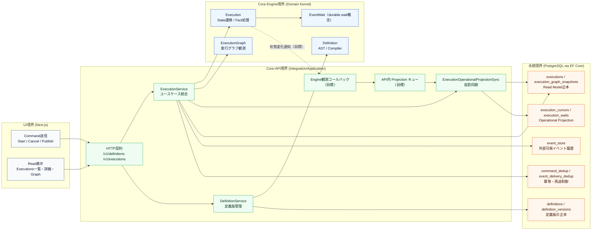

# ドメインモデル関連図（境界付き）

関連する概念が増えてきたため、Statevia の主要ドメインモデルを「どの境界に属するか」と「どこが正本か」を含めて俯瞰できるように整理する。

## 1. ドメイン境界と関連

## 2. 読み方（要点）

- `Core-Engine` は純粋ドメインロジック（定義解釈、遷移、グラフ生成）を担当し、I/O は持たない。
- `Core-API` はユースケース実行とトランザクション境界を担当し、Engine 結果を永続化モデルへ写像する。
- UI の正本は `GET /v1/executions*` が返す Read Model（`executions` / `execution_graph_snapshots`）である。
- `execution_cursors` / `execution_waits` は運用用投影であり、Read API 正本とは分離される。
- `event_store` は外部可視イベント履歴、`command_dedup` / `event_delivery_dedup` は冪等制御の責務を持つ。

## 3. 現状と目標の切り分け

- **現状（実装済み）**: 永続化テーブル更新は `Core-API` からのみ実行される。`UI` や `Core-Engine` が DB に直接書き込む経路は持たない。
- **目標（仕様記載あり）**: Engine の状態変化を API 側へ観測コールバックし、API 内キューで execution 単位に併合しつつ `ProjectionSync` で DB 反映する流れを想定する。
- **図の凡例**: 破線は「目標/導入予定」の経路、実線は「現状の責務境界で成立している経路」を示す。

## 4. 参照元ドキュメント

- `docs/architecture/overview.md`
- `docs/specifications/data-integration.md`
- `docs/specifications/api-http.md`
- [decisions/event-store.md](../decisions/event-store.md)

## 5. Action 実行プラットフォーム境界（Core-API）

Engine は `IStateExecutor` のみを知る。Action の解決・テナント可視性・実行モード決定は Core-API の Platform 層が担う。

| コンポーネント | 正本 / 責務 | Engine から見えるか |
| --- | --- | --- |
| `IActionCatalog` | actionId → `ActionDescriptor` + in-process factory。`ActionPublication` は sibling 参照 | No |
| `IActionVisibilityResolver` | TenantId + Descriptor → 利用可否 | No |
| `IActionExecutionPolicy` | Context + Descriptor → `ActionExecutionMode`（TrustLevel 下限、緩和不可） | No |
| `IExecutionPolicyProvider` | scope（Org/Project/Env/Tenant）別 `ExecutionPolicy` を返し、base へ最厳優先で合成（緩和不可） | No |
| `IActionExecutionBackendSelector` | `ActionExecutionMode` ＋設定（`ProviderKey`）→ 具体 `IActionExecutionBackend` 選択 | No |
| `IActionExecutionBackend` | Mode を満たす実行実装（in-process / action-host / container / wasm）。1 Mode に複数実装可 | No |
| `IActionExecutor` | Catalog → Visibility → Policy → Selector → Backend ディスパッチ | No（`StateActionExecutorAdapter` 経由で間接委譲） |
| `IModuleSource` / `CompositeModuleSource` | Module 取得元。`Priority` 昇順で集約し重複は高優先勝ち（DI 順非依存） | No |
| `ModuleHost` | `CompositeModuleSource` が供給する Module の ALC load と Catalog 登録 | No |

共有契約は `core/actions/Statevia.Core.Actions.Abstractions`（実行系）/ `infrastructure/Statevia.Infrastructure.Modules`（Module 系）。詳細は [actions/platform.md](../specifications/actions/platform.md)。

### 5.1 ExecutionMode（隔離契約）と Backend（実装）の分離

`ActionExecutionMode` は **隔離レベルの契約**（in-process / action-host / container / wasm / remote）であり、Backend は**その契約を満たす具体実装**である。1 Mode に複数 Backend を登録でき、`IActionExecutionBackendSelector` が `Backends:{Mode}` の `ProviderKey` で選択する（単一登録は自動選択、複数登録で未指定は fail-safe エラー、Backend 不在 Mode は `UnsupportedExecutionMode`）。Policy は Mode のみ決定し、実装選択には関与しない。

### 5.2 階層 Execution Policy（緩和不可合成）

`IExecutionPolicyProvider` が scope 別の `ExecutionPolicy`（`MinimumMode`）を返し、base（`ConfigurableExecutionPolicy` の TrustLevel×Env 結果）へ `Strictness.Max` で重ねる。**どの階層も base 下限を緩和できない**。現状実装は Tenant scope（appsettings `Statevia:ExecutionPolicy:Tenants`）のみで、Org/Project scope は将来拡張。

### 5.3 Module 供給パイプライン（Source → Materialize → Host → Catalog）

ModuleHost が consume するのは複数 Source を集約した `CompositeModuleSource`。各 Source は取得した Module を `MaterializedModule`（`infrastructure/Statevia.Infrastructure.Modules`・ローカル完全表現＝正本）へ materialize し、`DiscoveredModule`（DTO）へ射影して ModuleHost へ渡す。リモート取得は `MaterializingModuleSourceBase` 派生が acquire→cache→verify→extract→materialize を担う。実装済みは **`OciModuleSource`**（`IOciArtifactFetcher` / OrasProject.Oras、`Statevia:Modules:Oci`、Priority 既定 200）、**`S3ModuleSource`**（`IS3ArtifactFetcher` / AWSSDK.S3、`Statevia:Modules:S3`、Priority 既定 300）、**`GitModuleSource`**（`IGitArtifactFetcher` / HTTP archive・GitHub・GitLab、`Statevia:Modules:Git`、Priority 既定 400）。OCI / S3 / Git とも content identity（manifest digest / ETag・VersionId / commit SHA+ModulePath）解決後にキャッシュ命中なら本体再取得をスキップする。集約は明示 `Priority` 昇順（filesystem=100）、同名 Module は高優先勝ち＋warning、同 Priority は `SourceLabel` で tie-break。

### 5.4 version coexist（責務分離・設計のみ）

同一 Module の複数版共存は、**Catalog が fullVersion（major.minor.patch）を保持・検索のみ**担当し、**Compiler 配下の `VersionResolver`** が imports の versionRange から具体版を解決、確定版を **`ResolvedModuleReference`** として不変 Definition に保存し、**Runtime は再解決・フォールバックを一切行わず exact lookup のみ**、という責務分離で設計確定済み（**実装は未着手**）。actionId は論理 ID（`{moduleId}.{actionName}`）を維持し版を含めない。現状 Catalog は actionId 完全一致キーのため、同一 moduleId の複数版は未対応。
