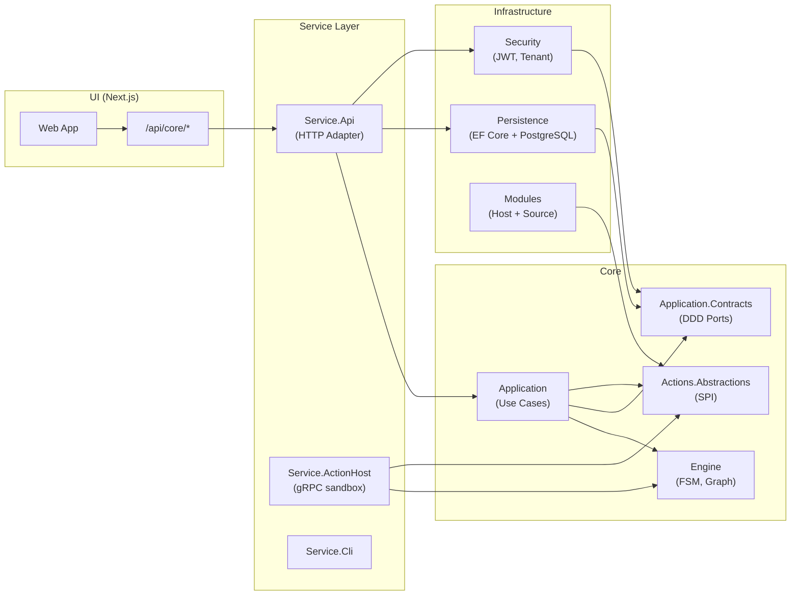

# アーキテクチャ

Version: 2.0
Project: Statevia — 実行型ステートマシン

**Version 2.0（2026-07-04）**: 4 カテゴリ構成（core / infrastructure / service / ui）とクリーン・アーキテクチャ準拠を反映。

---

## 1. システム構成

### 1.1 構成の要点

- **Core-Engine（C#）**: `core/engine/` のライブラリ。API プロセス内で `IExecutionEngine` として同一プロセス利用。独立 HTTP サービスはない。
- **Core-Application（C#）**: `core/application/`。ユースケース実装。Engine / Actions.Abstractions のみに依存し、infrastructure / service を参照しない。
- **Infrastructure（C#）**: `infrastructure/`。EF Core 永続化、JWT 認証、通知、Module ホスト等の技術実装。
- **Core-API（C#）**: `service/api/`。ASP.NET Core。HTTP アダプタとして v1/definitions・v1/executions を提供。Composition Root として全層を結合。
- **UI（TypeScript）**: `ui/studio/`。Next.js。Route Handler のプロキシ（`/api/core/*`）で Core-API の `/v1/*` に転送。

### 1.2 全体図



### 1.3 ディレクトリ対応

| 役割 | 場所 |
| --- | --- |
| Core-Engine | `core/engine/Statevia.Core.Engine/` |
| Core-Application | `core/application/Statevia.Core.Application/` |
| Application Contracts | `core/application/Statevia.Core.Application.Contracts/` |
| Actions Abstractions | `core/actions/Statevia.Core.Actions.Abstractions/` |
| Persistence | `infrastructure/Statevia.Infrastructure.Persistence/` |
| Security | `infrastructure/Statevia.Infrastructure.Security/` |
| Core-API | `service/api/Statevia.Service.Api/` |
| Action Host | `service/action-host/Statevia.Service.ActionHost/` |
| CLI | `service/cli/Statevia.Service.Cli/` |
| UI | `ui/studio/` |

### 1.4 Docker 構成（参考）

- **postgres**: データベース
- **service-api**: C# API（`service/api/Dockerfile`）
- **ui**: Next.js（`ui/studio/Dockerfile`）

`docker-compose.yml` はリポジトリルートに配置。

---

## 2. 責任分界

### 2.1 Core-Engine（C# ライブラリ）

- 定義のロード・検証・コンパイル（Definition）
- FSM 遷移・Fork/Join・スケジューラ（Engine / FSM / Join / Scheduler）
- 状態実行・ExecutionGraph の更新（Execution / ExecutionGraph）
- 終端の優先順位はエンジン内で保証

### 2.2 Core-Application（ユースケース）

- 定義の登録・publish・一覧・取得
- 実行の開始・キャンセル・イベント発行
- コマンド重複排除（dedup）
- セキュリティスナップショット・認可判定
- Action スキーマ検証

### 2.3 Infrastructure

- EF Core 永続化（CoreDbContext、Migrations）
- JWT 発行・検証・テナントコンテキスト
- 通知送信（SMTP）
- Module ホスト・OCI Source・署名検証
- gRPC Action Backend
- ID 生成（UUID v7）

### 2.4 Core-API（HTTP アダプタ / DB 所有者）

- **v1/definitions**: 定義の登録・publish・一覧・取得
- **v1/executions**: 実行開始・一覧・取得・グラフ取得・キャンセル・イベント発行
- **v1/health**: 死活
- Composition Root: 全層の DI 登録
- Engine は同一プロセスで呼び出しのみ（RPC/HTTP はなし）

### 2.5 UI（Next.js）

- `/api/core/*` で Core-API の `/v1/*` にプロキシ
- 一覧・詳細・グラフ表示（ReactFlow）。キャンセル・イベント送信

---

## 3. 依存方向（不変条件）

クリーン・アーキテクチャ（オニオン）に準拠し、以下の依存方向を維持する。

```text
core/engine                              ← 参照なし（最内殻）
core/application.contracts             → core/engine
core/actions.abstractions                → core/engine
core/application                         → core/engine, application.contracts, actions.abstractions

infrastructure/*                         → core/application.contracts or core/actions.abstractions
service/*                                → core/* + infrastructure/*（Composition Root）
ui                                       → service/api（HTTP のみ）
```

**禁止（`tests/Statevia.Architecture.Tests` で機械的に検出）:**

- `core/*` → `infrastructure/*`
- `core/*` → `service/*`
- `infrastructure/*` → `service/*`

---

## 4. Core-Engine のレイヤー

Core-Engine は定義駆動・事実駆動型 FSM に基づくワークフローエンジン。以下はエンジン内部のレイヤーと責務（`core/engine/Statevia.Core.Engine/` に実装）。

### 4.1 概要（データフロー）

Definition (YAML / JSON)
→ AST
→ Compiler
→ FSM / Fork / Join / JoinTracker
→ Scheduler（並列制御）
→ State Executor（非同期実行）
→ Execution Graph（観測）

### 4.2 定義レイヤー (Definition)

ワークフロー定義の読み込みと検証を担当。

### 4.3 コンパイラレイヤー (Compiler)

定義を内部ランタイム構造に変換する：

- FSM 遷移テーブル
- Fork テーブル
- Join トラッカー

### 4.4 FSM レイヤー

事実に基づいて遷移を評価する：(State, Fact) → TransitionResult

### 4.5 スケジューラレイヤー (Scheduler)

実行順序と並列度を制御。エンジンは同時実行制限を超えるポリシーは強制しない。

### 4.6 エグゼキュータレイヤー (Executor)

ユーザー定義の状態を非同期で実行する。

### 4.7 実行グラフ (Execution Graph)

デバッグと可視化のための実行履歴を記録。観測用であり、実行には影響しない。
