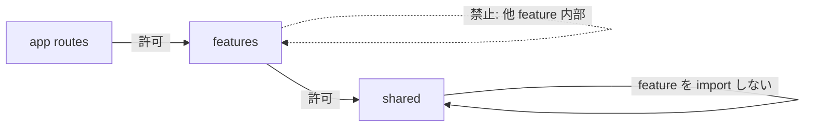

# UI Studio 内部構成（feature-first）

| 項目 | 値 |
| --- | --- |
| 種別 | Architecture |
| Version | 0.1 |
| 更新日 | 2026-07-23 |
| 関連 | [repository-layout.md](repository-layout.md), [development-guidelines.md](../development-guidelines.md) |

**Version 0.1（2026-07-23）**: Studio 内部を `app/` + `features/` + `shared/` へ段階移行する正本を追加。

---

Statevia Studio（`ui/studio/`）の**内部モジュール境界**の正本である。利用者向け画面の振る舞い・Core-API の HTTP 契約は変更しない。目的は所有権の明確化と、ページ増加時の変更影響の見通しである。

## 1. ターゲットツリー

```text
ui/studio/
├─ app/                      # App Router のみ（薄い page / layout / route handlers）
│  ├─ api/                   # BFF（`/api/core/*`）。移動しない
│  └─ definitions/page.tsx   # feature の画面を import するだけ
├─ features/
│  ├─ definitions/           # api, model, hooks, ui, i18n 切片
│  ├─ executions/            # 実行一覧・詳細・SSE・関連 hooks
│  ├─ definition-editor/     # グラフ編集器（巨大のため独立）
│  ├─ admin/
│  ├─ auth/
│  └─ dashboard/
└─ shared/
   ├─ api/                   # transport + 共通 query 型
   ├─ ui/                    # PageShell, Toast 等
   ├─ i18n/                  # Context・locale・共通キー合成
   ├─ auth/                  # session / jwt ヘルパ
   └─ lib/                   # dateTime, errors, validation primitives
```

移行中は旧 `app/lib` / `app/components` / `app/features` が併存してよい。長期の互換 re-export は残さない。

## 2. パスエイリアス

| エイリアス | 実体 |
| --- | --- |
| `@/features/*` | `features/*` |
| `@/shared/*` | `shared/*` |

`@/app/*` は原則使わない。route から feature を参照する。

## 3. 依存方向（必須）



| 向き | 可否 |
| --- | --- |
| `app` → `features` | 許可 |
| `features` → `shared` | 許可 |
| `shared` → `features` | **禁止** |
| feature → 他 feature の内部 | **禁止**（共有が必要なら `shared` へ上げるか公開エントリを明示） |

機械チェック: `ui/studio/eslint.config.js` で `shared/**` からの `@/features` / `features` 参照を `no-restricted-imports` で error にする。feature 間内部参照はレビュー必須（下記チェックリスト）。

## 4. feature 内の標準レイヤ

| 層 | 置き場 | 例 |
| --- | --- | --- |
| API client | `features/*/api.ts` | `listDefinitions`, `softDeleteDefinition` |
| hooks | `features/*/hooks/` | URL 同期、一覧取得、delete/restore |
| UI | `features/*/ui/` | 一覧行、確認ボタン群 |
| route | `app/**/page.tsx` | feature の Page を返すだけ |

## 5. 画面追加の手順（概要）

1. `features/<name>/` に `api` / `hooks` / `ui` を置く。
2. `app/**/page.tsx` は薄い wrapper のみにする。
3. 横断関心のみ `shared/` に置く（ドメイン知識を `shared` に落とさない）。
4. `npm run lint` / `typecheck` / `test:run` を通す。

## 6. 段階移行チェックリスト

| Phase | 内容 | 完了条件 |
| --- | --- | --- |
| 0 | 本正本・paths・骨格・依存方向チェック | lint / typecheck / test:run |
| 1 | transport / UI primitive / i18n・auth・汎用 lib を `shared` へ | 同上。長期 re-export なし |
| 2 | `features/definitions` パイロット（api / hooks / ui / i18n） | 定義一覧・詳細の既存テスト通過 |
| 3 | `features/executions`（必要なら graph） | 実行画面・関連テスト |
| 4 | `features/definition-editor`（移動と境界のみ） | 編集画面の挙動非変更 |
| 5 | admin / auth / dashboard、旧ディレクトリ削除、docs 最終反映 | 旧 `app/lib` 等が無いこと |

### PR レビュー必須項目（依存方向）

- [ ] `shared` から `features` への import が無い（ESLint で検知）
- [ ] feature が他 feature の内部パスを import していない
- [ ] `app/**/page.tsx` が肥大化していない（表示・ロジックは feature 側）
- [ ] 一時 re-export を残す場合は同一 Phase 内で解消する方針が PR に書かれている

## 7. 非目標

- 機能追加、HTTP 契約変更、見た目の再デザイン
- `DefinitionGraphEditor` 内部アルゴリズムの大規模書き換え
- データ取得の全面 Server Components 化（規則の文書化は可）
- C# Clean Architecture フォルダ名のそのまま移植
- React Query 等の新規状態管理ライブラリ導入
