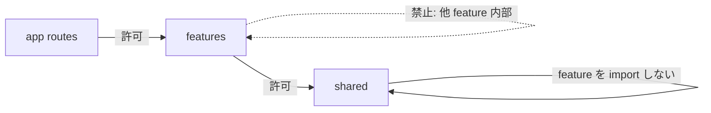

# UI Studio 内部構成（feature-first）

| 項目 | 値 |
| --- | --- |
| 種別 | Architecture |
| Version | 0.8 |
| 更新日 | 2026-07-26 |
| 関連 | [repository-layout.md](repository-layout.md), [development-guidelines.md](../development-guidelines.md), [ui-user-guide.md](../guides/ui-user-guide.md) |

**Version 0.8（2026-07-26）**: Phase 5 完了（task 15）。最終ツリー・画面追加手順・Tailwind `content`・Docker ビルド注意を実装結果に合わせて確定。本移行は **Core-API の HTTP 契約および利用者向け画面の振る舞いを変更しない**。

**Version 0.7（2026-07-26）**: Phase 5 task 14。旧 `app/lib` / `app/components` / `app/graphs` を削除。shell と `theme` を `shared` へ、グラフ定義を `features/executions/graphs` へ。i18n を feature 切片化し `shared/i18n/uiText*.ts` で合成。

**Version 0.6（2026-07-26）**: Phase 5 task 13。`features/admin` / `auth` / `dashboard` へ PageClient を移動。各 route は薄い wrapper。

**Version 0.5（2026-07-25）**: Phase 4 完了。`features/definition-editor`。内部アルゴリズムの書き換えなし。

**Version 0.4（2026-07-25）**: Phase 3 完了。`features/executions`。グラフ描画横断は `shared` へ。

---

Statevia Studio（`ui/studio/`）の**内部モジュール境界**の正本である。目的は所有権の明確化と、ページ増加時の変更影響の見通しである。

**契約・UX の非変更（必須）**: 本構成は配置と import 境界のみを対象とする。Core-API の HTTP 契約（パス・クエリ・レスポンス形）および利用者向け画面の操作体験は変えない。契約の正本は [`../specifications/api-http.md`](../specifications/api-http.md) および各 UI 仕様である。

## 1. 最終ツリー

```text
ui/studio/
├─ app/                      # App Router のみ（薄い page / layout / route handlers）
│  ├─ api/                   # BFF（`/api/core/*`・auth）。移動しない
│  ├─ admin|dashboard|definitions|executions|login/
│  │  └─ **/page.tsx         # feature の画面を import するだけ
│  ├─ layout.tsx
│  └─ globals.css
├─ features/
│  ├─ definitions/           # api, hooks, ui, types, i18n
│  ├─ executions/            # api, hooks, lib, ui, types, graphs, i18n
│  ├─ definition-editor/     # ui, lib, actionSchema, types, i18n（巨大のため独立）
│  ├─ admin/                 # ui, types, i18n
│  ├─ auth/                  # ui, i18n
│  └─ dashboard/             # ui, i18n
├─ shared/
│  ├─ api/                   # transport + 共通 query 型
│  ├─ ui/                    # PageShell, Toast, AppHeader, GraphNodeShell 等
│  ├─ i18n/                  # Context・locale・横断辞書 + feature 切片の合成
│  ├─ auth/                  # session / jwt ヘルパ
│  └─ lib/                   # dateTime, errors, validation, theme, graphLayout
├─ public/
├─ Dockerfile                # build 時に app / features / shared を COPY
├─ .dockerignore
└─ tailwind.config.ts        # content に app / features / shared を含める
```

旧 `app/lib` / `app/components` / `app/graphs` / `app/features` は削除済み。長期の互換 re-export は残さない。小規模 feature（admin / auth / dashboard）は必ずしも `api` / `hooks` 層を分けない。

## 2. パスエイリアス

| エイリアス | 実体 |
| --- | --- |
| `@/features/*` | `features/*` |
| `@/shared/*` | `shared/*` |

`@/app/*` は原則使わない。route から feature を参照する。

## 3. 依存方向（必須）


```mermaid
flowchart LR
    appRoutes["app routes"] -->|"&nbsp;&nbsp;許可&nbsp;&nbsp;"| features
    features -->|"&nbsp;&nbsp;許可&nbsp;&nbsp;"| shared
    features -.->|"&nbsp;&nbsp;禁止: 他 feature 内部&nbsp;&nbsp;"| features
    shared -->|"&nbsp;&nbsp;feature を import しない&nbsp;&nbsp;"| shared
```

| 向き | 可否 |
| --- | --- |
| `app` → `features` | 許可 |
| `features` → `shared` | 許可 |
| `shared` → `features` | **禁止**（例外: `shared/i18n/uiText*.ts` が feature の i18n 切片を合成 import する） |
| feature → 他 feature の内部 | **禁止**（共有が必要なら `shared` へ上げるか公開エントリを明示） |

機械チェック: `ui/studio/eslint.config.js` で `shared/**` からの `@/features` / `features` 参照を `no-restricted-imports` で error にする（`shared/i18n/uiText.ts` / `uiText.en.ts` のみ辞書合成のため除外）。feature 間内部参照はレビュー必須（下記チェックリスト）。

## 4. feature 内の標準レイヤ

| 層 | 置き場 | 例 |
| --- | --- | --- |
| API client | `features/*/api.ts` | `listDefinitions`, `softDeleteDefinition` |
| hooks | `features/*/hooks/` | URL 同期、一覧取得、delete/restore |
| UI | `features/*/ui/` | 一覧行、確認ボタン群、PageClient |
| i18n | `features/*/i18n/` | 画面文言切片（`shared/i18n` で合成） |
| route | `app/**/page.tsx` | feature の Page を返すだけ（`"use client"` は feature 側） |

## 5. 画面追加の手順

1. `features/<name>/` に必要な層（`api` / `hooks` / `ui` / `types` / `i18n`）を置く。
2. `app/**/page.tsx` は薄い wrapper のみにする（表示・ロジックは feature 側）。
3. 横断関心のみ `shared/` に置く（ドメイン知識を `shared` に落とさない）。
4. 文言を追加する場合は feature の i18n 切片を更新し、`shared/i18n/uiText*.ts` の合成を維持する。
5. Tailwind クラスを `features` / `shared` に書く場合、`tailwind.config.ts` の `content` に当該 glob が含まれていることを確認する（含まれないと本番 CSS から落ちる）。
6. `npm run lint` / `typecheck` / `test:run` を通す。
7. Docker イメージを使う場合は `ui/studio/Dockerfile` が `features` / `shared` を COPY していること、および再ビルドを前提にする。

## 6. 段階移行チェックリスト

| Phase | 内容 | 完了条件 |
| --- | --- | --- |
| 0 | 本正本・paths・骨格・依存方向チェック | lint / typecheck / test:run（完了） |
| 1 | transport / UI primitive / i18n・auth・汎用 lib を `shared` へ | 同上。長期 re-export なし（完了） |
| 2 | `features/definitions` パイロット（api / hooks / ui / i18n） | 定義一覧・詳細の既存テスト通過（完了） |
| 3 | `features/executions`（必要なら graph） | 実行画面・関連テスト（完了） |
| 4 | `features/definition-editor`（移動と境界のみ） | 編集画面の挙動非変更（完了） |
| 5 | admin / auth / dashboard、旧ディレクトリ削除、docs 最終反映 | **完了**（task 13–15） |

### PR レビュー必須項目（依存方向）

- [ ] `shared` から `features` への import が無い（ESLint で検知。i18n 合成の除外ファイル以外）
- [ ] feature が他 feature の内部パスを import していない
- [ ] `app/**/page.tsx` が肥大化していない（表示・ロジックは feature 側）
- [ ] 一時 re-export を残す場合は同一 Phase 内で解消する方針が PR に書かれている
- [ ] HTTP 契約・利用者向け振る舞いを意図せず変えていない

## 7. 非目標

- 機能追加、HTTP 契約変更、見た目の再デザイン
- `DefinitionGraphEditor` 内部アルゴリズムの大規模書き換え
- データ取得の全面 Server Components 化（規則の文書化は可）
- C# Clean Architecture フォルダ名のそのまま移植
- React Query 等の新規状態管理ライブラリ導入
