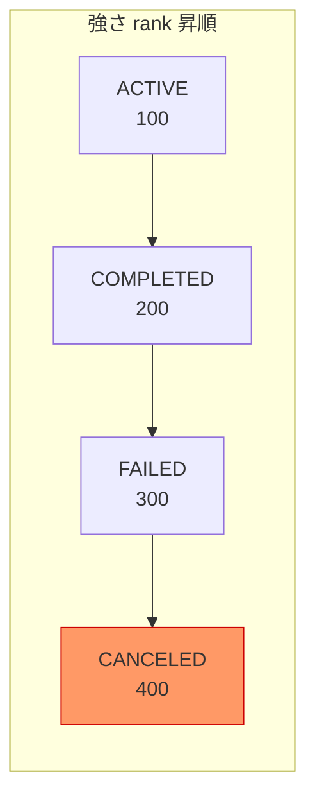
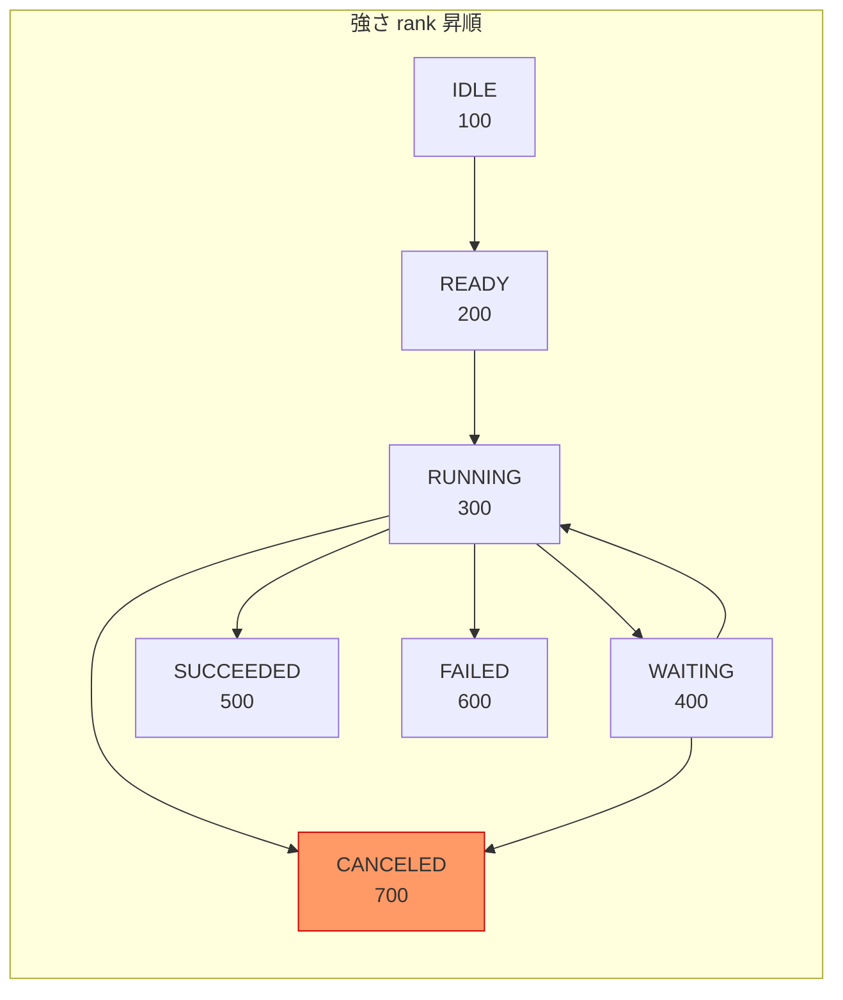
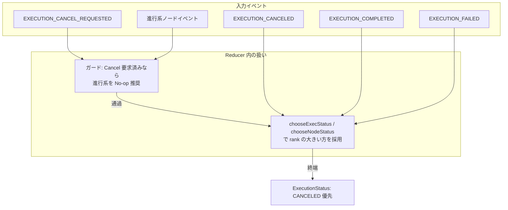

# コア Reducer 仕様

Version: 1.0
Project: 実行型ステートマシン

---

## 1. ゴール

- Event を適用して ExecutionState を更新する **純粋 reducer** を定義する
- 競合（Cancel vs Complete/Fail/Resume 等）は **散発的 if** ではなく、
  **共通の優先順位関数**で機械的に解決する

---

## 2. 状態モデル（最小）

- **ExecutionStatus**: ACTIVE, COMPLETED, FAILED, CANCELED
- **NodeStatus**: IDLE, READY, RUNNING, WAITING, SUCCEEDED, FAILED, CANCELED
- **ExecutionState**: executionId, graphId, status, nodes（Map）, cancelRequestedAt, canceledAt, failedAt, completedAt, version
- **NodeState**: nodeId, nodeType, status, attempt, workerId, waitKey, output, error, canceledByExecution（任意）

---

## 3. 優先順位（図式）

### 3.1 ExecutionStatus の優先順位

**rank が大きいほど「強い」終端。競合時は大きい方を採用する（chooseExecStatus）。**

- **CANCELED（400）** が最強。CANCEL_REQUESTED 発行後、終端競合は Cancel を優先して確定する。
- COMPLETED / FAILED は CANCELED で上書きされない（reducer で chooseExecStatus を必ず使う）。

### 3.2 NodeStatus の優先順位

**rank が大きいほど「確定に近い」状態。競合時は大きい方を採用する（chooseNodeStatus）。**

- **CANCELED（700）** が最強。
- 例外: **WAITING → RUNNING** は Resumed で明示的に許可（rank では WAITING &lt; RUNNING だが、再開時のみ RUNNING を採用）。

### 3.3 終端競合時の適用関係

- **EXECUTION_CANCEL_REQUESTED** が一度入ると、以後の進行系イベント（NODE_READY, NODE_STARTED, NODE_RESUMED, EXECUTION_COMPLETED, EXECUTION_FAILED 等）は **No-op 推奨**（監査用に Event は残してもよい）。
- それでも reducer は **chooseExecStatus** で rank を比較するため、CANCELED が COMPLETED/FAILED で上書きされることはない。

---

## 4. ガード（概要）

- **isCancelRequested**: cancelRequestedAt != null なら true。
- **shouldIgnoreProgressEvent**: Cancel 要求済みのとき、進行を進めるタイプのイベント（NODE_READY, NODE_STARTED, NODE_RESUMED, EXECUTION_COMPLETED, EXECUTION_FAILED 等）を **No-op 推奨**。監査で Event を残す運用でも、chooseExecStatus により最終状態は Cancel が優先される。

---

## 5. Reducer の流れ（概念）

1. **スキーマバージョン** が 1 でなければ state をそのまま返す。
2. **ガード**: Cancel 要求済みかつ進行系イベントなら No-op（推奨）。
3. **適用**: イベント type に応じて state を更新（Execution/Node の status は chooseExecStatus / chooseNodeStatus で決定）。
4. **normalize**: Execution が CANCELED 確定なら、未終端ノード（IDLE/READY/RUNNING/WAITING）を CANCELED に収束させ、canceledByExecution を付与（推奨）。

---

## 6. 不変条件（Invariants）

- ExecutionStatus は rank によって **単調に強くなる方向**にしか変化しない。
- NodeStatus も同様（**WAITING → RUNNING** のみ例外で許可）。
- EXECUTION_CANCELED 適用後は ExecutionStatus は **CANCELED で固定**（chooseExecStatus で保証）。
- cancelRequestedAt は **一度入ったら消えない**。

---

## 7. 副作用との分離

reducer は **副作用を起こさない**。  
中断要求や次ノードの READY 化は **Event 生成側（Process Manager / Orchestrator）** が担当し、その結果を Event として reducer に流す。

例: Cancel 受理 → Orchestrator が NODE_INTERRUPT_REQUESTED を発行。Join 成立 → Orchestrator が次ノードの NODE_READY を発行。
