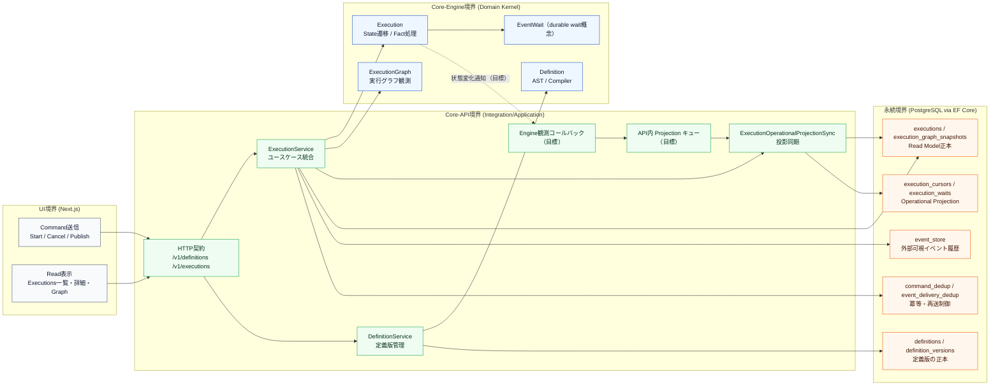

# ドメインモデル関連図（境界付き）

関連する概念が増えてきたため、Statevia の主要ドメインモデルを「どの境界に属するか」と「どこが正本か」を含めて俯瞰できるように整理する。

## 1. ドメイン境界と関連

## 2. 読み方（要点）

- `Core-Engine` は純粋ドメインロジック（定義解釈、遷移、グラフ生成）を担当し、I/O は持たない。
- `Core-API` はユースケース実行とトランザクション境界を担当し、Engine 結果を永続化モデルへ写像する。
- UI の正本は `GET /v1/executions*` が返す Read Model（`executions` / `execution_graph_snapshots`）である。
- `execution_cursors` / `execution_waits` は運用用投影であり、Read API 正本とは分離される。
- `event_store` は外部可視イベント履歴、`command_dedup` / `event_delivery_dedup` は冪等制御の責務を持つ。

## 3. 現状と目標の切り分け

- **現状（実装済み）**: 永続化テーブル更新は `Core-API` からのみ実行される。`UI` や `Core-Engine` が DB に直接書き込む経路は持たない。
- **目標（仕様記載あり）**: Engine の状態変化を API 側へ観測コールバックし、API 内キューで execution 単位に併合しつつ `ProjectionSync` で DB 反映する流れを想定する。
- **図の凡例**: 破線は「目標/導入予定」の経路、実線は「現状の責務境界で成立している経路」を示す。

## 4. 参照元ドキュメント

- `docs/statevia-architecture.md`
- `docs/statevia-data-integration-contract.md`
- `docs/core-api-interface.md`
- `.spec-workflow/specs/execution-platform-data-model/design.md`
