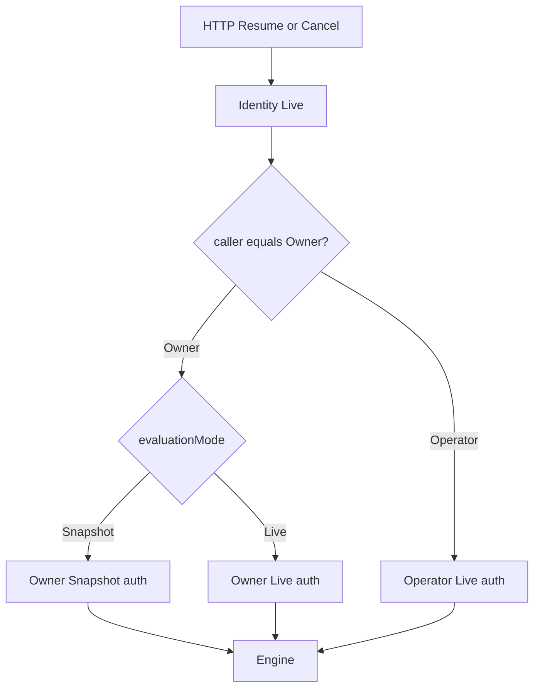

# Execution Security Snapshot

- Version: 1.2.2
- 更新日: 2026-06-08
- Status: **実装済み（E4 · 2026-06-08）** — `executions.security_snapshot_json`、Start キャプチャ、Resume / Cancel の Owner / Operator 認可
- 関連: [`requirements.md`](../.spec-workflow/specs/runtime-security-boundary/requirements.md) 要件9、[`design.md`](../.spec-workflow/specs/runtime-security-boundary/design.md)、[`runtime-security-boundary.md`](./runtime-security-boundary.md)

---

## 概要

長時間実行・Wait / Resume / Retry では、**HTTP リクエスト時点のログイン者**だけでは権限評価を説明できない。Start 時点の Principal と許可集合を **`ExecutionSecuritySnapshot`** として固定し、**Owner 経路**の認可を **`SecurityEvaluationMode`** で切り替える。

本書は E4（task 11 設計 + task 14 実装）の正本。Engine への Snapshot 注入は **将来**（§Engine 接続）。

## 用語

| 用語 | 意味 |
| --- | --- |
| **Identity（Live）** | リクエスト／ワーカー処理時点で Principal が解決・有効であること（無効化・論理削除は **fail-closed**） |
| **Authorization（Snapshot / Live）** | 操作に必要な semantic permission key を満たすかの評価 |
| **ExecutionSecuritySnapshot** | Start 成功時に確定する、実行に紐づくセキュリティ文脈の不変（論理）スナップショット |
| **SecurityEvaluationMode** | **Owner 経路**の Resume / Cancel 認可が Snapshot か Live か（Operator には効かない — 後述） |
| **Execution Owner** | Start を発行した Principal（`startedByPrincipalId`）。当該 execution の **所有** に相当 |
| **Execution Operator** | Owner 以外で Resume / Cancel 等を行う Principal。**常に Live 権限**で評価 |

## ExecutionSecuritySnapshot（論理モデル）

Start 成功時（同一 ReadCommitted tx 内で executions 行と一緒に確定する想定）に次を保持する。

| フィールド | 型 | 説明 |
| --- | --- | --- |
| `snapshotVersion` | int | **JSON 構造**の版。**初版 = 1**（フィールド追加時にインクリメント） |
| `securityModelVersion` | int | **認可アルゴリズム**の版。**初版 = 1**（Owner/Operator 分離モデル）。ABAC 等へモデル自体が変わるときにインクリメント |
| `tenantInternalId` | UUID | テナント内部 ID（`tenants.tenant_id`） |
| `startedByPrincipalId` | UUID | Start を発行した Principal（**Execution Owner**） |
| `principalType` | string | `User` / `ServiceAccount` / `System`（監査表示用） |
| `effectivePermissionKeys` | string[] | Start 時点の展開済み global permission（API キーは **`expanded ∩ allowed_scopes`** 済み） |
| `permissionSetHash` | string | `effectivePermissionKeys` を **正規化ソート**したうえでの **SHA-256**（hex）。監査整合・将来の部分永続化用 |
| `authorizationContext` | object | **`AuthorizationContextSnapshot`**（後述） |
| `evaluationMode` | enum | **Owner 経路**に適用する **`SecurityEvaluationMode`**（初版 tenant 既定 = Snapshot） |
| `capturedAt` | timestamp | UTC。Start tx のコミット時刻 |
| `captureReason` | string | 固定 `"Start"`（将来の再キャプチャ拡張用） |

### snapshotVersion と securityModelVersion

| 版 | 変わるもの | 例 |
| --- | --- | --- |
| `snapshotVersion` | Snapshot **JSON の形** | `groupSnapshots` 追加、`authorizationContext` フィールド増 |
| `securityModelVersion` | **評価アルゴリズム** | Snapshot-only → Owner/Operator 分離 → ABAC 混合 |

監査で「どのルールで許可/拒否したか」を説明するときは **`securityModelVersion`** を参照する。初版は両方 **1**。

### permissionSetHash の算出

1. `effectivePermissionKeys` を **ordinal 昇順**でソート（重複除去）。
2. 各 key を UTF-8 の `\n` 区切りで連結（末尾改行なし）。
3. 連結結果の SHA-256 を **小文字 hex** で保存。

監査時は `permissionSetHash` + 再計算用 key 一覧で整合確認する。EventStore 等に hash のみ冗長出力しても説明可能。言語（.NET / Go / Rust）を跨いでも同一手順で再計算できる。

### AuthorizationContextSnapshot

`projectRole` 単体では将来の ABAC に足りないため、**拡張可能な JSON オブジェクト**として保持する。

初版（`snapshotVersion = 1`, `securityModelVersion = 1`）:

```json
{
  "projectId": "uuid",
  "projectRole": "executor",
  "groupSnapshots": [
    { "id": "uuid", "name": "Operators" }
  ],
  "isTenantAdmin": false
}
```

| フィールド | 説明 |
| --- | --- |
| `projectId` | 定義が属する project |
| `projectRole` | Start 時点の project 有効ロール。**正規化内部値**（小文字 enum 文字列）。監査 UI では表示ラベルに変換 |
| `groupSnapshots` | Start 時点の所属グループ。**ID と名称**を対で保存（グループ削除後も監査可能） |
| `isTenantAdmin` | Start 時点の `is_tenant_admin` |

#### projectRole の正規化

[`ProjectAccessRolePolicy.ToStorageValue`](../api/Statevia.Service.Api/Application/Security/ProjectAccessRolePolicy.cs) と同一の **小文字 storage 値**を保存する。

| 内部値 | 表示例（UI） |
| --- | --- |
| `reader` | Reader |
| `executor` | Executor |
| `publisher` | Publisher |
| `admin` | Admin |

`Editor` / `EDITOR` 等の表記ゆれを防ぐ。Snapshot には **storage 値のみ**書き、表示は監査 UI / i18n 側。

将来フィールド（例: `attributes`, `policyVersion`）は **`snapshotVersion` インクリメント**とセットで追加する。

### 永続化

- 初版: **`executions.security_snapshot_json`**（PostgreSQL **`text`**。他 JSON 列 `graph_json` / `payload_json` 等と同型。EF マイグレーション `AddExecutionSecuritySnapshot`）。
- **用途**: Cancel / Resume の Owner / Operator 認可のための **不変 BLOB**（Start 時に 1 回書き込み、以降は全文 read のみ）。**`jsonb` は採用しない**（DB 側の JSON 演算・インデックスは不要）。
- **初版は `effectivePermissionKeys` 配列も JSON 内に保持**し、整合は `permissionSetHash` で検証する。大規模時は hash + 外部参照への縮退を検討可。
- **検索・集計**（分析・監査 UI 等）が必要になった場合は **`executions` 列を SQL で掘らず**、**別テーブルへ投影**する（例: `execution_security_audit` 等 — 未実装。`execution-analytics-phase1` 等で検討）。
- EventStore / 監査ログには **`startedByPrincipalId`**, **`permissionSetHash`**, **`evaluationMode`**, **`securityModelVersion`** を冗長出力する（即時調査用。長期集計の正本は投影テーブル側を想定）。

## SecurityEvaluationMode

### 適用範囲（重要）

`evaluationMode` は **Owner 経路の Authorization にのみ**効く。実質 **OwnerEvaluationMode** と読み替えてよい。

| 経路 | `evaluationMode` の影響 | 評価 |
| --- | --- | --- |
| **Owner** Resume / Cancel | **効く** | `Snapshot` → Start 時 `effectivePermissionKeys` / `Live` → 現在の展開 permission |
| **Operator** Resume / Cancel | **効かない** | **常に Live**（caller 自身の permission） |
| Start / Read | — | **常に Live** |
| Retry（System） | — | tenant 境界 + System Principal（permission Live 再展開なし） |

`evaluationMode = Live` の execution でも **Operator は Live** のまま。変化しないのは仕様どおり（Operator は元々 Live 固定）。

### 値の定義

| 値 | Owner 経路の意味 |
| --- | --- |
| **`Snapshot`（既定）** | Owner 自身の Resume / Cancel は Start 時 `effectivePermissionKeys` を正とする |
| **`Live`** | Owner 自身の Resume / Cancel も **現在**の group / admin / API キー scope で再評価する |

### 既定モード（合意）

- **テナント既定: `Snapshot`（Owner 経路）**
- Operator 経路は **`evaluationMode` に関係なく Live** 固定。

### Identity と Authorization の分離

1. **Identity（常に Live）**: Principal が解決・有効であること。無効 Principal は **401/403**。
2. **Authorization**: 主体（Owner / Operator）と `evaluationMode`（Owner のみ）で決まる。

## Resume / Cancel の認可主体（Owner / Operator）

### 合意（初版 · 企業向け SaaS 既定）

| 実行者 | Identity | Authorization |
| --- | --- | --- |
| **Owner** | Live | **`evaluationMode` 依存** — Snapshot または Live（上表） |
| **Operator** | Live | **常に Live** — Owner Snapshot は継承しない |



### 説明例

**User-A が自分で Resume（権限変更後 · `evaluationMode = Snapshot`）**

> Snapshot に `executions.write` あり。Authorization 変更後も Owner 経路は **Snapshot 上許可**。User-A が無効化済みなら Identity で **403**。

**User-B が User-A の execution を Resume**

> Operator 経路 → **Live**。User-B に `executions.write` なし → **403**。`evaluationMode` が Snapshot でも Operator は Live である点は仕様どおり。

**Snapshot-only Operator（将来 opt-in）**

> tenant ポリシーで Operator も Snapshot 評価を許す拡張は **明示 opt-in**。初版既定は Operator = Live。

### Execution Operator と将来の `executions.manage`

| 概念 | permission（将来） | 意味 |
| --- | --- | --- |
| Owner | Snapshot / Live（`evaluationMode`） | 開始者自身 |
| Operator | `executions.manage` | 他人 execution の Resume / Cancel / Retry トリガ |

## 操作別の評価（Wait / Resume / Retry）

| 操作 | トリガ | Identity | Authorization | 監査に残すキー |
| --- | --- | --- | --- | --- |
| **Start** | `POST /v1/executions` | Live | Live — `executions.write`。成功時 Snapshot 作成 | `permissionSetHash`, `securityModelVersion` |
| **Wait 遷移** | Engine 内部 | — | v1: 追加評価なし | `executionId`, wait kind |
| **Resume** | `POST .../events` | Live | Owner: `evaluationMode` / Operator: Live | `callerPrincipalId`, `evaluationMode` |
| **Cancel** | `POST .../cancel` | Live | Resume と同型 | 同上 |
| **Retry** | Scheduler / ワーカー | System Principal | tenant 境界のみ（後述） | `systemPrincipalId`, retry reason |
| **Read** | `GET /v1/executions*` | Live | Live `executions.read` | `callerPrincipalId` |

### Retry

- **System Principal** + `TenantExecutionScope`。ユーザー permission の Live 再展開は **しない**。
- 初版既定: Owner Principal **無効化後**も **Retry は継続**。tenant 境界のみ確認。

#### Execution Liveness Policy（将来 · 未実装）

Owner Principal **無効化後**の execution 存続は tenant ポリシーで選べるようにする余地を残す。

| ポリシー | Owner 無効化 / 削除後 |
| --- | --- |
| **`Continue`（初版既定）** | Wait / Retry は継続。Operator が Live 権限を持てば Resume / Cancel 可能 |
| **`Suspend`** | 新規 Retry / Resume を止め、Wait 状態を維持 |
| **`Cancel`** | execution を自動 Cancel |

評価トリガ: Owner Principal の `disabled_at` / `deleted_at` 検知、または定期ワーカー。Retry 前チェックに組み込む想定。

## 関連 permission key

### 初版（実装済みカタログ）

| key | 用途 |
| --- | --- |
| `executions.write` | Start / Resume / Cancel（移行期単一 key） |
| `executions.read` | GET |
| `definitions.read` | Start 前定義解決 |

### 将来分割（合意 · 未実装）

| key | 用途 |
| --- | --- |
| `executions.start` | Start |
| `executions.resume` | Resume |
| `executions.cancel` | Cancel |
| `executions.read` | Read |
| `executions.manage` | Operator 経路 |

移行: 新 key 追加 → admin シード → Snapshot は Start 時の実 key を保存 → 移行期のみ `executions.write` を superset 受理。

## Engine 接続（将来）

1. Core-API が Start tx で Snapshot を永続化。
2. Cancel / Publish 前に Identity + Owner/Operator Authorization（task 8）。
3. Engine へは executionId と domain payload のみ。
4. 将来 action callback 用に Snapshot を読み取り専用 DTO で注入。

## 未実装・後続

| 項目 | 担当 |
| --- | --- |
| Snapshot 永続化 | task 14 ✅ |
| Resume / Cancel Owner / Operator 認可 | task 14 ✅ |
| コントローラ認可（global permission） | task 8 ✅ |
| permission key 分割 | PermissionCatalog |
| **Execution Liveness Policy** | tenant 設定 + Retry / Resume 前チェック |
| Snapshot-only Operator opt-in | tenant ポリシー |
| `user_profiles` 分離 | 要件9 — 任意 |
| **概要ドキュメント** | ✅ [`runtime-security-boundary.md`](./runtime-security-boundary.md) §Execution Security Snapshot |
| **分析・監査の検索・集計投影** | 別テーブル（本列は `text` BLOB のまま） |

## 変更履歴

| Version | 日付 | 内容 |
| --- | --- | --- |
| 1.2.2 | 2026-06-08 | 永続化を `text` 確定、`jsonb` 非採用、分析・監査は別投影テーブル方針を明記 |
| 1.2.1 | 2026-06-07 | 説明例の User-A / User-B 化、外部サービス名・具体シナリオ表現の除去 |
| 1.2.0 | 2026-06-07 | `evaluationMode` = Owner 経路のみと明文化、`securityModelVersion`、`groupSnapshots`、projectRole 正規化、Execution Liveness Policy 将来節 |
| 1.1.0 | 2026-06-07 | Owner Snapshot / Operator Live、`permissionSetHash`、permission 分割方針 |
| 1.0.0 | 2026-06-07 | 初版 |
