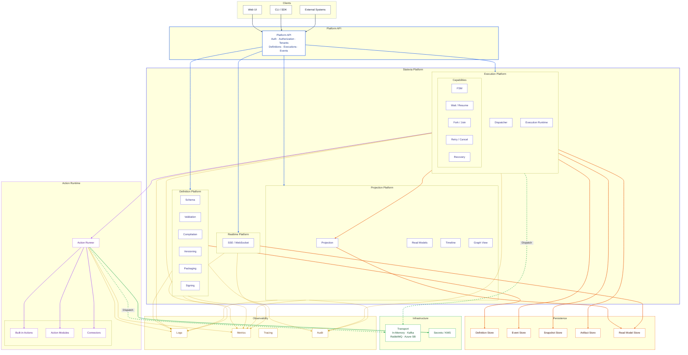

# プラットフォームアーキテクチャ（将来構想）

| 項目 | 値 |
| --- | --- |
| 種別 | Future |
| Version | 1.2.0 |
| 更新日 | 2026-07-07 |
| 関連 | [architecture/overview.md](../architecture/overview.md), [architecture/repository-layout.md](../architecture/repository-layout.md) |

---

**現時点では未実装の構想**です。現行の実装・契約は [architecture/](../architecture/) および [specifications/](../specifications/) を参照すること。

本書は、論理プラットフォーム構成の将来到達像を示す。

---

## プラットフォーム構成（論理）

Definition / Execution / Projection / Realtime / Action Runtime / Persistence を中心とした論理ブロック図。ノード背景は白、サブグラフ背景は Mermaid 既定。枠線色はブロック種別、矢印色はフロー種別に対応する。

