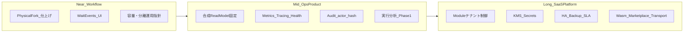

# 製品ロードマップ（成熟度と展望）

| 項目 | 値 |
| --- | --- |
| 種別 | Future |
| Version | 1.0.0 |
| 更新日 | 2026-08-08 |
| 関連 | [platform-architecture.md](platform-architecture.md), [../architecture/overview.md](../architecture/overview.md), [../specifications/platform/audit-and-repro.md](../specifications/platform/audit-and-repro.md) |

---

契約・実装の正本ではない。**能力の成熟度（ある／部分／ない）と推奨フェーズ順**を示す展望ドキュメントである。現行の振る舞い・契約は [`../specifications/`](../specifications/) および [`../architecture/`](../architecture/) を参照すること。

論理プラットフォームの到達像図は [platform-architecture.md](platform-architecture.md) を参照する。本書はその図と突き合わせるための成熟度マップである。

---

## 1. 現状の読み方

現在の改修重心は **ワークフロー Runtime（物理 Fork・耐久・合成読取）** である。認証・テナント・Action Modules・Wait / Resume は既に厚く、運用前提で使える核が揃っている。一方、運用 KPI・監査チェーン・分析・SaaS 運用境界は仕様先行または未着手が多い。

判断基準の優先順は次のとおりとする。

1. 実行正しさ（Runtime）
2. 観測・説明責任（可観測性・監査・分析）
3. SaaS 運用境界（テナント制御・シークレット・可用性）
4. プラットフォーム拡張（Wasm・Marketplace・外部 Transport 等）

---

## 2. 成熟度の定義

| 状態 | 意味 |
| --- | --- |
| **ある** | 実装と公開 docs があり、運用前提で使える |
| **部分** | 骨格・一部実装・仕様のみのいずれか。ギャップを併記する |
| **ない** | 製品機能として未提供（Future 構想を含む） |

---

## 3. フェーズ概観

日付コミットメントは置かない。依存関係に基づく Near / Mid / Long のみ示す。

---

## 4. 能力成熟度マトリクス

### 4.1 ワークフロー（Definition / Execution / Actions / UI）

| 状態 | 内容 | ギャップ / 備考 |
| --- | --- | --- |
| **ある** | FSM、Definition 版管理（immutable append）、Start / Cancel / Resume、Wait 複数イベント、DelayWait、checkpoint / work queue / OwnershipRecovery、論理 Fork / Join、Action Catalog / Policy、InProcess / OutOfProcess / Container、Module Source（Filesystem / OCI / S3 / Git）＋署名・TrustLevel、DB projection 正本＋ graph ＋ SSE、Studio（定義・実行・ダッシュボード）、JWT / API キー＋テナント＋ Execution Security Snapshot | 公開契約: [definition.md](../specifications/definition.md)、[api-http.md](../specifications/api-http.md)、[execution/](../specifications/execution/)、[actions/platform.md](../specifications/actions/platform.md)、[security-runtime.md](../specifications/platform/security-runtime.md) |
| **部分** | 物理 Fork（親＋子 execution・合成 graph / events）、Scheduler / Worker の任意プロセス分離、Action-level retry（定義 parse のみ）、Module 複数版共存（設計確定・実装未）、Graph Editor の `wait.events` UI | ネスト / 循環 / recovery の仕上げ、公開 `fork-join` 契約への同期、既定分離切替の判断が残る |
| **ない** | Wasm ランタイム、Marketplace Module Source、Connectors 製品化、統一 WebSocket Push | [platform-architecture.md](platform-architecture.md) の到達像側 |

### 4.2 運用・監視・可観測性

| 状態 | 内容 | ギャップ / 備考 |
| --- | --- | --- |
| **ある** | 構造化ログ（`[LoggerMessage]`）、相関 ID（`traceparent` / `X-Trace-Id`）、IO-14 マスキング、`GET /v1/health`、Docker / split-runtime ガイド、実行ダッシュボード＋ SSE | [logging-property-keys.md](../reference/logging-property-keys.md)、[io-log-masking.md](../specifications/platform/io-log-masking.md)、[operations-docker.md](../guides/operations-docker.md)、[push-api.md](../specifications/ui/push-api.md) |
| **部分** | 死活のみのヘルス、容量・負荷の公開指針 | readiness / 依存チェックなし。容量 Reference・負荷試験ガイドは未整備 |
| **ない** | Prometheus / OpenTelemetry メトリクス・分散トレース、アラート / SLO、正式な負荷試験ガイド | [data-integration.md](../specifications/data-integration.md) はメトリクスを将来対応と記載 |

### 4.3 監査

| 状態 | 内容 | ギャップ / 備考 |
| --- | --- | --- |
| **ある** | append-only `event_store`、実行 events API、actor / correlation 列のスキーマ、Execution Security Snapshot、監査・再現性の契約文書 | [audit-and-repro.md](../specifications/platform/audit-and-repro.md)、[execution-security-snapshot.md](../specifications/platform/execution-security-snapshot.md) |
| **部分** | イベント履歴による「何が起きたか」 | actor / correlation / causation の書込が未配線。監査専用テーブルの活用が未整備 |
| **ない** | hash chain 実装、管理操作（設定・Module 配置等）の監査、夜間 hash 検証ジョブ | Level 2 設計は仕様のみ |

### 4.4 分析

| 状態 | 内容 | ギャップ / 備考 |
| --- | --- | --- |
| **ある** | 実行一覧・詳細・グラフ（運用 UI） | BI / KPI 製品ではない |
| **部分** | BI 指標の構想（成功率・待機時間等）、実行分析の内部検討 | 公開製品機能としては未提供 |
| **ない** | ノードライフサイクル投影 API、テナント横断 KPI / DWH、Replay UI | [audit-and-repro.md](../specifications/platform/audit-and-repro.md) §7 の方向性のみ |

### 4.5 SaaS 向けセキュリティ

| 状態 | 内容 | ギャップ / 備考 |
| --- | --- | --- |
| **ある** | Password＋JWT、API キー（hash 保存）、permission keys、テナント lifecycle（Active / Suspended / Archived）、QueryFilter fail-closed、Module 署名 / TrustLevel、実行モード下限（Tenant Policy）、テナント別 Module パス、テナントブートストラップ | [security-runtime.md](../specifications/platform/security-runtime.md)、[permission-keys.md](../reference/permission-keys.md)、[operations-tenant-bootstrap.md](../guides/operations-tenant-bootstrap.md) |
| **部分** | OIDC / PAT（設計余地）、Module 配置境界、シークレット管理 | Module 配置は運用者 FS 信頼境界。`ISecretResolver` / KMS 連携は未実装 |
| **ない** | テナント容量・数量上限、Marketplace、保存時暗号化の製品機能、SAML / mTLS、クロステナント federation | federation は現行契約で不採用 |

### 4.6 可用性・耐久性

| 状態 | 内容 | ギャップ / 備考 |
| --- | --- | --- |
| **ある** | PostgreSQL 正本、`FOR UPDATE SKIP LOCKED` work queue、lease / fencing、OwnershipRecovery、EventDelivery リトライ、command dedup、API 内 Hosted 既定 On＋任意プロセス分離 | [durability.md](../concepts/durability.md)、[operations-docker.md](../guides/operations-docker.md) |
| **部分** | 複数 Worker による水平スケール（同一 PG）、split-runtime | 単一 PG compose 前提。容量 / SLA 未公開。既定分離切替は後続判断 |
| **ない** | マネージド HA、バックアップ / リストア ランブック、マルチリージョン、外部メッセージバス本線（Kafka 等）、正式 SLA | [platform-architecture.md](platform-architecture.md) の Transport / Infra 到達像 |

---

## 5. フェーズロードマップ

### 5.1 Near（信頼性クローズ）

1. 物理 Fork MVP 仕上げ（ネスト / recovery、循環・幽霊枝などの follow-up、公開 [fork-join.md](../specifications/execution/fork-join.md) 契約への同期）
2. Studio Graph Editor の `wait.events` 編集ギャップ解消（Engine / API 契約との一致）
3. Worker / Scheduler 既定分離の判断、容量ガイドの公開置き場

### 5.2 Mid（運用・監査・分析の製品化）

1. 合成 read model の終端固定（終端後の都度合成コスト削減）
2. 可観測性: readiness / 依存ヘルス、メトリクス、分散トレース（OpenTelemetry 方向）
3. 監査: actor 埋込 → hash chain の段階適用（[audit-and-repro.md](../specifications/platform/audit-and-repro.md) に実装を寄せる）
4. 実行分析 Phase 1（ノードイベント投影＋読取 API）
5. Action: Container 運用成熟、Org / Project Policy 階層、Module version 共存

### 5.3 Long（SaaS プラットフォーム）

1. Module テナント制御（存在確認・認可・容量 / 数量上限）、設定の Secret / DB 化
2. HA / バックアップ / RPO-RTO ランブック、外部 Transport
3. OIDC、Wasm / Marketplace / Connectors、Realtime 統一（WebSocket 等）
4. [platform-architecture.md](platform-architecture.md) の論理到達像へ収束

---

## 6. 論理構成図との対応

[platform-architecture.md](platform-architecture.md) のブロックごとの現状ステータス。

| 論理ブロック | 現状 | メモ |
| --- | --- | --- |
| Platform API（Auth・Tenants・Definitions・Executions） | **ある** | OIDC 等は将来 |
| Definition Platform（Schema / Validate / Compile / Version / Package / Sign） | **ある**（大半） | Packaging / 版共存の一部は部分 |
| Execution Platform（Dispatcher / Runtime / FSM / Wait / Retry / Recovery） | **部分** | FSM / Wait / Recovery はある。物理 Fork・Action retry は部分 |
| Projection（Read Models / Timeline / Graph） | **ある**（単一実行） | 物理 Fork 合成は部分。終端固定は Mid |
| Realtime（SSE / WebSocket） | **部分** | SSE（GraphUpdated）あり。WebSocket / 統一 Push はない |
| Action Runtime（Builtin / Modules / Connectors） | **部分** | Builtin / Modules はある。Connectors 製品化はない |
| Persistence（Definition / Event / Snapshot / Artifact / Read） | **ある**（中核） | Artifact / Snapshot の製品境界は運用依存 |
| Infrastructure Transport（Kafka 等） | **ない** | 現状はプロセス内 Hosted ＋ PG |
| Secrets / KMS | **ない** | 設定は env / appsettings 前提 |
| Observability（Logs / Metrics / Tracing / Audit） | **部分** | Logs はある。Metrics / Tracing / Audit チェーンは薄い |

---

## 7. 更新ルール

- 実装が「ある」に上がったら本表を更新し、契約・説明は [`../specifications/`](../specifications/) 側へ昇格する。
- 内部作業チケットや作業用 Spec フォルダへのリンクは置かない（[`DOCUMENTATION-STANDARD.md`](../DOCUMENTATION-STANDARD.md)）。
- 四半期などの日付固定はしない。依存関係が変わったときに Near / Mid / Long の並びを見直す。
