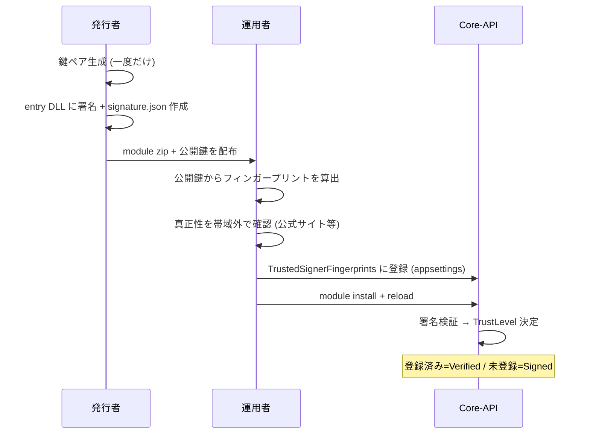

# Action Module 署名の運用フロー（発行者・運用者）

Version: 1.0  
Project: 実行型ステートマシン

---

Action Module の署名検証は、Module の **改ざん検知**（Signed）と **運営による信頼**（Verified）を分離する。本書は発行者と運用者の責務と手順を示す。

関連:

- zip 構成・署名ファイル配置: `docs/specifications/actions/module-zip-layout.md`
- 配置・reload 手順: `docs/guides/operations-docker.md`
- 設定キー: `AGENTS.md`（`Statevia:Modules:Signing`）
- 実装: `infrastructure/Statevia.Infrastructure.Modules/ModuleSignatureVerifier.cs`

---

## 1. 責務の分離

| ロール | 担うこと | 担保される性質 |
|--------|----------|----------------|
| **発行者** | 鍵ペア生成・entry DLL への署名・`signature.json` 同梱 | 改ざんされていないこと（`Signed`） |
| **運用者** | 信頼するフィンガープリントの登録（`TrustedSignerFingerprints`） | 運営が信頼した署名者であること（`Verified`） |

**重要:** 発行者の手順だけでは `Signed` 止まりとなる。運用者がフィンガープリントを登録して初めて `Verified` に昇格する。`signature.json` 内の `signerName` は自己申告で、信頼判定には使われない（表示専用）。

---

## 2. 全体フロー



---

## 3. 発行者の手順

前提: アルゴリズム `RSA-SHA256`、`publicKeyPem` は SubjectPublicKeyInfo（`BEGIN PUBLIC KEY`）、署名対象は **entry DLL のバイト列**。

```bash
# 1) 鍵ペア生成（秘密鍵は厳重保管。CI のシークレットストア等）
openssl genrsa -out signer-private.pem 2048
openssl rsa -in signer-private.pem -pubout -out signer-public.pem

# 2) entry DLL に署名（SHA-256 + PKCS#1 v1.5）
openssl dgst -sha256 -sign signer-private.pem -out sig.bin order.module/order.module.dll
base64 -w0 sig.bin > sig.b64

# 3) signature.json を module ディレクトリ直下に作成
#    ファイル名は {moduleDirectoryName}.signature.json（entry DLL の兄弟）
cat > order.module/order.module.signature.json <<EOF
{
  "algorithm": "RSA-SHA256",
  "publicKeyPem": "$(awk '{printf "%s\\n", $0}' signer-public.pem)",
  "signatureBase64": "$(cat sig.b64)",
  "signerName": "Acme Corp"
}
EOF
```

その後、`docs/specifications/actions/module-zip-layout.md` の手順で zip 化し、**公開鍵（またはフィンガープリント）を別経路で**運用者へ伝える。秘密鍵は配布しない。

---

## 4. 運用者の手順

```bash
# 1) 受け取った公開鍵のフィンガープリント（SubjectPublicKeyInfo(DER) の SHA-256）を算出
openssl pkey -in signer-public.pem -pubin -pubout -outform DER | openssl dgst -sha256
#   例) SHA256(stdin)= 9f86d081...（大小文字・コロン区切りは可。Core-API 側で正規化）
```

2. **真正性の確認（帯域外）**: そのフィンガープリントが本当に意図した発行者のものか、公式サイト・契約・別経路で照合する。ここが信頼の起点であり、自動化しない。

3. **信頼登録**: appsettings の `Statevia:Modules:Signing` に登録する。

```json
{
  "Statevia": {
    "Modules": {
      "Signing": {
        "TrustedSignerFingerprints": [ "9F86D081884C7D659A2FEAA0C55AD015A3BF4F1B2B0B822CD15D6C15B0F00A08" ],
        "RequireSignature": false
      }
    }
  }
}
```

4. **配置と反映**:

```bash
statevia module install ./order.module.zip --modules-path ./modules --api-base http://localhost:8080 --token "<jwt>"
# 反映には Core-API 再起動、または内部 reload が必要
curl -X POST http://localhost:8080/internal/modules/reload -H "Authorization: Bearer <jwt>"
```

5. **確認**: `GET /admin/modules`（認可必須）で `Status` / `TrustLevel` を確認する。

---

## 5. TrustLevel と実行モード

| 状態 | TrustLevel | 本番の実行モード |
|------|------------|------------------|
| `signature.json` なし | `Community`（`RequireSignature=true` なら登録 skip） | OutOfProcess |
| 署名有効・フィンガープリント登録済み | `Verified` | OutOfProcess（開発は InProcess に緩和） |
| 署名有効・フィンガープリント未登録 | `Signed`（改ざんなしのみ保証） | OutOfProcess（緩和なし） |
| 署名不正・破損・未対応アルゴリズム | `Untrusted` | OutOfProcess（saas-shared は Container） |

UI / 一覧で `signerName` を表示する場合は、必ず `TrustLevel` とセットで提示する（例: `Acme Corp (Signed)` / `Acme Corp (Verified)`）。

---

## 6. 鍵ローテーション・失効

- **追加**: 新鍵のフィンガープリントを `TrustedSignerFingerprints` に追記する（旧鍵と一時併存可）。
- **降格**: 漏洩・廃止した鍵はフィンガープリントを配列から除去する。次回 reload / 起動で該当 Module は `Verified` → `Signed` に降格する。
- **将来拡張**: 即時の失効リスト（`RevokedSignerFingerprints`）と、依存 DLL も含む manifest 署名は拡張ポイントとして設計済み（詳細は [actions/platform.md](../specifications/actions/platform.md)）。

---

## 7. セキュリティ上の要点

- 信頼の起点は **運用者の `TrustedSignerFingerprints` のみ**。`signature.json` 同梱の公開鍵・`signerName` は信頼判定に使わない。`signerName` を詐称しても未登録なら `Signed` 止まり。
- フィンガープリントは `publicKeyPem` から **Core-API が再計算**した値で照合する（manifest 申告値は不採用）。
- 現状の署名対象は **entry DLL 単体**。同梱依存 DLL の差し替えは検知できないため、信頼境界は entry DLL のみと理解する。
- 秘密鍵は配布・コミットしない。署名は CI 等の保護された環境で行う。
