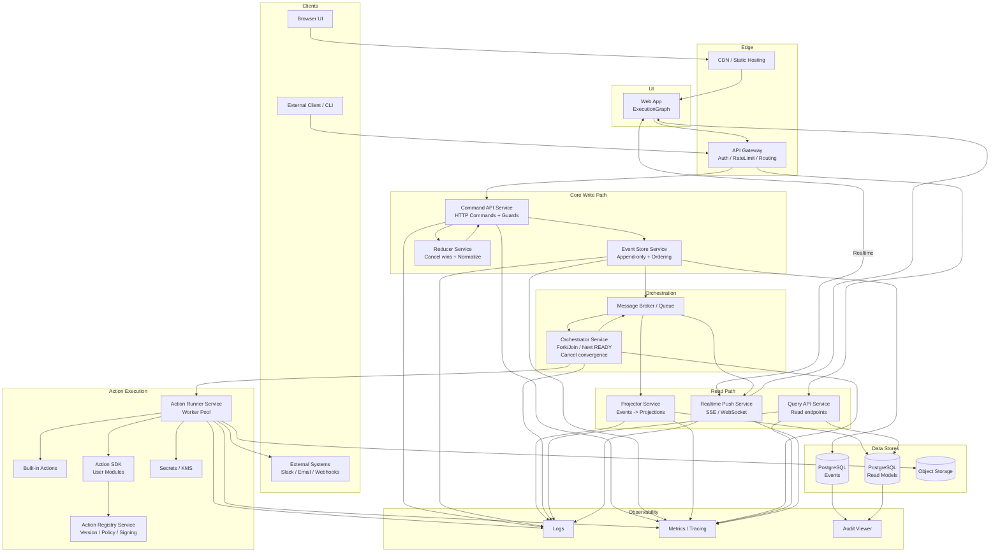

# マイクロサービス構成図

```mermaid
flowchart TB
  %% ===== Clients =====
  subgraph Clients["Clients"]
    Browser["Browser UI"]
    ExtClient["External Client / CLI"]
    ExtSystems["External Systems\nSlack / Email / Webhooks"]
  end

  %% ===== Edge =====
  subgraph Edge["Edge"]
    CDN["CDN / Static Hosting"]
    APIGW["API Gateway\nAuth / RateLimit / Routing"]
  end

  %% ===== UI =====
  subgraph UI["UI"]
    WebApp["Web App\nExecutionGraph"]
  end

  %% ===== Core Write Path =====
  subgraph CoreWrite["Core Write Path"]
    CmdAPI["Command API Service\nHTTP Commands + Guards"]
    EventStoreSvc["Event Store Service\nAppend-only + Ordering"]
    ReducerSvc["Reducer Service\nCancel wins + Normalize"]
  end

  %% ===== Read Path =====
  subgraph Read["Read Path"]
    ProjectorSvc["Projector Service\nEvents -> Projections"]
    QueryAPI["Query API Service\nRead endpoints"]
    PushSvc["Realtime Push Service\nSSE / WebSocket"]
  end

  %% ===== Orchestration =====
  subgraph Orchestration["Orchestration"]
    OrchSvc["Orchestrator Service\nFork/Join / Next READY\nCancel convergence"]
    Queue["Message Broker / Queue"]
  end

  %% ===== Actions =====
  subgraph Actions["Action Execution"]
    RunnerSvc["Action Runner Service\nWorker Pool"]
    Builtins["Built-in Actions"]
    SDK["Action SDK\nUser Modules"]
    RegistrySvc["Action Registry Service\nVersion / Policy / Signing"]
    Secrets["Secrets / KMS"]
  end

  %% ===== Data =====
  subgraph Data["Data Stores"]
    DBEvents[(PostgreSQL\nEvents)]
    DBRead[(PostgreSQL\nRead Models)]
    Obj[(Object Storage)]
  end

  %% ===== Observability =====
  subgraph Obs["Observability"]
    Logs["Logs"]
    Metrics["Metrics / Tracing"]
    Audit["Audit Viewer"]
  end

  %% ===== Flows: UI and API =====
  Browser --> CDN --> WebApp
  WebApp --> APIGW
  ExtClient --> APIGW

  %% Commands (write)
  APIGW --> CmdAPI
  CmdAPI --> EventStoreSvc
  EventStoreSvc --> DBEvents
  CmdAPI --> ReducerSvc
  ReducerSvc --> CmdAPI

  %% Event fan-out
  EventStoreSvc --> Queue

  %% Read projections and query
  Queue --> ProjectorSvc
  ProjectorSvc --> DBRead
  QueryAPI --> DBRead
  APIGW --> QueryAPI
  WebApp <-->|Realtime| PushSvc
  PushSvc --> WebApp
  Queue --> PushSvc

  %% Orchestration
  Queue --> OrchSvc
  OrchSvc --> Queue
  OrchSvc --> RunnerSvc

  %% Action execution & integrations
  RunnerSvc --> Builtins
  RunnerSvc --> SDK
  SDK --> RegistrySvc
  RunnerSvc --> Secrets
  RunnerSvc --> ExtSystems
  RunnerSvc --> Obj

  %% Observability taps
  CmdAPI --> Logs
  EventStoreSvc --> Logs
  ProjectorSvc --> Logs
  OrchSvc --> Logs
  RunnerSvc --> Logs
  QueryAPI --> Logs
  PushSvc --> Logs

  CmdAPI --> Metrics
  EventStoreSvc --> Metrics
  ProjectorSvc --> Metrics
  OrchSvc --> Metrics
  RunnerSvc --> Metrics
  QueryAPI --> Metrics
  PushSvc --> Metrics

  DBEvents --> Audit
  DBRead --> Audit
```
