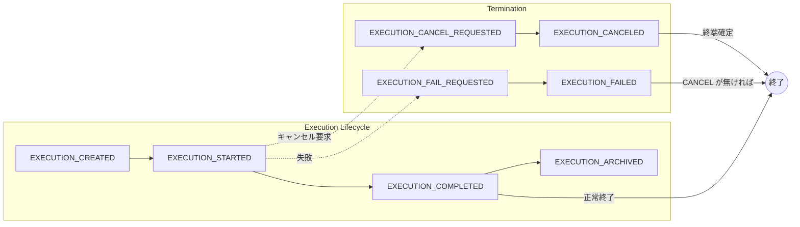
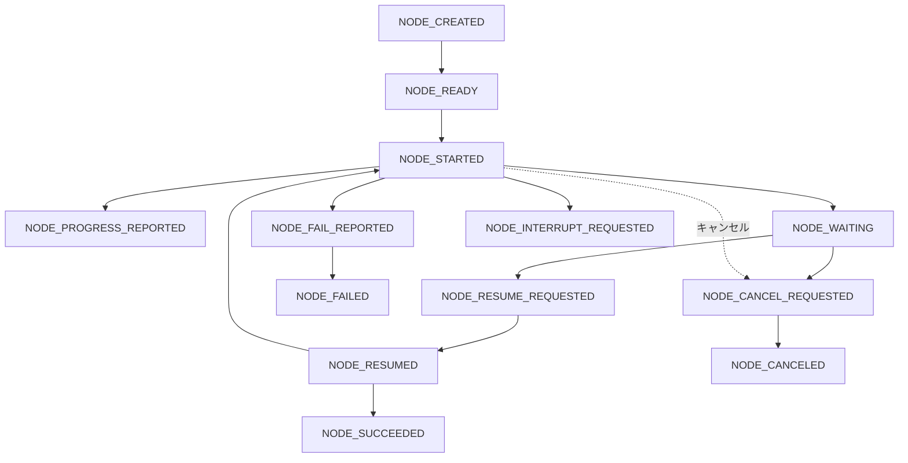
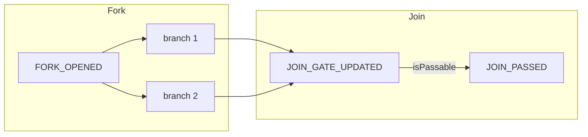

# コアイベント・コマンド仕様

| 項目 | 値 |
| --- | --- |
| 種別 | Specification |
| Version | 1.0 |
| 更新日 | 2026-07-07 |
| 関連 | [fsm.md](fsm.md), [concepts/execution-model.md](../../concepts/execution-model.md) |

---

## Normative 要約

- **MUST**: 外部入力は Command として受け、検証後に 1 件以上の Event に変換する。
- **MUST**: 状態更新は Event のみで行う（reducer は Event のみ参照）。
- **MUST**: 本書に列挙された Event type 以外を発行してはならない。
- **MUST**: 競合は reducer の優先順位規則で決定する。
- **SHOULD**: Cancel 要求受理後は進行系 Command を拒否する。

詳細は §0 方針および固定コマンド一覧を参照。

---

## 0. 方針

- コアは **Command → Event** に変換し、状態は **Event のみ**で更新する（Event Sourcing/監査性を想定）
- イベントは「事実」。後から意味を変えない
- 競合は reducer で **優先順位規則**により決定
- ここにない Event type は発行禁止（互換性・監査性のため）

---

## 1. 共通スキーマ（全イベント共通）

### 1.1 EventEnvelope

- eventId: string (UUID)
- executionId: string
- type: string (下記の固定一覧)
- occurredAt: string (RFC3339)
- actor:
  - kind: "system" | "user" | "scheduler" | "external"
  - id?: string
- correlationId?: string
- causationId?: string (直前イベントのeventIdなど)
- schemaVersion: 1
- payload: object (typeごとに定義)

---

## 2. 固定イベント一覧（完全列挙）

本プロジェクトの core event は以下の **24種** に固定する。

### A. Execution Lifecycle（4）

1. EXECUTION_CREATED
2. EXECUTION_STARTED
3. EXECUTION_COMPLETED
4. EXECUTION_ARCHIVED  ※運用上の保管/クローズ（任意）

### B. Execution Termination（Cancel/Fail）（4）

5. EXECUTION_CANCEL_REQUESTED
6. EXECUTION_CANCELED
7. EXECUTION_FAIL_REQUESTED  ※「失敗確定」前の合意形成が必要な場合用（任意）
8. EXECUTION_FAILED

> 優先順位: EXECUTION_CANCELED が最強。  
> CANCEL_REQUESTED が存在する場合、以後の終端競合は Cancel を優先して確定する。

### C. Node Lifecycle（10）

9. NODE_CREATED
10. NODE_READY
11. NODE_STARTED
12. NODE_PROGRESS_REPORTED
13. NODE_WAITING
14. NODE_RESUME_REQUESTED
15. NODE_RESUMED
16. NODE_SUCCEEDED
17. NODE_FAIL_REPORTED
18. NODE_FAILED

### D. Node Cancellation（3）

19. NODE_CANCEL_REQUESTED
20. NODE_CANCELED
21. NODE_INTERRUPT_REQUESTED  ※実行中ワーカーへの中断要求（best-effort）

### E. Graph Control（Fork/Join）（3）

22. FORK_OPENED
23. JOIN_GATE_UPDATED
24. JOIN_PASSED

---

## 2.1 イベントの流れ（フロー図）

### Execution レベル

- 通常: CREATED → STARTED → COMPLETED（任意で ARCHIVED）。
- キャンセル: CANCEL_REQUESTED 発行後は Cancel 優先で CANCELED が終端確定。
- 失敗: FAIL_REQUESTED → FAILED。CANCEL_REQUESTED/CANCELED がある場合は Execution 終端は CANCELED 優先。

### Node レベル（1 ノードのライフサイクル）

- 作成 → READY → STARTED。待機する場合は WAITING → RESUME_REQUESTED → RESUMED で再開。
- 成功: NODE_SUCCEEDED。失敗: NODE_FAIL_REPORTED → NODE_FAILED。
- キャンセル: NODE_CANCEL_REQUESTED → NODE_CANCELED。実行中への停止要求は NODE_INTERRUPT_REQUESTED（best-effort）。

### Fork / Join

- FORK_OPENED: ブランチがアクティブ化された事実（payload に branchIds）。
- JOIN_GATE_UPDATED: 各ブランチの完了/失敗/キャンセルに応じてゲート更新（expectedBranches, completedBranches, isPassable 等）。
- JOIN_PASSED: 条件を満たして次へ進んだ事実。

---

## 3. 各イベントの payload 定義

以下は payload の最低限フィールド（追加は将来拡張で可だが、互換性維持のため破壊的変更は禁止）。

---

### 3.1 EXECUTION_CREATED

payload:

- graphId: string
- input?: object

---

### 3.2 EXECUTION_STARTED

payload:

- startedBy?: { kind: string, id?: string }

---

### 3.3 EXECUTION_COMPLETED

payload:

- result?: object

ガード:

- CANCEL_REQUESTED / CANCELED が存在するなら reducer は COMPLETED を採用しない（No-op or keep audit）

---

### 3.4 EXECUTION_ARCHIVED

payload:

- reason?: string

---

### 3.5 EXECUTION_CANCEL_REQUESTED

payload:

- reason?: string
- requestedBy?: { kind: string, id?: string }

意味:

- この時点で終端の優先が固定される（以後の終端競合は Cancel 優先）

---

### 3.6 EXECUTION_CANCELED

payload:

- reason?: string
- canceledAt?: string (occurredAtと同一でもよい)

意味:

- Execution 終端確定（不可逆）

---

### 3.7 EXECUTION_FAIL_REQUESTED（任意）

payload:

- reason?: string
- requestedBy?: { kind: string, id?: string }

---

### 3.8 EXECUTION_FAILED

payload:

- reason?: string
- failedNodeId?: string
- error?: { code?: string, message?: string, detail?: object }

ガード:

- CANCEL_REQUESTED / CANCELED が存在するなら reducer は FAILED を ExecutionStatus として採用しない（auditとして残すのは可）

---

### 3.9 NODE_CREATED

payload:

- nodeId: string
- nodeType: string ("Task" | "Wait" | "Fork" | "Join" | "Start" | "Success" | "Failed" | "Canceled" etc.)
- meta?: object

---

### 3.10 NODE_READY

payload:

- nodeId: string

ガード:

- Execution が終端なら No-op

---

### 3.11 NODE_STARTED

payload:

- nodeId: string
- attempt: number (1..)
- workerId?: string

ガード:

- CANCEL_REQUESTED / CANCELED が存在するなら No-op 推奨

---

### 3.12 NODE_PROGRESS_REPORTED

payload:

- nodeId: string
- progress?: number (0..100)
- message?: string
- metrics?: object

---

### 3.13 NODE_WAITING

payload:

- nodeId: string
- waitKey?: string  (外部入力の識別子)
- prompt?: object    (UI提示用のヒント。コアは解釈しない)

---

### 3.14 NODE_RESUME_REQUESTED

payload:

- nodeId: string
- resumeKey?: string
- requestedBy?: { kind: string, id?: string }

ガード:

- CANCEL_REQUESTED / CANCELED が存在するなら拒否推奨（または reducer で No-op）

---

### 3.15 NODE_RESUMED

payload:

- nodeId: string

ガード:

- node が WAITING であること（それ以外は No-op）

---

### 3.16 NODE_SUCCEEDED

payload:

- nodeId: string
- output?: object

ガード:

- CANCEL_REQUESTED / CANCELED が存在するなら NodeStatus の確定は SUCCEEDED のまま残してよいが、Execution終端は CANCELED を優先

---

### 3.17 NODE_FAIL_REPORTED

payload:

- nodeId: string
- error?: { code?: string, message?: string, detail?: object }

意味:

- 失敗の兆候/報告。確定は NODE_FAILED（もしくは Execution側確定）

---

### 3.18 NODE_FAILED

payload:

- error?: { code?: string, message?: string, detail?: object }

ガード:

- CANCEL_REQUESTED / CANCELED が存在するなら Execution終端は CANCELED を優先

---

### 3.19 NODE_CANCEL_REQUESTED

payload:

- nodeId: string
- reason?: string

意味:

- node単体キャンセル要求（Executionキャンセルとは別経路）

---

### 3.20 NODE_CANCELED

payload:

- nodeId: string
- reason?: string

意味:

- nodeの終端確定

---

### 3.21 NODE_INTERRUPT_REQUESTED

payload:

- nodeId: string
- workerId?: string
- reason?: string

意味:

- 実行中処理の停止要求（best-effort）。停止が失敗してもこのイベント自体は事実として残る。

---

### 3.22 FORK_OPENED

payload:

- nodeId: string        (Fork node)
- branchIds: string[]   (branch head node ids)

意味:

- Fork によりブランチがアクティブ化された事実

---

### 3.23 JOIN_GATE_UPDATED

payload:

- nodeId: string        (Join node)
- expectedBranches: string[]
- completedBranches: string[]
- failedBranches: string[]
- canceledBranches: string[]
- policy: "ALL_SUCCESS" | "ANY_SUCCESS" | "ALL_DONE" | "CUSTOM"
- isPassable: boolean

推奨 default:

- policy = ALL_SUCCESS

ガード:

- CANCEL_REQUESTED / CANCELED が存在する場合、isPassable の真偽に関わらず Execution終端は Cancel を優先

---

### 3.24 JOIN_PASSED

payload:

- nodeId: string (Join node)

意味:

- Join 条件を満たして次へ進んだ事実

---

## 4. イベント命名規則

- REQUESTED: 意思/要求（外部入力や上位判断）
- REPORTED: 途中報告/兆候（確定前）
- *ED（過去形）: 確定イベント（reducerの最終状態を決める）

---

## 5. 実装上の必須条件

- reducer は以下を必ず守る:
  - CANCEL_REQUESTED が観測されたら execution.cancelRequestedAt をセット（以後保持）
  - EXECUTION_CANCELED が適用されたら ExecutionStatus は不可逆で CANCELED 固定
  - EXECUTION_COMPLETED / EXECUTION_FAILED は CANCEL_REQUESTED がある場合、ExecutionStatus を上書きしない
- コマンド層は以下を推奨:
  - Cancel受理後の Resume/Start は拒否（ユーザー体験のため）
  - ただし event log として REQUESTED を残す運用も可（監査用途）

---

## コマンド（統合: 旧 commands-spec）

### コマンド層の方針

- 外部入力は Command として受ける
- Command は **必ず検証（ガード）**され、通れば 1つ以上の Event に変換される
- reducer は Event だけを見る（コマンド直適用は禁止）
- Cancel要求以降は「進行系コマンド」を原則拒否（UX と整合）

---

## 1. 固定コマンド一覧（完全列挙）

本プロジェクトの core command は以下の **12種** に固定する。

### A. Execution

1. CreateExecution
2. StartExecution
3. CancelExecution
4. ArchiveExecution

### B. Node（主にWait/Task）

5. MarkNodeReady
6. StartNode
7. ReportNodeProgress
8. PutNodeWaiting
9. RequestResumeNode
10. ResumeNode
11. SucceedNode
12. FailNode

> Fork/Join 由来の READY 化や Join通過は、Orchestrator（後述）が内部的に MarkNodeReady を発行する。

---

## 2. 共通入力（全コマンド共通）

- executionId: string
- actor: { kind: "system"|"user"|"scheduler"|"external", id?: string }
- correlationId?: string

---

## 3. ガード（共通ルール）

### 3.1 Execution終端後

- Execution.status が COMPLETED/FAILED/CANCELED の場合、**全コマンド拒否**
  - 例外: ArchiveExecution は許可してよい（運用）

### 3.2 Cancel要求以降

- execution.cancelRequestedAt が存在する場合、以下は **原則拒否**
  - StartExecution
  - MarkNodeReady
  - StartNode
  - ReportNodeProgress
  - PutNodeWaiting
  - RequestResumeNode
  - ResumeNode
  - SucceedNode
  - FailNode

許可するもの:

- CancelExecution（冪等化）
- ArchiveExecution（運用）

> 監査目的で「要求だけは記録したい」場合は、
> 拒否せず REQUESTED 系 Event を出して reducer 側で No-op でもよいが、
> デフォルトは拒否（ユーザー体験・整合性優先）。

---

## 4. Command → Event 変換表

### 4.1 CreateExecution

**Guards**  

- executionId が未使用
- graphId が存在

**Emits**  

- EXECUTION_CREATED

payload:

- graphId
- input?

---

### 4.2 StartExecution

**Guards**  

- Execution.status == ACTIVE（Created直後もACTIVE扱い）
- cancelRequestedAt == null

**Emits**  

- EXECUTION_STARTED

---

### 4.3 CancelExecution

**Guards**  

- 終端でなければ受理（冪等）
- 終端でも「すでにCanceledならOK」「それ以外終端なら拒否/No-op」運用を選べる
  - デフォルト: 終端なら No-op（Event出さない）

**Emits（推奨: 2段階）**  

1) EXECUTION_CANCEL_REQUESTED（初回のみ）
2) EXECUTION_CANCELED（確定）

> “確定”を即時にするか、ワーカー停止などを待って確定するかは運用選択。
> REQUESTED が入った時点で以後の終端競合は Cancel 優先。

---

### 4.4 ArchiveExecution

**Guards**  

- 任意（運用次第）
- 通常は終端後のみ許可推奨

**Emits**  

- EXECUTION_ARCHIVED

---

### 4.5 MarkNodeReady

**Guards**  

- node.status in { IDLE }（または IDLE/READY 冪等）
- Execution 終端でない
- cancelRequestedAt == null

**Emits**  

- NODE_READY

---

### 4.6 StartNode

**Guards**  

- node.status in { READY }（冪等で READY/RUNNING も許可してよい）
- cancelRequestedAt == null

**Emits**  

- NODE_STARTED (attempt, workerId)

---

### 4.7 ReportNodeProgress

**Guards**  

- node.status in { RUNNING }（任意で WAITING も可）
- cancelRequestedAt == null（デフォルト拒否）

**Emits**  

- NODE_PROGRESS_REPORTED

---

### 4.8 PutNodeWaiting

**Guards**  

- node.status in { RUNNING }
- cancelRequestedAt == null

**Emits**  

- NODE_WAITING (waitKey, prompt?)

---

### 4.9 RequestResumeNode

**Guards**  

- node.status == WAITING
- cancelRequestedAt == null

**Emits**  

- NODE_RESUME_REQUESTED

---

### 4.10 ResumeNode

**Guards**  

- node.status == WAITING
- cancelRequestedAt == null
- (option) resumeKey が一致すること

**Emits**  

- NODE_RESUMED

---

### 4.11 SucceedNode

**Guards**  

- node.status in { RUNNING }（WAITING を許可するかは運用）
- cancelRequestedAt == null（デフォルト拒否）
- node.status が終端でない

**Emits**  

- NODE_SUCCEEDED (output?)

---

### 4.12 FailNode

**Guards**  

- node.status in { RUNNING, WAITING }（運用）
- cancelRequestedAt == null（デフォルト拒否）
- node.status が終端でない

**Emits**  

- NODE_FAIL_REPORTED（任意）
- NODE_FAILED

---

## 5. Orchestrator（プロセスマネージャ）責務

reducer / command-handler とは別に、以下を担当するコンポーネントを置く：

### 5.1 次ノード起動

- NODE_SUCCEEDED / NODE_FAILED / NODE_CANCELED を監視し、
  グラフ条件が満たされたら MarkNodeReady を内部発行する

### 5.2 Fork/Join 制御

- Fork到達 → FORK_OPENED（監査）＋ ブランチの NODE_READY 群を発行
- ブランチ終了 → JOIN_GATE_UPDATED を更新
- Join成立 → JOIN_PASSED（監査）＋ 次ノードの NODE_READY を発行

### 5.3 Cancel収束（重要）

- EXECUTION_CANCEL_REQUESTED を検知したら：
  - 実行中ノードに NODE_INTERRUPT_REQUESTED を発行（best-effort）
  - 未終端ノードの NODE_CANCELED を発行（収束）
  - 収束完了条件を満たしたら EXECUTION_CANCELED を発行（運用により即時でも可）

---

## 6. エラーハンドリング指針

- ガード違反は:
  - API: 409 Conflict / 422 Unprocessable Entity 相当
  - 内部: Rejected(CommandRejected) として返す（Eventは出さないのがデフォルト）
- 冪等コマンドは:
  - 同一効果なら 200/204 でOK（Event重複発行しない）

---

## 7. 必須チェック

- CancelExecution は最優先で受理される（終端以外）
- cancelRequestedAt が入ったら進行系コマンドを拒否する（デフォルト）
- reducer 側でも chooseExecStatus / normalize により Cancel を最終的に保証する
