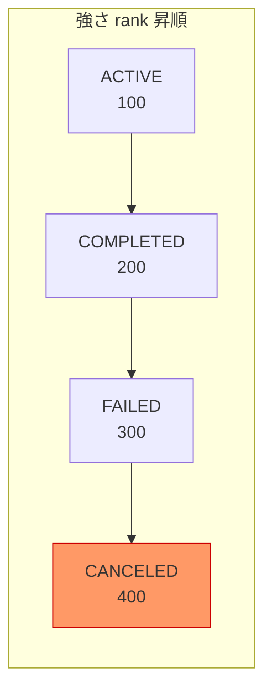
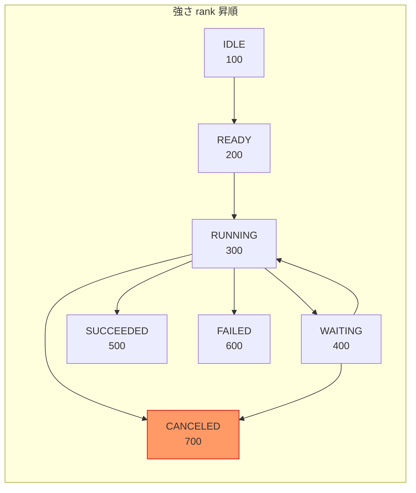
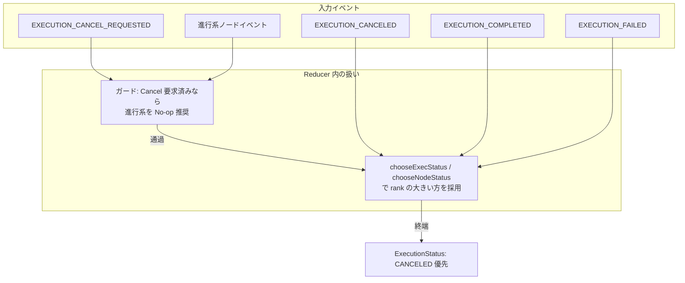

# FSM 仕様

| 項目 | 値 |
| --- | --- |
| 種別 | Specification |
| Version | 1.0 |
| 更新日 | 2026-07-07 |
| 関連 | [concepts/execution-model.md](../../concepts/execution-model.md) |

---

## Normative 要約

- **MUST**: 遷移は `(状態, 事実) → 結果` で評価する。リクエスト（キャンセル要求等）は事実ではない。
- **MUST**: reducer は Event のみを適用し、Command を直接状態に適用してはならない。
- **MUST**: 許可された事実語彙（`Completed` / `Failed` / `Cancelled` / `Joined` 等）以外で遷移してはならない。
- **SHOULD**: Wait 解消後の正常終了は FSM 上 `Completed` 事実として扱う。

背景は [execution-model](../../concepts/execution-model.md) を参照。

---

statevia は事実駆動型有限状態機械を使用します。

## コアコンセプト

遷移は以下によって評価されます：

(状態, 事実) -> 遷移結果

事実は実際の実行結果を表します：

- Completed（完了）
- Failed（失敗）
- Cancelled（キャンセル済み）
- Joined（結合済み）

リクエスト（例：キャンセルリクエスト）は事実ではありません。

### Wait 状態と事実（実装に準拠）

YAML の `wait.event`（例: `payment.completed`）は **外部から `PublishEvent` されたイベント名**と突き合わせ、`IEventProvider.WaitAsync` が再開するために使う識別子である（`EventProvider` / `WaitOnlyState`）。

待機が解けて状態の `ExecuteAsync` が正常終了したあと、エンジンが FSM に渡す事実は **`Completed` 固定**である。`ExecutionEngine.ScheduleStateAsync` は executor 成功時に `ProcessFact(..., Fact.Completed, ...)` とし、`TransitionTable.Evaluate(stateName, "Completed")` で `on` を引く。

したがって Wait 状態の遷移は **`on.Completed`（例: `Completed: { next: ... }`）** で記述する。**`on.<wait.event と同じ文字列>` は現行実装では評価されない**（イベント名と FSM の事実名を混同しないこと）。

## FSM の特性

- 決定論的遷移
- 暗黙の状態遷移なし
- 自己遷移は禁止
- 遷移は O(1) ルックアップテーブルに事前コンパイルされる

## 遷移結果

遷移結果は以下を行うことができます：

- 新しい状態を開始する
- 現在の状態を終了する
- Fork または Join ロジックをトリガーする

---

## コア状態機械（統合: 旧 state-machine-spec）

## 1. 目的

本仕様は、実行型ステートマシンの**コア機能**（状態遷移・イベント処理・競合解決）を定義する。  
UIは本仕様の結果を描画するだけであり、優先順位ロジックはコアが確定する。

---

## 2. 用語

- **Execution**: 1回の実行インスタンス。全ノードの状態を保持する集約（Aggregate）。
- **Node**: 実行単位（Task/Wait/Fork/Join/...）。
- **Event**: 状態変化を引き起こす入力（外部/内部）。
- **Command**: API/ユーザー操作等から来る要求。検証後、Eventに変換される。
- **Reducer**: Event を適用して状態を更新する純粋関数（副作用なし推奨）。
- **Effect/Action**: 実行エンジンが行う副作用（ジョブ開始、外部通知など）。

---

## 3. ステータスモデル

### 3.1 ExecutionStatus（集約の状態）

- ACTIVE（進行中）
- COMPLETED（正常終了）
- FAILED（異常終了）
- CANCELED（キャンセル終了）

**優先順位（確定ルール）**  
`CANCELED > FAILED > COMPLETED > ACTIVE`

> 同一タイムスライス/同一トランザクションで複数終端が競合した場合、常に CANCELED が勝つ。

### 3.2 NodeStatus（ノードの状態）

- IDLE（未到達）
- READY（実行可能）
- RUNNING（実行中）
- WAITING（待機中：外部入力待ち）
- SUCCEEDED（成功）
- FAILED（失敗）
- CANCELED（キャンセル）

**ノード優先順位（確定ルール）**  
`CANCELED > FAILED > SUCCEEDED > WAITING > RUNNING > READY > IDLE`

---

## 4. イベントモデル

### 4.1 イベント共通フィールド

- eventId: UUID
- executionId
- type
- occurredAt: timestamp
- actor: system | user | scheduler | external
- correlationId: 任意（API呼び出しなどと紐づけ）

### 4.2 代表イベント

#### Executionレベル

- EXECUTION_STARTED
- EXECUTION_CANCEL_REQUESTED
- EXECUTION_CANCELED
- EXECUTION_FAILED
- EXECUTION_COMPLETED

#### Nodeレベル

- NODE_READY
- NODE_STARTED
- NODE_WAITING
- NODE_RESUMED
- NODE_SUCCEEDED
- NODE_FAILED
- NODE_CANCELED

---

## 5. 競合解決のコアルール

### 5.1 Cancelは「最終確定」イベント

- Cancel要求（REQUESTED）と Cancel確定（CANCELED）を分ける
- ただし **Cancel要求が受理された時点で、以後の成功/失敗より優先**して扱う

### 5.2 競合解決（Conflict Resolution）

同一Execution内で以下が同時に起きうる:

- ノード成功とCancel
- ノード失敗とCancel
- Join成立とCancel
- ResumeとCancel

**解決規則**

1. まず `EXECUTION_CANCEL_REQUESTED` が存在すれば、後続の遷移は Cancel を優先
2. `EXECUTION_CANCELED` が適用されると、Executionは終端固定（不可逆）
3. ノードは可能な限り `NODE_CANCELED` に収束させる  
   - すでにSUCCEEDED/FAILEDになっているノードは「結果として残す」か「Canceledへ上書き」かを選べるが、コア仕様では下記を推奨

**推奨（監査・説明性重視）**

- ノードの既確定結果（SUCCEEDED/FAILED）は保持し、追加で `cancellationApplied=true` のようなメタを付与
- ただしUIや集約の最終状態は CANCELED として統一

---

## 6. 状態遷移規則

### 6.1 Execution遷移

- ACTIVE → CANCELED
- ACTIVE → FAILED
- ACTIVE → COMPLETED
- FAILED/COMPLETED/CANCELED は終端（不可逆）

### 6.2 Node遷移（基本）

- IDLE → READY → RUNNING → (SUCCEEDED | FAILED | WAITING)
- WAITING → (RUNNING via RESUME) → (SUCCEEDED | FAILED)
- 任意状態 → CANCELED（ただし終端ノードは保持してもよい）

---

## 7. Fork/Join（並列制御）

### 7.1 Fork

- Fork到達で複数ブランチの先頭ノードを READY にする

### 7.2 Join

Joinは「合流条件」が満たされたときに次へ進める。

合流条件（デフォルト推奨）:

- 全ブランチが SUCCEEDED で Join成立
- いずれかが FAILED で Execution FAILED（ただしCancelがあればCancelが勝つ）
- Cancel要求が来たら Join成立判定よりCancelを優先

---

## 8. Wait/Resume/Cancel の相互作用（重要）

### 8.1 Wait

- NODE_WAITING になったノードは外部入力待ち

### 8.2 Resume

- Resumeは WAITING ノードに対してのみ有効
- ただし Cancel要求が受理済みなら Resumeは拒否されるか、受理しても結果は Cancelに収束

### 8.3 Cancel

- Cancel要求受理後は、全ての未終端ノードに対して Cancel収束を開始
- 実行中ノードには「中断要求（best-effort）」を発行する（エンジン側責務）

---

## 9. コマンド受理条件（ガード）

### 9.1 CancelExecution

- Executionが終端でなければ受理
- 受理したら即 `EXECUTION_CANCEL_REQUESTED` を発行

### 9.2 ResumeNode

- 対象ノードが WAITING であること
- Executionに Cancel要求が存在しないこと（存在するなら拒否推奨）

### 9.3 StartNode / CompleteNode

- Executionが終端でないこと
- Cancel要求が存在しないこと（存在するなら拒否またはNo-op）

---

## 10. イベント適用順序（同一バッチ内）

同一トランザクション/同一バッチで複数イベントを適用する場合の並び順:

1. Cancel関連（REQUESTED → CANCELED）
2. Failure関連
3. Success/Completion関連
4. Running/Waiting/Ready関連

これにより終端の優先順位を機械的に担保する。

---

## 11. 監査性（Auditability）

- Cancel要求時刻と、Cancel確定時刻を分けて記録する
- 「Cancelが勝った」場合でも、もともと成功/失敗しそうだった事実はイベントで残せる
- UI/外部通知は、ExecutionStatusを一次情報として扱う

---

## 12. 実装ガイド（最小コア）

### 12.1 集約（Execution Aggregate）

保持すべき最低限:

- executionId
- status（ExecutionStatus）
- cancelRequestedAt（optional）
- nodes: Map<nodeId, NodeState>
- edges（またはgraph参照）
- version（楽観ロック用）

### 12.2 リデューサ（Reducer）

- apply(event, state) => newState
- 「優先順位」をif文で散らすのではなく、共通関数で固定化する（推奨）

---

## 13. 非目標

- UI描画ルール（別仕様）
- 通信方式（SSE/WebSocket等）
- 分散ロック/ワーカー実装詳細

---

## Reducer（統合: 旧 reducer-spec）

## 1. ゴール

- Event を適用して ExecutionState を更新する **純粋 reducer** を定義する
- 競合（Cancel vs Complete/Fail/Resume 等）は **散発的 if** ではなく、
  **共通の優先順位関数**で機械的に解決する

---

## 2. 状態モデル（最小）

- **ExecutionStatus**: ACTIVE, COMPLETED, FAILED, CANCELED
- **NodeStatus**: IDLE, READY, RUNNING, WAITING, SUCCEEDED, FAILED, CANCELED
- **ExecutionState**: executionId, graphId, status, nodes（Map）, cancelRequestedAt, canceledAt, failedAt, completedAt, version
- **NodeState**: nodeId, nodeType, status, attempt, workerId, waitKey, output, error, canceledByExecution（任意）

---

## 3. 優先順位（図式）

### 3.1 ExecutionStatus の優先順位

**rank が大きいほど「強い」終端。競合時は大きい方を採用する（chooseExecStatus）。**

- **CANCELED（400）** が最強。CANCEL_REQUESTED 発行後、終端競合は Cancel を優先して確定する。
- COMPLETED / FAILED は CANCELED で上書きされない（reducer で chooseExecStatus を必ず使う）。

### 3.2 NodeStatus の優先順位

**rank が大きいほど「確定に近い」状態。競合時は大きい方を採用する（chooseNodeStatus）。**

- **CANCELED（700）** が最強。
- 例外: **WAITING → RUNNING** は Resumed で明示的に許可（rank では WAITING &lt; RUNNING だが、再開時のみ RUNNING を採用）。

### 3.3 終端競合時の適用関係

- **EXECUTION_CANCEL_REQUESTED** が一度入ると、以後の進行系イベント（NODE_READY, NODE_STARTED, NODE_RESUMED, EXECUTION_COMPLETED, EXECUTION_FAILED 等）は **No-op 推奨**（監査用に Event は残してもよい）。
- それでも reducer は **chooseExecStatus** で rank を比較するため、CANCELED が COMPLETED/FAILED で上書きされることはない。

---

## 4. ガード（概要）

- **isCancelRequested**: cancelRequestedAt != null なら true。
- **shouldIgnoreProgressEvent**: Cancel 要求済みのとき、進行を進めるタイプのイベント（NODE_READY, NODE_STARTED, NODE_RESUMED, EXECUTION_COMPLETED, EXECUTION_FAILED 等）を **No-op 推奨**。監査で Event を残す運用でも、chooseExecStatus により最終状態は Cancel が優先される。

---

## 5. Reducer の流れ（概念）

1. **スキーマバージョン** が 1 でなければ state をそのまま返す。
2. **ガード**: Cancel 要求済みかつ進行系イベントなら No-op（推奨）。
3. **適用**: イベント type に応じて state を更新（Execution/Node の status は chooseExecStatus / chooseNodeStatus で決定）。
4. **normalize**: Execution が CANCELED 確定なら、未終端ノード（IDLE/READY/RUNNING/WAITING）を CANCELED に収束させ、canceledByExecution を付与（推奨）。

---

## 6. 不変条件（Invariants）

- ExecutionStatus は rank によって **単調に強くなる方向**にしか変化しない。
- NodeStatus も同様（**WAITING → RUNNING** のみ例外で許可）。
- EXECUTION_CANCELED 適用後は ExecutionStatus は **CANCELED で固定**（chooseExecStatus で保証）。
- cancelRequestedAt は **一度入ったら消えない**。

---

## 7. 副作用との分離

reducer は **副作用を起こさない**。  
中断要求や次ノードの READY 化は **Event 生成側（Process Manager / Orchestrator）** が担当し、その結果を Event として reducer に流す。

例: Cancel 受理 → Orchestrator が NODE_INTERRUPT_REQUESTED を発行。Join 成立 → Orchestrator が次ノードの NODE_READY を発行。
