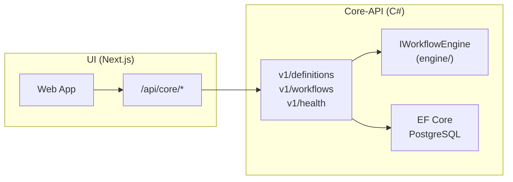

# アーキテクチャ

Version: 1.0
Project: 実行型ステートマシン

---

statevia のアーキテクチャ：システム構成（Core-Engine / Core-API / UI）と、Core-Engine 内部のレイヤー。

---

## 1. システム構成

### 1.1 構成の要点

- **Core-Engine（C#）**: `engine/` のライブラリ。API プロセス内で `IWorkflowEngine` として同一プロセス利用。独立 HTTP サービスはない。
- **Core-API（C#）**: `api/`。ASP.NET Core。v1/definitions・v1/workflows を提供。DB 所有者（EF Core + PostgreSQL）。Engine を参照してワークフロー開始・キャンセル・イベント発行を行う。
- **UI（TypeScript）**: `services/ui/`。Next.js。Route Handler のプロキシ（`/api/core/*`）で Core-API の `/v1/*` に転送。CORS 回避。

### 1.2 全体図

### 1.3 ディレクトリ対応

| 役割       | 場所           |
|------------|----------------|
| Core-Engine | `engine/Statevia.Core.Engine/` |
| Core-API    | `api/Statevia.Core.Api/`       |
| UI          | `services/ui/`                 |
| 永続化      | API の EF Core マイグレーション |

### 1.4 Docker 構成（参考）

- **postgres**: データベース
- **core-api**: C# API（`api/Dockerfile`）
- **ui**: Next.js（`services/ui/Dockerfile`）

`docker-compose.yml` はリポジトリルートに配置。

---

## 2. 責任分界

### 2.1 Core-Engine（C# ライブラリ）

- 定義のロード・検証・コンパイル（Definition）
- FSM 遷移・Fork/Join・スケジューラ（Engine / FSM / Join / Scheduler）
- 状態実行・ExecutionGraph の更新（Execution / ExecutionGraph）
- 終端の優先順位はエンジン内で保証

### 2.2 Core-API（C# / DB 所有者）

- **v1/definitions**: 定義の登録・一覧・取得（YAML 検証・コンパイル済み JSON 保存）
- **v1/workflows**: ワークフロー開始（definitionId 指定）・一覧・取得・グラフ取得・キャンセル・イベント発行
- **v1/health**: 死活
- 永続化: EF Core（workflow_definitions, workflows, execution_graph_snapshots, display_ids 等）
- Engine は同一プロセスで呼び出しのみ（RPC/HTTP はなし）

### 2.3 UI（Next.js）

- `/api/core/*` で Core-API の `/v1/*` にプロキシ
- 一覧・詳細・グラフ表示（ReactFlow）。キャンセル・イベント送信

---

## 3. Core-Engine のレイヤー

Core-Engine は定義駆動・事実駆動型 FSM に基づくワークフローエンジン。以下はエンジン内部のレイヤーと責務（`engine/Statevia.Core.Engine/` に実装）。

### 3.1 概要（データフロー）

Definition (YAML / JSON)  
→ AST  
→ Compiler  
→ FSM / Fork / Join / JoinTracker  
→ Scheduler（並列制御）  
→ State Executor（非同期実行）  
→ Execution Graph（観測）

### 3.2 定義レイヤー (Definition)

ワークフロー定義の読み込みと検証を担当。

### 3.3 コンパイラレイヤー (Compiler)

定義を内部ランタイム構造に変換する：

- FSM 遷移テーブル
- Fork テーブル
- Join トラッカー

### 3.4 FSM レイヤー

事実に基づいて遷移を評価する：(State, Fact) → TransitionResult

### 3.5 スケジューラレイヤー (Scheduler)

実行順序と並列度を制御。エンジンは同時実行制限を超えるポリシーは強制しない。

### 3.6 エグゼキュータレイヤー (Executor)

ユーザー定義の状態を非同期で実行する。

### 3.7 実行グラフ (Execution Graph)

デバッグと可視化のための実行履歴を記録。観測用であり、実行には影響しない。
