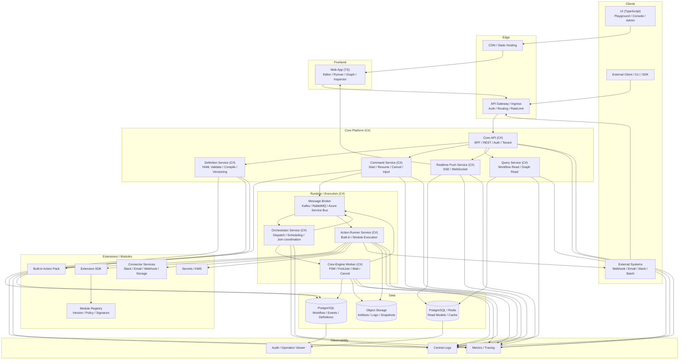

# マイクロサービス構成図

Version: 1.0
Project: 実行型ステートマシン

---

**注意**: 以下は将来のマイクロサービス分割を想定した構成図。現在の実装は単一 Core-API（C#）＋ Engine 同一プロセス。実装構成は statevia-architecture.md を参照。

```mermaid
flowchart TB
  %% ===== Clients =====
  subgraph Clients["Clients"]
    Browser["UI (TypeScript)<br>Playground / Console / Admin"]
    CLI["External Client / CLI / SDK"]
    Ext["External Systems<br>Webhook / Email / Slack / Batch"]
  end

  %% ===== Edge =====
  subgraph Edge["Edge"]
    CDN["CDN / Static Hosting"]
    APIGW["API Gateway / Ingress<br>Auth / Routing / RateLimit"]
  end

  %% ===== Frontend =====
  subgraph Frontend["Frontend"]
    WebApp["Web App (TS)<br>Editor / Runner / Graph / Inspector"]
  end

  %% ===== Core Platform =====
  subgraph Core["Core Platform (C#)"]
    CoreAPI["Core-API (C#)<br>BFF / REST / Auth / Tenant"]
    DefSvc["Definition Service (C#)<br>YAML Validate / Compile / Versioning"]
    CmdSvc["Command Service (C#)<br>Start / Resume / Cancel / Input"]
    QuerySvc["Query Service (C#)<br>Workflow Read / Graph Read"]
    PushSvc["Realtime Push Service (C#)<br>SSE / WebSocket"]
  end

  %% ===== Engine Runtime =====
  subgraph Runtime["Runtime / Execution (C#)"]
    OrchSvc["Orchestrator Service (C#)<br>Dispatch / Scheduling / Join coordination"]
    EngineWorker["Core-Engine Worker (C#)<br>FSM / ForkJoin / Wait / Cancel"]
    ActionRunner["Action Runner Service (C#)<br>Built-in / Module Execution"]
    Queue["Message Broker<br>Kafka / RabbitMQ / Azure Service Bus"]
  end

  %% ===== Extensions =====
  subgraph Extensions["Extensions / Modules"]
    Builtins["Built-in Action Pack"]
    ModuleSDK["Extension SDK"]
    Registry["Module Registry<br>Version / Policy / Signature"]
    Connector["Connector Services<br>Slack / Email / Webhook / Storage"]
    Secrets["Secrets / KMS"]
  end

  %% ===== Data =====
  subgraph Data["Data"]
    WriteDB[(PostgreSQL<br>Workflow / Events / Definitions)]
    ReadDB[(PostgreSQL / Redis<br>Read Models / Cache)]
    Blob[(Object Storage<br>Artifacts / Logs / Snapshots)]
  end

  %% ===== Observability =====
  subgraph Obs["Observability"]
    Logs["Central Logs"]
    Metrics["Metrics / Tracing"]
    Audit["Audit / Operation Viewer"]
  end

  %% ===== Flows =====
  Browser --> CDN --> WebApp
  WebApp --> APIGW
  CLI --> APIGW
  Ext --> APIGW

  APIGW --> CoreAPI
  CoreAPI --> DefSvc
  CoreAPI --> CmdSvc
  CoreAPI --> QuerySvc
  CoreAPI --> PushSvc

  DefSvc --> WriteDB
  CmdSvc --> WriteDB
  CmdSvc --> Queue
  QuerySvc --> ReadDB
  PushSvc --> ReadDB
  PushSvc --> WebApp

  Queue --> OrchSvc
  OrchSvc --> Queue
  OrchSvc --> EngineWorker
  EngineWorker --> WriteDB
  EngineWorker --> Queue
  EngineWorker --> Blob

  Queue --> ActionRunner
  ActionRunner --> Builtins
  ActionRunner --> ModuleSDK
  ModuleSDK --> Registry
  ActionRunner --> Connector
  ActionRunner --> Secrets
  ActionRunner --> Ext
  ActionRunner --> Blob

  WriteDB --> Audit
  ReadDB --> Audit

  CoreAPI --> Logs
  DefSvc --> Logs
  CmdSvc --> Logs
  QuerySvc --> Logs
  PushSvc --> Logs
  OrchSvc --> Logs
  EngineWorker --> Logs
  ActionRunner --> Logs

  CoreAPI --> Metrics
  DefSvc --> Metrics
  CmdSvc --> Metrics
  QuerySvc --> Metrics
  PushSvc --> Metrics
  OrchSvc --> Metrics
  EngineWorker --> Metrics
  ActionRunner --> Metrics
```
