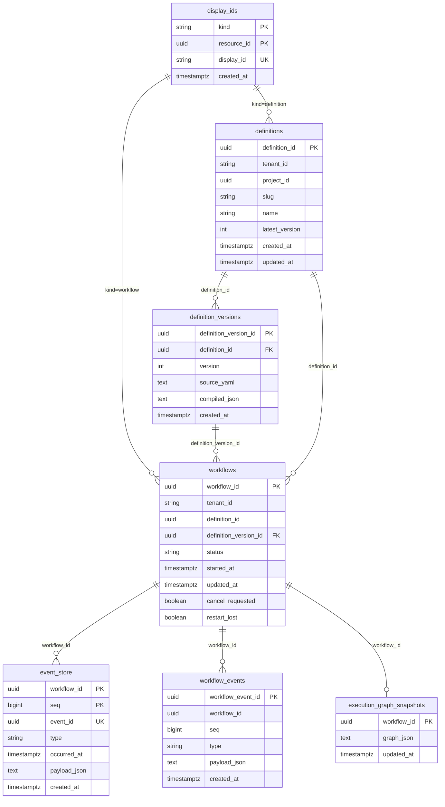
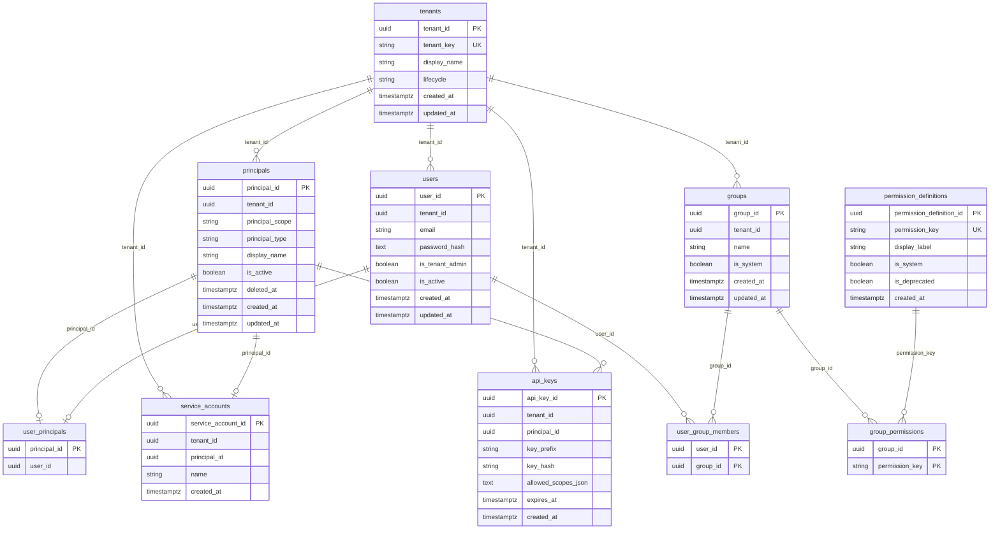

# スキーマ定義

Version: 1.3
Project: 実行型ステートマシン

**Version 1.3（2026-05-21）**: ランタイムセキュリティ境界（`tenants` / `principals` / `users` / `groups` / `api_keys` 等）を追記。Platform テーブルの PK は `<table>.<entity>_id` 命名（例: `tenants.tenant_id`, `users.user_id`）。詳細は [`runtime-security-boundary.md`](./runtime-security-boundary.md) を参照。

**Version 1.2（2026-05-20）**: immutable 定義版（`definitions` / `definition_versions`）と `workflows.definition_version_id` を追記。`command_dedup` / `event_delivery_dedup` を一覧に含める。truth / projection の役割分担を明記。HTTP 契約は [`core-api-interface.md`](./core-api-interface.md) §1.1 を参照。

**Version 1.1（2026-05-05）**: `workflow_definitions` に `tenant_id`・`updated_at` を追記（EF マイグレーション実装に準拠）。

---

Core-API（C#）の EF Core マイグレーションで管理する PostgreSQL スキーマ。  
実装: `api/Statevia.Core.Api/Persistence/` および `Migrations/`。

**書き込み経路（2026-05-20 時点）:** 定義の新規作成・publish は **`definitions` + `definition_versions` のみ**。`workflow_definitions` は移行期のレガシーテーブル（バックフィル元）として残存し、**新規 INSERT は行わない**。

**テナント識別子（2026-05-21 以降）:**

| 識別子 | 型 | 用途 |
| --- | --- | --- |
| `tenants.tenant_id` | uuid | 内部 FK・JWT クレーム `tenant_id`・セキュリティ系テーブルの `tenant_id` FK |
| `tenant_key` | varchar(64) | SDK / CLI / `X-Tenant-Id` / 既存実行系テーブルの `tenant_id` varchar |

移行期は実行系の `tenant_id` varchar と `tenant_key` を **同値**で運用する。UUID 参照への寄せは別マイグレーションとする。

---

## 1. テーブル一覧

| テーブル | 空間 | 役割 |
| --- | --- | --- |
| display_ids | 横断 | 表示用 ID（10 桁）⇔ UUID の対応（definition / workflow 共通） |
| definitions | KnowledgeSpace | 論理定義メタ（slug・最新版番号の投影） |
| definition_versions | KnowledgeSpace | **immutable 定義版の truth**（YAML + compiled JSON） |
| workflow_definitions | （レガシー） | 旧 mutable 定義（移行前データ。参照専用） |
| workflows | ExecutionSpace | ワークフロー実行の projection（状態・版固定・キャンセル要求） |
| event_store | ExecutionSpace | イベントソース（append-only、workflow 単位で seq 付与） |
| workflow_events | ExecutionSpace | 監査用イベント（event_store と同一トランザクションで記録） |
| execution_graph_snapshots | ExecutionSpace | 実行グラフのスナップショット（projection） |
| command_dedup | 信頼性 | コマンド冪等（Start 等の `X-Idempotency-Key`） |
| event_delivery_dedup | 信頼性 | イベント配送冪等（Publish / Cancel の client event id） |
| tenants | Platform | テナントの truth（内部 UUID・外部 `tenant_key`・ライフサイクル） |
| permission_definitions | Platform | グローバル権限定義（キー・表示ラベル） |
| principals | Platform | 実行主体（User / ServiceAccount / System の共通行） |
| users | Platform | 人間ユーザー（メール・パスワードハッシュ・管理者フラグ） |
| user_principals | Platform | User ↔ Principal の 1:1 対応 |
| groups | Platform | テナント内グループ（権限付与の単位） |
| group_permissions | Platform | グループに付与された権限キー |
| user_group_members | Platform | ユーザーとグループの所属 |
| service_accounts | Platform | サービスアカウント（Principal への subtype 行） |
| api_keys | Platform | API キー（平文は保存せず prefix + hash） |

### 1.1 truth / projection（定義・実行）

| 対象 | 役割 |
| --- | --- |
| `definition_versions` + `UNIQUE(definition_id, version)` | 定義版の **truth** |
| `definitions.latest_version` | **投影**（非権威） |
| `workflows.definition_version_id` | 開始時に固定した版（execution correctness） |
| `event_store` / `execution_graph_snapshots` | 実行履歴・グラフの durable 正（既存方針） |

### 1.2 Platform テーブルと QueryFilter

| 対象 | 役割 |
| --- | --- |
| `tenants` | テナントの **truth**（`lifecycle` は `LifecycleTransitionPolicy` で遷移制御） |
| `principals` | Actor 行の **truth**（論理削除は `deleted_at` / `is_active`） |
| 実行系 `tenant_id` varchar | 移行期は **`tenant_key` と同値**（HasQueryFilter は varchar 列で一致） |
| セキュリティ系 `tenant_id` uuid | **`tenants.tenant_id` 参照**（HasQueryFilter は内部 UUID で一致） |
| `IgnoreQueryFilters()` | **`IPlatformDataAccess`（Platform 専用層）のみ**許容 |

---

## 2. テーブル定義

### 2.1 display_ids

表示用 ID（英数字 10 桁）と UUID の対応。kind で definition / workflow を区別。

| カラム | 型 | 制約 | 説明 |
| --- | --- | --- | --- |
| kind | varchar(32) | PK, NOT NULL | `definition` または `workflow` |
| resource_id | uuid | PK, NOT NULL | 実体の UUID（definition_id / workflow_id） |
| display_id | varchar(10) | NOT NULL, UNIQUE | 表示・URL 用の短い ID |
| created_at | timestamptz | NOT NULL | 作成日時 |

### 2.2 definitions

| カラム | 型 | 制約 | 説明 |
| --- | --- | --- | --- |
| definition_id | uuid | PK, NOT NULL | 定義の一意識別子 |
| tenant_id | varchar(64) | NOT NULL | テナント（移行期の境界。`X-Tenant-Id` 省略時は `default`） |
| project_id | uuid | NULL | 所属 project（フェーズ 1b まで NULL 可） |
| slug | varchar(128) | NOT NULL | project 内 slug（移行期は `UNIQUE(tenant_id, slug)`） |
| name | varchar(512) | NOT NULL | 表示名（API の `name`） |
| latest_version | int | NOT NULL | 最新版番号（**投影**。truth は `definition_versions`） |
| created_at | timestamptz | NOT NULL | 作成日時 |
| updated_at | timestamptz | NOT NULL | 最終 publish 日時 |

**インデックス:** `UNIQUE(tenant_id, slug)`

### 2.3 definition_versions

| カラム | 型 | 制約 | 説明 |
| --- | --- | --- | --- |
| definition_version_id | uuid | PK, NOT NULL | 版行の一意識別子 |
| definition_id | uuid | FK → definitions, NOT NULL | 親定義 |
| version | int | NOT NULL | 版番号（定義内で 1 始まり） |
| source_yaml | text | NOT NULL | 当該版の YAML（immutable） |
| compiled_json | text | NOT NULL | 当該版のコンパイル済み JSON（Engine 投入の正） |
| created_at | timestamptz | NOT NULL | 版作成日時 |

**インデックス:** `UNIQUE(definition_id, version)`

**publish 順序:** 同一 DB トランザクション内で **version INSERT → `definitions.latest_version` 更新**（投影逆転禁止）。

### 2.4 workflow_definitions（レガシー）

移行前の mutable 定義。`AddDefinitionVersions` マイグレーションで `definitions` / `definition_versions`（version=1）へバックフィル済み。**新規書き込み対象外。**

| カラム | 型 | 制約 | 説明 |
| --- | --- | --- | --- |
| definition_id | uuid | PK, NOT NULL | 定義の一意識別子 |
| tenant_id | varchar(64) | NOT NULL | テナント |
| name | varchar(512) | NOT NULL | 定義名 |
| source_yaml | text | NOT NULL | 元の YAML |
| compiled_json | text | NOT NULL | コンパイル済み JSON |
| created_at | timestamptz | NOT NULL | 作成日時 |
| updated_at | timestamptz | NOT NULL | 最終更新日時 |

### 2.5 workflows（projection）

| カラム | 型 | 制約 | 説明 |
| --- | --- | --- | --- |
| workflow_id | uuid | PK, NOT NULL | ワークフロー実行の一意識別子 |
| tenant_id | varchar(64) | NOT NULL | テナント |
| definition_id | uuid | NOT NULL | 参照元定義（論理 FK） |
| definition_version_id | uuid | FK → definition_versions, NOT NULL | **開始時に固定した版** |
| status | varchar(64) | NOT NULL | Running / Completed / Cancelled / Failed 等 |
| started_at | timestamptz | NOT NULL | 開始日時 |
| updated_at | timestamptz | NOT NULL | 最終更新日時 |
| cancel_requested | boolean | NOT NULL | キャンセル要求有無 |
| restart_lost | boolean | NOT NULL | 再起動で失効したか（U8） |

### 2.6 event_store（イベントソース）

| カラム | 型 | 制約 | 説明 |
| --- | --- | --- | --- |
| workflow_id | uuid | PK, NOT NULL | ワークフロー ID |
| seq | bigint | PK, NOT NULL | 同一 workflow 内の連番（API が付与） |
| event_id | uuid | NOT NULL, UNIQUE | イベントの一意 ID |
| type | varchar(128) | NOT NULL | イベント種別 |
| occurred_at | timestamptz | NOT NULL | 発生日時 |
| actor_kind | varchar(32) | NULL | system / user / scheduler / external |
| actor_id | varchar(256) | NULL | アクター ID |
| correlation_id | varchar(256) | NULL | 相関 ID |
| causation_id | uuid | NULL | 原因イベント ID |
| schema_version | int | NOT NULL | ペイロードスキーマ版 |
| payload_json | text | NULL | ペイロード（JSON） |
| created_at | timestamptz | NOT NULL | 登録日時 |

### 2.7 workflow_events（監査用）

| カラム | 型 | 制約 | 説明 |
| --- | --- | --- | --- |
| workflow_event_id | uuid | PK, NOT NULL | 監査レコードの一意 ID |
| workflow_id | uuid | NOT NULL | ワークフロー ID |
| seq | bigint | NOT NULL | event_store と同一 seq |
| type | varchar(128) | NOT NULL | イベント種別 |
| payload_json | text | NULL | ペイロード（JSON） |
| created_at | timestamptz | NOT NULL | 登録日時 |

### 2.8 execution_graph_snapshots

| カラム | 型 | 制約 | 説明 |
| --- | --- | --- | --- |
| workflow_id | uuid | PK, NOT NULL | ワークフロー ID |
| graph_json | text | NOT NULL | ExecutionGraph の JSON |
| updated_at | timestamptz | NOT NULL | 更新日時 |

### 2.9 command_dedup

| カラム | 型 | 制約 | 説明 |
| --- | --- | --- | --- |
| dedup_key | text | PK, NOT NULL | 冪等キー（テナント・エンドポイント・idempotency key 等の合成） |
| endpoint | text | NOT NULL | HTTP メソッド + パス |
| idempotency_key | text | NOT NULL | `X-Idempotency-Key` |
| request_hash | text | NULL | リクエスト本文のハッシュ |
| status_code | int | NULL | キャッシュした HTTP ステータス |
| response_body | text | NULL | キャッシュしたレスポンス本文 |
| created_at | timestamptz | NOT NULL | 作成日時 |
| expires_at | timestamptz | NOT NULL | 有効期限 |

### 2.10 event_delivery_dedup

| カラム | 型 | 制約 | 説明 |
| --- | --- | --- | --- |
| tenant_id | varchar(64) | PK, NOT NULL | テナント |
| workflow_id | uuid | PK, NOT NULL | ワークフロー ID |
| client_event_id | uuid | PK, NOT NULL | クライアント発行イベント ID |
| batch_id | uuid | NULL | バッチ ID |
| status | varchar(32) | NOT NULL | RECEIVED / APPLIED 等 |
| accepted_at | timestamptz | NOT NULL | 受付日時 |
| applied_at | timestamptz | NULL | 適用日時 |
| error_code | varchar(128) | NULL | エラーコード |
| updated_at | timestamptz | NOT NULL | 更新日時 |

**インデックス:** `(tenant_id, workflow_id, batch_id)`

### 2.11 tenants

テナントの truth。初回マイグレーションで `tenant_key = default` の行をシードする。

| カラム | 型 | 制約 | 説明 |
| --- | --- | --- | --- |
| tenant_id | uuid | PK, NOT NULL | 内部テナント ID（不変） |
| tenant_key | varchar(64) | NOT NULL, UNIQUE | 外部向けキー（`X-Tenant-Id` / JWT。immutable） |
| display_name | varchar(256) | NOT NULL | 表示名 |
| lifecycle | varchar(32) | NOT NULL | `Active` / `Suspended` / `Archived` |
| created_at | timestamptz | NOT NULL | 作成日時 |
| updated_at | timestamptz | NOT NULL | 更新日時 |

**インデックス:** `UNIQUE(tenant_key)`

**シード:** `tenant_id = 00000000-0000-4000-8000-000000000001`, `tenant_key = default`, `lifecycle = Active`

### 2.12 permission_definitions

グローバル権限定義。テナント横断の権限キー辞書。

| カラム | 型 | 制約 | 説明 |
| --- | --- | --- | --- |
| permission_definition_id | uuid | PK, NOT NULL | 行 ID |
| permission_key | varchar(128) | NOT NULL, UNIQUE | 権限キー（例: `workflow:start`） |
| display_label | varchar(256) | NOT NULL | 表示ラベル |
| display_key | varchar(128) | NULL | UI 表示用キー |
| owner_type | varchar(64) | NULL | 所有者種別 |
| owner_key | varchar(128) | NULL | 所有者キー |
| is_system | boolean | NOT NULL | システム予約か |
| is_deprecated | boolean | NOT NULL | 非推奨か |
| created_at | timestamptz | NOT NULL | 作成日時 |

**インデックス:** `UNIQUE(permission_key)`

### 2.13 principals

実行主体の共通行。User / ServiceAccount / System を `principal_type` で区別する。

| カラム | 型 | 制約 | 説明 |
| --- | --- | --- | --- |
| principal_id | uuid | PK, NOT NULL | Principal ID |
| tenant_id | uuid | NOT NULL | 所属テナント（論理 FK → `tenants.tenant_id`） |
| principal_scope | varchar(32) | NOT NULL | `Tenant` / `Platform` |
| principal_type | varchar(32) | NOT NULL | `User` / `ServiceAccount` / `System` |
| display_name | varchar(256) | NOT NULL | 表示名 |
| is_system | boolean | NOT NULL | システム予約か |
| is_active | boolean | NOT NULL | 有効か |
| disabled_at | timestamptz | NULL | 無効化日時 |
| deleted_at | timestamptz | NULL | 論理削除日時 |
| created_at | timestamptz | NOT NULL | 作成日時 |
| updated_at | timestamptz | NOT NULL | 更新日時 |

### 2.14 users

人間ユーザー。パスワードは **平文を保存せず** `password_hash` のみ保持する。

| カラム | 型 | 制約 | 説明 |
| --- | --- | --- | --- |
| user_id | uuid | PK, NOT NULL | ユーザー ID |
| tenant_id | uuid | NOT NULL | 所属テナント（論理 FK → `tenants.tenant_id`） |
| email | varchar(320) | NOT NULL | メールアドレス（テナント内一意） |
| password_hash | text | NOT NULL | パスワードハッシュ |
| is_tenant_admin | boolean | NOT NULL | テナント管理者か |
| is_platform_admin | boolean | NOT NULL | プラットフォーム管理者か |
| is_active | boolean | NOT NULL | 有効か |
| disabled_at | timestamptz | NULL | 無効化日時 |
| created_at | timestamptz | NOT NULL | 作成日時 |
| updated_at | timestamptz | NOT NULL | 更新日時 |

**インデックス:** `UNIQUE(tenant_id, email)`

### 2.15 user_principals

User と Principal の 1:1 対応。

| カラム | 型 | 制約 | 説明 |
| --- | --- | --- | --- |
| principal_id | uuid | PK, NOT NULL | Principal ID（論理 FK → `principals.principal_id`） |
| user_id | uuid | NOT NULL | ユーザー ID（論理 FK → `users.user_id`） |

### 2.16 groups

テナント内グループ。権限付与の単位。

| カラム | 型 | 制約 | 説明 |
| --- | --- | --- | --- |
| group_id | uuid | PK, NOT NULL | グループ ID |
| tenant_id | uuid | NOT NULL | 所属テナント（論理 FK → `tenants.tenant_id`） |
| name | varchar(128) | NOT NULL | グループ名（テナント内一意） |
| is_system | boolean | NOT NULL | システム予約か |
| created_at | timestamptz | NOT NULL | 作成日時 |
| updated_at | timestamptz | NOT NULL | 更新日時 |

**インデックス:** `UNIQUE(tenant_id, name)`

### 2.17 group_permissions

グループに付与された権限キー。

| カラム | 型 | 制約 | 説明 |
| --- | --- | --- | --- |
| group_id | uuid | PK, NOT NULL | グループ ID（論理 FK → `groups.group_id`） |
| permission_key | varchar(128) | PK, NOT NULL | 権限キー（論理 FK → `permission_definitions.permission_key`） |

### 2.18 user_group_members

ユーザーとグループの多対多所属。

| カラム | 型 | 制約 | 説明 |
| --- | --- | --- | --- |
| user_id | uuid | PK, NOT NULL | ユーザー ID（論理 FK → `users.user_id`） |
| group_id | uuid | PK, NOT NULL | グループ ID（論理 FK → `groups.group_id`） |

### 2.19 service_accounts

サービスアカウント。Principal 行と 1:1 で対応する subtype 行。

| カラム | 型 | 制約 | 説明 |
| --- | --- | --- | --- |
| service_account_id | uuid | PK, NOT NULL | サービスアカウント ID |
| tenant_id | uuid | NOT NULL | 所属テナント（論理 FK → `tenants.tenant_id`） |
| principal_id | uuid | NOT NULL | Principal ID（論理 FK → `principals.principal_id`） |
| name | varchar(128) | NOT NULL | 表示名 |
| created_at | timestamptz | NOT NULL | 作成日時 |

### 2.20 api_keys

API キー。**平文キーは保存しない**。lookup 用に `key_prefix` と `key_hash` のみ保持する。

| カラム | 型 | 制約 | 説明 |
| --- | --- | --- | --- |
| api_key_id | uuid | PK, NOT NULL | API キー行 ID |
| tenant_id | uuid | NOT NULL | 所属テナント（論理 FK → `tenants.tenant_id`） |
| principal_id | uuid | NOT NULL | 発行主体（論理 FK → `principals.principal_id`） |
| key_prefix | varchar(16) | NOT NULL | 表示・lookup 用 prefix（先頭数文字） |
| key_hash | varchar(128) | NOT NULL | 保存用ハッシュ（SHA-256 Base64 等） |
| allowed_scopes_json | text | NOT NULL | 許可スコープ（JSON 配列。交差のみ適用） |
| expires_at | timestamptz | NULL | 有効期限 |
| last_used_at | timestamptz | NULL | 最終利用日時 |
| created_at | timestamptz | NOT NULL | 作成日時 |

**インデックス:** `(tenant_id, key_prefix)`

---

## 3. ER 図

- **display_ids**: `resource_id` は `definitions.definition_id` または `workflows.workflow_id` に対応（kind で区別）。
- **workflows.definition_version_id** → **definition_versions.definition_version_id**（実行開始時の版固定）。
- **workflows.definition_id** → **definitions.definition_id**（論理参照。版の正は `definition_version_id`）。
- **event_store** / **workflow_events** / **execution_graph_snapshots** → **workflows.workflow_id**。
- **workflow_definitions** は図から省略（レガシー。バックフィル後は `definitions` / `definition_versions` が正）。

### 3.1 Platform（テナント・Principal・認可）

- **tenants.tenant_key** は外部向け不変キー。実行系 `tenant_id` varchar は移行期 **同値**で運用する。
- **principals** は User / ServiceAccount / System の共通親行。**論理削除**は `deleted_at` / `is_active` で表現する。
- **user_principals** は User 型 Principal との 1:1 対応。
- **group_permissions.permission_key** → **permission_definitions.permission_key**（グローバル権限辞書）。
- **api_keys** は平文を保存せず **key_prefix + key_hash** のみ保持する。

---

## 4. インデックス（主要）

| テーブル | インデックス | 種別 |
| --- | --- | --- |
| display_ids | display_id | UNIQUE |
| definitions | (tenant_id, slug) | UNIQUE |
| definition_versions | (definition_id, version) | UNIQUE |
| event_store | event_id | UNIQUE |
| workflows | definition_version_id | INDEX（FK） |
| event_delivery_dedup | (tenant_id, workflow_id, batch_id) | INDEX |
| tenants | tenant_key | UNIQUE |
| permission_definitions | permission_key | UNIQUE |
| users | (tenant_id, email) | UNIQUE |
| groups | (tenant_id, name) | UNIQUE |
| api_keys | (tenant_id, key_prefix) | INDEX |

---

## 5. マイグレーション

| マイグレーション | 内容 |
| --- | --- |
| `20260516043215_InitialCreate` | 初期スキーマ（`workflow_definitions`、event_store、dedup 等） |
| `20260520135348_AddDefinitionVersions` | `definitions` / `definition_versions` 追加、`workflows.definition_version_id` 追加とバックフィル |
| `20260521150030_AddRuntimeSecurityBoundary` | Platform テーブル（`tenants` / `principals` / `users` / `groups` / `api_keys` 等）追加、`default` テナントシード |

適用: `cd api && dotnet ef database update --project Statevia.Core.Api`

**既存 DB への注意:** テーブルが手動作成済みで `InitialCreate` が失敗する場合は、マイグレーション履歴（`__EFMigrationsHistory`）と実スキーマの整合を確認してから適用する。未適用分のみ実行するか、クリーン DB で検証する。

スキーマの追加・変更は EF Core マイグレーションで行う。契約・運用叙述は [`core-api-interface.md`](./core-api-interface.md) および [`statevia-data-integration-contract.md`](./statevia-data-integration-contract.md) を参照。
