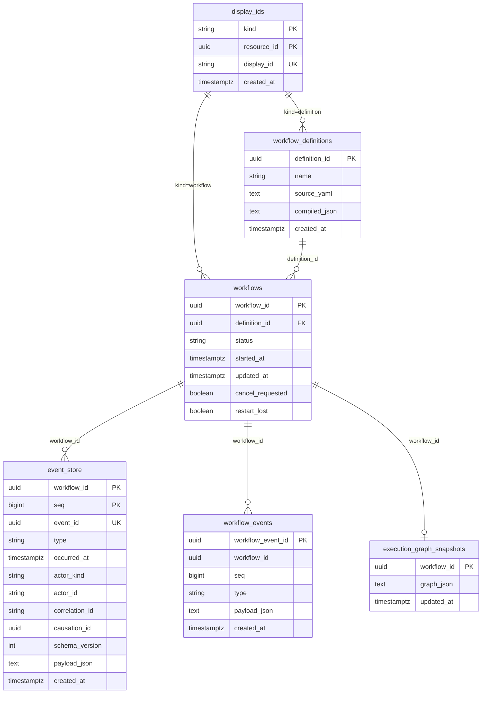

# スキーマ定義

Version: 1.0
Project: 実行型ステートマシン

---

Core-API（C#）の EF Core マイグレーションで管理する PostgreSQL スキーマ。  
実装: `api/Statevia.Core.Api/Persistence/` および `Migrations/`。

---

## 1. テーブル一覧

| テーブル | 役割 |
|----------|------|
| display_ids | 表示用 ID（10 桁）⇔ UUID の対応（definition / workflow 共通） |
| workflow_definitions | ワークフロー定義（YAML + コンパイル済み JSON） |
| workflows | ワークフロー実行の projection（状態・キャンセル要求・restart_lost） |
| event_store | イベントソース（append-only、workflow 単位で seq 付与） |
| workflow_events | 監査用イベント（event_store と同一トランザクションで記録） |
| execution_graph_snapshots | 実行グラフのスナップショット（projection） |

---

## 2. テーブル定義

### 2.1 display_ids

表示用 ID（英数字 10 桁）と UUID の対応。kind で definition / workflow を区別。

| カラム | 型 | 制約 | 説明 |
|--------|-----|------|------|
| kind | varchar(32) | PK, NOT NULL | `definition` または `workflow` |
| resource_id | uuid | PK, NOT NULL | 実体の UUID（definition_id / workflow_id） |
| display_id | varchar(10) | NOT NULL, UNIQUE | 表示・URL 用の短い ID |
| created_at | timestamptz | NOT NULL | 作成日時 |

### 2.2 workflow_definitions

| カラム | 型 | 制約 | 説明 |
|--------|-----|------|------|
| definition_id | uuid | PK, NOT NULL | 定義の一意識別子 |
| name | varchar(512) | NOT NULL | 定義名 |
| source_yaml | text | NOT NULL | 元の YAML |
| compiled_json | text | NOT NULL | コンパイル済み JSON |
| created_at | timestamptz | NOT NULL | 作成日時 |

### 2.3 workflows（projection）

| カラム | 型 | 制約 | 説明 |
|--------|-----|------|------|
| workflow_id | uuid | PK, NOT NULL | ワークフロー実行の一意識別子 |
| definition_id | uuid | NOT NULL | 参照元定義 |
| status | varchar(64) | NOT NULL | Running / Completed / Cancelled / Failed 等 |
| started_at | timestamptz | NOT NULL | 開始日時 |
| updated_at | timestamptz | NOT NULL | 最終更新日時 |
| cancel_requested | boolean | NOT NULL | キャンセル要求有無 |
| restart_lost | boolean | NOT NULL | 再起動で失効したか（U8） |

### 2.4 event_store（イベントソース）

| カラム | 型 | 制約 | 説明 |
|--------|-----|------|------|
| workflow_id | uuid | PK, NOT NULL | ワークフロー ID |
| seq | bigint | PK, NOT NULL | 同一 workflow 内の連番（API が付与） |
| event_id | uuid | NOT NULL, UNIQUE | イベントの一意 ID |
| type | varchar(128) | NOT NULL | イベント種別 |
| occurred_at | timestamptz | NOT NULL | 発生日時 |
| actor_kind | varchar(32) | NULL | system / user / scheduler / external |
| actor_id | varchar(256) | NULL | アクター ID |
| correlation_id | varchar(256) | NULL | 相関 ID |
| causation_id | uuid | NULL | 原因イベント ID |
| schema_version | int | NOT NULL | ペイロードスキーマ版 |
| payload_json | text | NULL | ペイロード（JSON） |
| created_at | timestamptz | NOT NULL | 登録日時 |

### 2.5 workflow_events（監査用）

| カラム | 型 | 制約 | 説明 |
|--------|-----|------|------|
| workflow_event_id | uuid | PK, NOT NULL | 監査レコードの一意 ID |
| workflow_id | uuid | NOT NULL | ワークフロー ID |
| seq | bigint | NOT NULL | event_store と同一 seq |
| type | varchar(128) | NOT NULL | イベント種別 |
| payload_json | text | NULL | ペイロード（JSON） |
| created_at | timestamptz | NOT NULL | 登録日時 |

### 2.6 execution_graph_snapshots

| カラム | 型 | 制約 | 説明 |
|--------|-----|------|------|
| workflow_id | uuid | PK, NOT NULL | ワークフロー ID |
| graph_json | text | NOT NULL | ExecutionGraph の JSON |
| updated_at | timestamptz | NOT NULL | 更新日時 |

---

## 3. ER 図

- **display_ids**: `resource_id` は `workflow_definitions.definition_id` または `workflows.workflow_id` に対応（kind で区別）。図では概念的な参照のみ。
- **workflows.definition_id** → **workflow_definitions.definition_id**
- **event_store.workflow_id** / **workflow_events.workflow_id** / **execution_graph_snapshots.workflow_id** → **workflows.workflow_id**

---

## 4. インデックス（主要）

- `display_ids.display_id` — UNIQUE（表示用 ID からの逆引き）
- `event_store.event_id` — UNIQUE

スキーマの追加・変更は EF Core マイグレーションで行う。
