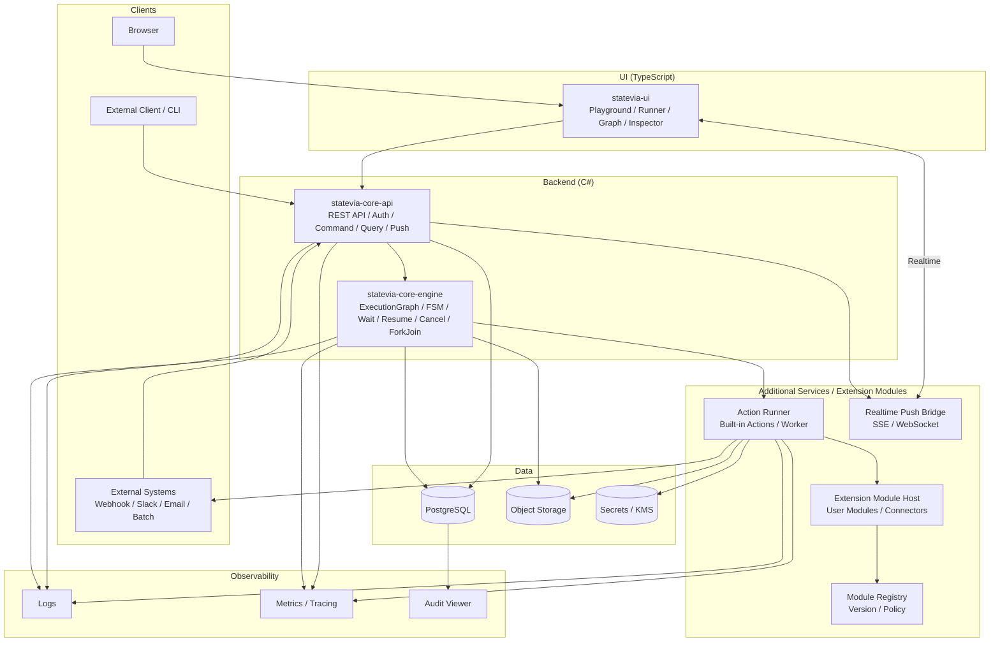

# システム構成図

Version: 1.0
Project: 実行型ステートマシン

---

**注意**: 以下は論理レイヤー・将来拡張を想定した図。現在の実装は statevia-architecture.md および statevia-directory.md を参照。

```mermaid
flowchart TB
  %% ========= Clients =========
  subgraph Clients["Clients"]
    Browser["Browser"]
    ExtClient["External Client / CLI"]
    ExtSystems["External Systems<br>Webhook / Slack / Email / Batch"]
  end

  %% ========= UI =========
  subgraph UI["UI (TypeScript)"]
    WebApp["statevia-ui<br>Playground / Runner / Graph / Inspector"]
  end

  %% ========= Backend =========
  subgraph Backend["Backend (C#)"]
    CoreAPI["statevia-core-api<br>REST API / Auth / Command / Query / Push"]
    CoreEngine["statevia-core-engine<br>ExecutionGraph / FSM / Wait / Resume / Cancel / ForkJoin"]
  end

  %% ========= Extensions =========
  subgraph Extensions["Additional Services / Extension Modules"]
    ActionRunner["Action Runner<br>Built-in Actions / Worker"]
    ModuleHost["Extension Module Host<br>User Modules / Connectors"]
    Registry["Module Registry<br>Version / Policy"]
    PushBridge["Realtime Push Bridge<br>SSE / WebSocket"]
  end

  %% ========= Data =========
  subgraph Data["Data"]
    DB[(PostgreSQL)]
    Obj[(Object Storage)]
    Secrets[(Secrets / KMS)]
  end

  %% ========= Observability =========
  subgraph Obs["Observability"]
    Logs["Logs"]
    Metrics["Metrics / Tracing"]
    Audit["Audit Viewer"]
  end

  %% ========= Flows =========
  Browser --> WebApp
  ExtClient --> CoreAPI
  ExtSystems --> CoreAPI

  WebApp --> CoreAPI
  WebApp <-->|Realtime| PushBridge

  CoreAPI --> CoreEngine
  CoreAPI --> DB
  CoreEngine --> DB
  CoreEngine --> Obj

  CoreEngine --> ActionRunner
  ActionRunner --> ModuleHost
  ModuleHost --> Registry
  ActionRunner --> Secrets
  ActionRunner --> ExtSystems
  ActionRunner --> Obj

  CoreAPI --> PushBridge
  CoreAPI --> Logs
  CoreEngine --> Logs
  ActionRunner --> Logs

  CoreAPI --> Metrics
  CoreEngine --> Metrics
  ActionRunner --> Metrics

  DB --> Audit
```
