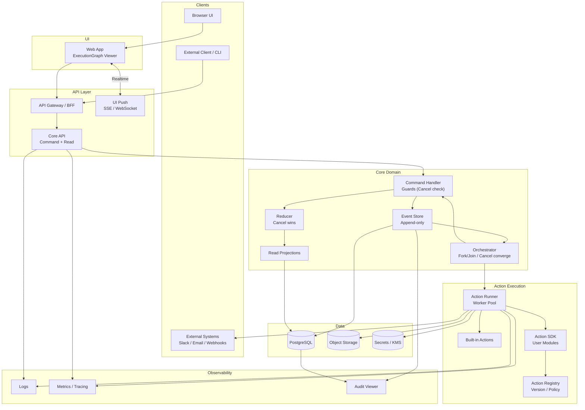

# システム構成図

```mermaid
flowchart TB
  %% ========= Clients =========
  subgraph Clients["Clients"]
    Browser["Browser UI"]
    ExtClient["External Client / CLI"]
    Integrations["External Systems\nSlack / Email / Webhooks"]
  end

  %% ========= UI =========
  subgraph UI["UI"]
    WebApp["Web App\nExecutionGraph Viewer"]
  end

  %% ========= API =========
  subgraph API["API Layer"]
    APIGW["API Gateway / BFF"]
    CoreAPI["Core API\nCommand + Read"]
    PushAPI["UI Push\nSSE / WebSocket"]
  end

  %% ========= Core =========
  subgraph Core["Core Domain"]
    Cmd["Command Handler\nGuards (Cancel check)"]
    ES["Event Store\nAppend-only"]
    Reducer["Reducer\nCancel wins"]
    Proj["Read Projections"]
    Orch["Orchestrator\nFork/Join / Cancel converge"]
  end

  %% ========= Actions =========
  subgraph Actions["Action Execution"]
    Runner["Action Runner\nWorker Pool"]
    Builtins["Built-in Actions"]
    SDK["Action SDK\nUser Modules"]
    Registry["Action Registry\nVersion / Policy"]
  end

  %% ========= Data =========
  subgraph Data["Data"]
    DB[(PostgreSQL)]
    Obj[(Object Storage)]
    Secrets[(Secrets / KMS)]
  end

  %% ========= Observability =========
  subgraph Obs["Observability"]
    Logs["Logs"]
    Metrics["Metrics / Tracing"]
    Audit["Audit Viewer"]
  end

  %% ========= Flows =========
  Browser --> WebApp
  WebApp --> APIGW
  ExtClient --> APIGW

  APIGW --> CoreAPI
  WebApp <-->|Realtime| PushAPI

  CoreAPI --> Cmd
  Cmd --> ES
  Cmd --> Reducer
  Reducer --> Proj

  ES --> DB
  Proj --> DB

  ES --> Orch
  Orch --> Cmd

  Orch --> Runner
  Runner --> Builtins
  Runner --> SDK
  SDK --> Registry
  Runner --> Secrets
  Runner --> Integrations

  Runner --> Obj

  CoreAPI --> Logs
  Runner --> Logs
  CoreAPI --> Metrics
  Runner --> Metrics
  ES --> Audit
  DB --> Audit
```
